# CoWare
## Producto: CoBox
# UNIVERSIDAD PERUANA DE CIENCIAS APLICADAS

<p align="center">
  
</p>

### Carrera: Ingeniería de Software  
### Ciclo: 7° ciclo  
### Curso: Fundamentos de Arquitectura de Software  
### NRC: 6336  
### Profesor: Jorge Luis Delgado Vite

## Informe del TP1
**"CoWare"**  
**Producto: "CoBox"**

### Integrantes:
- Ramiro Alexander Guzmán Chávez – U202217062  
- David Alexander Pérez García – U202222942  
- Joaquín Pedraza Maldonado – U202218514
- Merly Salon Puerta – U20201b772  
- Jhon Alexander Galvez Chambi – U202323270  

**Octubre, 2025**  
**URL del proyecto:** [https://github.com/G1-FundamentosArqui-6336](https://github.com/G1-FundamentosArqui-6336)

---

## Registro de Versiones del Informe

| Versión | Fecha       | Autor                          | Descripción                                                                 |
|---------|-------------|--------------------------------|-----------------------------------------------------------------------------|
| TB1     | 09/09/2025  | Ramiro Alexander Guzmán Chávez | Desarrollo de la carátula, tabla de contenidos y estructura general del informe. |
| TB1     | 09/09/2025  | David Alexander Pérez García   | Redacción de la sección "Descripción de la Startup" y Lean UX Assumptions/Hypothesis. |
| TB1     | 09/09/2025  | Joaquín Pedraza Maldonado      | Elaboración de perfiles de integrantes y Segmentos Objetivo.                |
| TB1     | 10/09/2025  | Merly Salon Puerta             | Desarrollo de antecedentes, problemática y User Task Matrix.                |
| TB1     | 10/09/2025  | Jhon Alexander Galvez Chambi   | Lean UX Problem Statement y Empathy Maps.                                   |
| TB1     | 10/09/2025  | Ramiro Alexander Guzmán Chávez | Diseño del Lean UX Canvas y análisis de entrevistas.                        |
| TB1     | 11/09/2025  | Merly Salon Puerta             | Análisis de competidores y apoyo en entrevistas.                            |
| TB1     | 11/09/2025  | Joaquín Pedraza Maldonado      | Desarrollo de User Personas y User Stories.                                 |
| TB1     | 11/09/2025  | David Alexander Pérez García   | Registro y vaciado de entrevistas; elaboración de To-Be Scenario Mapping.   |
| TB1     | 11/09/2025  | Jhon Alexander Galvez Chambi   | Diseño del formato de entrevistas y desarrollo del Product Backlog.         |
| TB1     | 12/09/2025  | Ramiro Alexander Guzmán Chávez | As-is Scenario Mapping, conclusiones y recomendaciones.                     |
| TB1     | 12/09/2025  | Merly Salon Puerta             | Impact Map y apoyo en revisión general.                                     |
| TB1     | 12/09/2025  | Todos los integrantes          | Revisión final, formato del documento, referencias y anexos.                |
| TB2     | 26/09/2025  | Jhon Alexander Galvez Chambi   | Desarrollo de 4.1: Design Concepts, ViewPoints & ER Diagrams (principios, enfoques, estilos, patrones y diagrama de contexto). |
| TB2     | 26/09/2025  | David Alexander Pérez García   | Elaboración de 4.1.4: Approach Driven ViewPoints Diagrams.                  |
| TB2     | 26/09/2025  | Joaquín Pedraza Maldonado      | Desarrollo de 4.1.5-4.1.7: Diagramas de bases de datos relacionales/no relacionales, patrones de diseño y tácticas arquitectónicas. |
| TB2     | 26/09/2025  | Ramiro Alexander Guzmán Chávez | Redacción de 4.2: Architectural Drivers (propósito, funcionalidades primarias, escenarios de calidad, restricciones y preocupaciones arquitectónicas). |
| TB2     | 26/09/2025  | Merly Salon Puerta             | Desarrollo de 4.3: ADD Iterations (backlog arquitectónico, drivers, conceptos de diseño, instanciación de elementos, vistas C4/UML y análisis con Kanban). |
| TB2     | 27/09/2025  | Todos los integrantes          | Integración del Capítulo IV: Product Architecture Design, revisión grupal y ajustes finales para entrega de la TB2. |
| TP1     | 08/10/2025  | Ramiro Alexander Guzmán Chávez | Configuración del entorno de desarrollo, estructura del backend, documentación técnica de microservicios y despliegue inicial. |
| TP1     | 08/10/2025  | David Alexander Pérez García   | Implementación de pruebas unitarias, gestión del repositorio y aplicación de convenciones de estilo en el código backend. |
| TP1     | 08/10/2025  | Joaquín Pedraza Maldonado      | Elaboración de documentación de microservicios con enfoque DDD y revisión de endpoints. |
| TP1     | 08/10/2025  | Merly Salon Puerta             | Validación del diseño actual mediante Kanban Board, coordinación del sprint y registro de evidencias del desarrollo. |
| TP1     | 08/10/2025  | Jhon Alexander Galvez Chambi   | Validación del diseño técnico y documentación de evidencias del sprint review. |
| TP1     | 09/10/2025  | Todos los integrantes          | Integración del Capítulo V: Product Implementation, Validation & Deployment, revisión grupal y preparación del informe final. |
| TB3     | 02/11/2025  | Ramiro Alexander Guzmán Chávez | Desarrollo de 5.3.2.1: Sprint Backlog 2 y 5.3.2.2: Development Evidence for Sprint Review. |
| TB3     | 02/11/2025  | David Alexander Pérez García   | Desarrollo de 5.3.2.3: Testing Suite Evidence for Sprint Review y 5.3.2.4: Execution Evidence for Sprint Review. |
| TB3     | 02/11/2025  | Joaquín Pedraza Maldonado      | Desarrollo de 5.3.2.5: Microservices Documentation Evidence for Sprint Review. |
| TB3     | 02/11/2025  | Merly Salon Puerta             | Desarrollo de 5.3.2.6: Software Deployment Evidence for Sprint Review. |
| TB3     | 02/11/2025  | Jhon Alexander Galvez Chambi   | Desarrollo de 5.3.2.7: Team Collaboration Insights during Sprint y 5.3.2.8: Kanban Board. |
| TB3     | 03/11/2025  | Todos los integrantes          | Integración del Capítulo V: Sprint 2 Review & Evidence, revisión grupal y entrega de la TB3. |


## Contenido
#### Tabla de contenidos

- [Carátula](#carátula)
  - [Universidad, carrera, ciclo](#universidad-peruana-de-ciencias-aplicadas)
  - [Nombre del Startup](#cobox)
  - [Nombre del Producto](#cobox)
  - [Relación de Integrantes](#integrantes)
  - [Mes y Año](#mes-y-año)
- [Registro de Versiones del Informe](#registro-de-versiones-del-informe)
- [Contenido](#contenido)
- [Student Outcome](#student-outcome)

- [Capítulo I: Introducción](#capítulo-i-introducción)
  - [1.1. Startup Profile](#11-startup-profile)
    - [1.1.1. Descripción de la Startup](#111-descripción-de-la-startup)
    - [1.1.2. Perfiles de los integrantes del equipo](#112-perfiles-de-los-integrantes-del-equipo)
  - [1.2. Solution Profile](#12-solution-profile)
    - [1.2.1. Nombre del producto](#121-nombre-del-producto)
    - [1.2.2. Antecedentes y problemática](#122-antecedentes-y-problemática)
    - [1.2.3. Lean UX Process](#123-lean-ux-process)
      - [1.2.3.1. Lean UX Problem Statement](#1231-lean-ux-problem-statement)
      - [1.2.3.2. Lean UX Assumptions](#1232-lean-ux-assumptions)
      - [1.2.3.3. Lean UX Hypothesis](#1233-lean-ux-hypothesis)
      - [1.2.3.4. Lean UX Canvas](#1234-lean-ux-canvas)
  - [1.3. Segmentos Objetivo](#13-segmentos-objetivo)

- [Capítulo II: Requirements & Analysis](#capítulo-ii-requirements--analysis)
  - [2.1. Competidores](#21-competidores)
  - [2.2. Entrevistas](#22-entrevistas)
    - [2.2.1. Diseño de entrevistas](#221-diseño-de-entrevistas)
    - [2.2.2. Registro de entrevistas](#222-registro-de-entrevistas)
    - [2.2.3. Análisis de entrevistas](#223-análisis-de-entrevistas)
  - [2.3. Needfinding](#23-needfinding)
    - [2.3.1. User Personas](#231-user-personas)
    - [2.3.2. User Task Matrix](#232-user-task-matrix)
    - [2.3.3. Empathy Maps](#233-empathy-maps)
    - [2.3.4. As-is Scenario Mapping](#234-as-is-scenario-mapping)

- [Capítulo III: Requirements Specification](#capítulo-iii-requirements-specification)
  - [3.1. To-Be Scenario Mapping](#31-to-be-scenario-mapping)
  - [3.2. User Stories](#32-user-stories)
  - [3.3. Impact Map](#33-impact-map)
  - [3.4. Product Backlog](#34-product-backlog)

- [Capítulo IV: Product Architecture Design](#capítulo-iv-product-architecture-design)
  - [4.1. Design Concepts, ViewPoints & ER Diagrams](#41-design-concepts-viewpoints--er-diagrams)
    - [4.1.1. Principles Statements](#411-principles-statements)
    - [4.1.2. Approaches Statements, Architectural Styles & Patterns](#412-approaches-statements-architectural-styles--patterns)
    - [4.1.3. Context Diagram](#413-context-diagram)
    - [4.1.4. Approach driven ViewPoints Diagrams](#414-approach-driven-viewpoints-diagrams)
    - [4.1.5. Relational/Non Relational Database Diagram](#415-relationalnon-relational-database-diagram)
    - [4.1.6. Design Patterns](#416-design-patterns)
    - [4.1.7. Tactics](#417-tactics)
  - [4.2. Architectural Drivers](#42-architectural-drivers)
    - [4.1.8. Design Purpose](#418-design-purpose)
    - [4.1.9. Primary Functionality (Primary User Stories)](#419-primary-functionality-primary-user-stories)
    - [4.1.10. Quality Attribute Scenarios](#410-quality-attribute-scenarios)
    - [4.1.11. Constraints](#411-constraints)
    - [4.1.12. Architectural Concerns](#412-architectural-concerns)
  - [4.3. ADD Iterations](#43-add-iterations)
    - [4.2.1. Iteration 1:](#421-iteration-1)
      - [4.2.1.1. Architectural Design Backlog 1](#4211-architectural-design-backlog-1)
      - [4.2.1.2. Establish Iteration Goal by Selecting Drivers](#4212-establish-iteration-goal-by-selecting-drivers)
      - [4.2.1.3. Choose One or More Elements of the System to Refine](#4213-choose-one-or-more-elements-of-the-system-to-refine)
      - [4.2.1.4. Choose One or More Design Concepts That Satisfy the Selected Drivers](#4214-choose-one-or-more-design-concepts-that-satisfy-the-selected-drivers)
      - [4.2.1.5. Instantiate Architectural Elements, Allocate Responsibilities, and Define Interfaces](#4215-instantiate-architectural-elements-allocate-responsibilities-and-define-interfaces)
      - [4.2.1.6. Sketch Views (C4 & UML) and Record Design Decisions](#4216-sketch-views-c4--uml-and-record-design-decisions)
      - [4.2.1.7. Analysis of Current Design and Review Iteration Goal (Kanban Board)](#4217-analysis-of-current-design-and-review-iteration-goal-kanban-board)
- [Capítulo V: Product Implementation, Validation & Deployment](#capítulo-v-product-implementation-validation--deployment)
  - [5.1. Testing Suites & General Patterns](#51-testing-suites--general-patterns)
    - [5.1.1. Backend Application Core Testing Suite](#511-backend-application-core-testing-suite)
    - [5.1.2. Pattern Based Backend Application(s)](#512-pattern-based-backend-applications)
    - [5.1.3. Pattern Based Custom Software Library](#513-pattern-based-custom-software-library)
    - [5.1.4. Framework Pattern Driven Refactoring Report](#514-framework-pattern-driven-refactoring-report)
  - [5.2. Software Configuration Management](#52-software-configuration-management)
    - [5.2.1. Software Development Environment Configuration](#521-software-development-environment-configuration)
    - [5.2.2. Source Code Management](#522-source-code-management)
    - [5.2.3. Source Code Style Guide & Conventions](#523-source-code-style-guide--conventions)
    - [5.2.4. Software Deployment Configuration](#524-software-deployment-configuration)
  - [5.3. Microservices Implementation](#53-microservices-implementation)
    - [5.3.1. Sprint 1](#531-sprint-1)
      - [5.3.1.1. Sprint Backlog 1](#5311-sprint-backlog-1)
      - [5.3.1.2. Development Evidence for Sprint Review](#5312-development-evidence-for-sprint-review)
      - [5.3.1.3. Testing Suite Evidence for Sprint Review](#5313-testing-suite-evidence-for-sprint-review)
      - [5.3.1.4. Execution Evidence for Sprint Review](#5314-execution-evidence-for-sprint-review)
      - [5.3.1.5. Microservices Documentation Evidence for Sprint Review](#5315-microservices-documentation-evidence-for-sprint-review)
      - [5.3.1.6. Software Deployment Evidence for Sprint Review](#5316-software-deployment-evidence-for-sprint-review)
      - [5.3.1.7. Team Collaboration Insights during Sprint](#5317-team-collaboration-insights-during-sprint)
      - [5.3.1.8. Kanban Board](#5318-kanban-board)
    - [5.3.2. Sprint 2](#531-sprint-2)
      - [5.3.2.1. Sprint Backlog 2](#5321-sprint-backlog-2)
      - [5.3.2.2. Development Evidence for Sprint Review](#5322-development-evidence-for-sprint-review)
      - [5.3.2.3. Testing Suite Evidence for Sprint Review](#5323-testing-suite-evidence-for-sprint-review)
      - [5.3.2.4. Execution Evidence for Sprint Review](#5324-execution-evidence-for-sprint-review)
      - [5.3.2.5. Microservices Documentation Evidence for Sprint Review](#5325-microservices-documentation-evidence-for-sprint-review)
      - [5.3.2.6. Software Deployment Evidence for Sprint Review](#5326-software-deployment-evidence-for-sprint-review)
      - [5.3.2.7. Team Collaboration Insights during Sprint](#5327-team-collaboration-insights-during-sprint)
      - [5.3.2.8. Kanban Board](#5328-kanban-board)
    - [5.3.3. Sprint 3](#533-sprint-2)
      - [5.3.3.1. Sprint Backlog 2](#5331-sprint-backlog-2)
      - [5.3.3.2. Development Evidence for Sprint Review](#5332-development-evidence-for-sprint-review)
      - [5.3.3.3. Testing Suite Evidence for Sprint Review](#5333-testing-suite-evidence-for-sprint-review)
      - [5.3.3.4. Execution Evidence for Sprint Review](#5334-execution-evidence-for-sprint-review)
      - [5.3.3.5. Microservices Documentation Evidence for Sprint Review](#5335-microservices-documentation-evidence-for-sprint-review)
      - [5.3.3.6. Software Deployment Evidence for Sprint Review](#5336-software-deployment-evidence-for-sprint-review)
      - [5.3.3.7. Team Collaboration Insights during Sprint](#5337-team-collaboration-insights-during-sprint)
      - [5.3.3.8. Kanban Board](#5338-kanban-board)


- [Conclusiones y Recomendaciones](#conclusiones-y-recomendaciones)
- [Referencias Bibliográficas](#referencias-bibliográficas)
- [Anexos ](#anexos)


## Student Outcome  

---

### ABET – EAC - Student Outcome 7  

**Criterio:** La capacidad de adquirir y aplicar nuevos conocimientos según sea necesario, utilizando estrategias de aprendizaje apropiadas.  

En el siguiente cuadro se describen las acciones realizadas y enunciados de conclusiones por parte del equipo, que permiten sustentar el haber alcanzado el logro del ABET – EAC - Student Outcome:

| Criterio específico | Acciones realizadas | Conclusiones |
|----------------------|---------------------|--------------|
| Actualiza conceptos y conocimientos necesarios para su desarrollo profesional y en especial para su proyecto en soluciones de software. | **TB1:**<br>**David Alexander Pérez García:** Me encargué de investigar y analizar los requerimientos del sistema, lo cual me permitió profundizar en el diseño de arquitecturas escalables, aplicar buenas prácticas de desarrollo y conocer mejor el uso de bases de datos geoespaciales para funcionalidades críticas como geolocalización, evidencias y reportes.<br><br>**Ramiro Alexander Guzmán Chávez:** Investigué metodologías ágiles, centrándome en Scrum, para aplicarlas en la planificación del proyecto. Esto me permitió mejorar la organización del equipo y entender cómo adaptar estos marcos de trabajo a equipos pequeños y tareas técnicas dentro de un entorno real de desarrollo.<br><br>**Joaquín Pedraza Maldonado:** Aprendí a utilizar Figma para la creación de prototipos de alta fidelidad y estudié principios de diseño centrado en el usuario. Esto me permitió estructurar interfaces intuitivas y validar decisiones de diseño con base en criterios funcionales y estéticos dentro del proyecto.<br><br>**Merly Salon Puerta:** Profundicé en técnicas de análisis cualitativo y *needfinding* para comprender mejor las necesidades del usuario. Apliqué herramientas como mapas de empatía y user personas, lo cual facilitó la identificación de funcionalidades relevantes para el sistema desde una perspectiva centrada en el usuario.<br><br>**Jhon Alexander Galvez Chambi:** Investigué el funcionamiento de APIs de geolocalización y su integración con sistemas backend. Estudié también estructuras de datos espaciales, lo cual me permitió implementar el seguimiento en tiempo real dentro del sistema y comprender mejor el procesamiento de información geográfica.<br><br>**TB2:**<br>**Jhon Alexander Galvez Chambi:** Desarrollé conceptos de diseño arquitectónico, diagramas de contexto y enfoques basados en estilos y patrones arquitectónicos. Esto me permitió comprender cómo modelar la estructura del sistema y alinear los diagramas con las necesidades del proyecto.<br><br>**David Alexander Pérez García:** Elaboré el enfoque *Approach driven ViewPoints Diagrams*, lo que me ayudó a profundizar en cómo representar diferentes perspectivas de arquitectura para distintos interesados, fortaleciendo el entendimiento de vistas arquitectónicas escalables.<br><br>**Joaquín Pedraza Maldonado:** Diseñé diagramas de bases de datos relacionales y no relacionales, además de aplicar patrones de diseño y tácticas arquitectónicas. Esto me permitió ampliar mis conocimientos en optimización de datos, escalabilidad y en cómo estructurar soluciones flexibles y mantenibles.<br><br>**Ramiro Alexander Guzmán Chávez:** Desarrollé los *Architectural Drivers*, definiendo propósito, funcionalidades primarias, escenarios de atributos de calidad, restricciones y preocupaciones arquitectónicas. Esto me permitió profundizar en cómo los drivers influyen en las decisiones arquitectónicas y en la evaluación de trade-offs.<br><br>**Merly Salon Puerta:** Dirigí las iteraciones ADD, desarrollando el backlog arquitectónico, metas de iteración, refinamiento de elementos del sistema y vistas C4/UML. Además, analicé el diseño actual y revisé los objetivos mediante tablero Kanban. Este proceso me permitió adquirir experiencia práctica en cómo evolucionar un diseño arquitectónico en iteraciones controladas.<br><br>**TP1:**<br>**Ramiro Alexander Guzmán Chávez:** Profundicé en la configuración y despliegue de entornos de desarrollo, integrando control de versiones, convenciones de estilo y despliegue automatizado. Aprendí a manejar herramientas de configuración para asegurar coherencia entre entornos locales y remotos.<br><br>**David Alexander Pérez García:** Implementé pruebas unitarias y configuraciones de entorno para el backend, aplicando patrones de refactorización guiados por buenas prácticas. Esto me permitió reforzar mi entendimiento sobre la importancia de la calidad de código y la automatización en entornos profesionales.<br><br>**Joaquín Pedraza Maldonado:** Documenté los microservicios con enfoque DDD, aplicando patrones de diseño y estructuración modular. Comprendí cómo los bounded contexts permiten mantener independencia entre servicios y claridad en la lógica de negocio.<br><br>**Merly Salon Puerta:** Desarrollé y validé el tablero Kanban para la gestión de tareas del sprint, revisando avances y priorizaciones. Esto me permitió adquirir experiencia en documentación colaborativa y control de versiones de evidencias del desarrollo.<br><br>**Jhon Alexander Galvez Chambi:** Realicé la validación del diseño y evidencias del sprint, evaluando el cumplimiento de las metas planteadas y registrando resultados en los reportes de revisión. Esto fortaleció mi capacidad de análisis técnico y trazabilidad de avances.<br><br>**TB3:**<br>**Ramiro Alexander Guzmán Chávez:** Amplié mis conocimientos en gestión avanzada de backlog e integración continua, aplicando estrategias de trazabilidad y documentación del Sprint Backlog 2 y evidencias técnicas.<br><br>**David Alexander Pérez García:** Perfeccioné habilidades en automatización de pruebas y ejecución continua, recolectando métricas de rendimiento y fortaleciendo prácticas de calidad continua.<br><br>**Joaquín Pedraza Maldonado:** Profundicé en documentación técnica de microservicios y alineación con estrategias de despliegue, aplicando buenas prácticas de versionado y trazabilidad.<br><br>**Merly Salon Puerta:** Aprendí estrategias de despliegue, control de dependencias y mecanismos de rollback, reforzando competencias en CI/CD.<br><br>**Jhon Alexander Galvez Chambi:** Profundicé en herramientas ágiles y comunicación colaborativa, documentando insights del equipo y gestionando el Kanban Board. | **TB1:**<br>Durante esta fase, el equipo demostró su capacidad para adquirir nuevos conocimientos y aplicarlos en el desarrollo del proyecto. La búsqueda activa de información, el dominio de herramientas técnicas y el enfoque práctico evidencian que cada integrante fortaleció sus competencias, aportando valor al sistema propuesto mediante un aprendizaje técnico autónomo y efectivo.<br><br>**TB2:**<br>El equipo demostró capacidad de adquirir nuevos conocimientos aplicados directamente en el diseño arquitectónico del sistema. Cada integrante profundizó en técnicas y herramientas específicas, desde vistas arquitectónicas hasta tácticas de calidad y drivers, consolidando un aprendizaje autónomo y colaborativo orientado a la creación de una arquitectura sólida y escalable.<br><br>**TP1:**<br>El equipo consolidó nuevos aprendizajes enfocados en la implementación, validación y despliegue del producto. Se reforzaron competencias en documentación técnica, pruebas automatizadas, control de versiones, gestión de entornos y comunicación ágil, demostrando madurez en la aplicación práctica del conocimiento adquirido.<br><br>**TB3:**<br>El equipo aplicó estrategias avanzadas de automatización, gestión colaborativa, documentación técnica, integración y despliegue, demostrando dominio creciente en metodologías ágiles y herramientas profesionales de ingeniería de software. |
| Reconoce la necesidad del aprendizaje permanente para el desempeño profesional y el desarrollo de proyectos en soluciones de software. | **TB1:**<br>**David Alexander Pérez García:** Reconocí la importancia del aprendizaje continuo y actualicé mis conocimientos en React, Next.js y Spring Boot. También aprendí a usar PostGIS para manejar datos geoespaciales y estudié mejores prácticas para el tratamiento de información sensible y evidencias digitales en plataformas web.<br><br>**Ramiro Alexander Guzmán Chávez:** Acepté la necesidad de seguir aprendiendo para responder a las exigencias del proyecto, por lo que estudié liderazgo técnico, gestión de tiempos y coordinación en equipos ágiles, apoyándome en libros, artículos y recursos académicos relacionados a metodologías de desarrollo de software.<br><br>**Joaquín Pedraza Maldonado:** Consideré fundamental actualizar mis habilidades en diseño UX/UI, por lo que revisé guías, buenas prácticas y recursos actualizados sobre accesibilidad, diseño responsivo y comportamiento del usuario. Esto me permitió diseñar una experiencia visual adecuada y adaptada a las necesidades reales del proyecto.<br><br>**Merly Salon Puerta:** Comprendí que el aprendizaje permanente es clave para obtener información útil del usuario, por lo que me capacité en métodos de recolección de datos cualitativos, análisis de entrevistas y síntesis de hallazgos para mejorar la relevancia y funcionalidad del sistema propuesto.<br><br>**Jhon Alexander Galvez Chambi:** Reafirmé la necesidad del aprendizaje continuo para dominar tecnologías nuevas, por eso profundicé en el uso de servicios de geolocalización, estructuras REST y autenticación segura, aplicando ese conocimiento para integrar funcionalidades críticas del sistema.<br><br>**TB2:**<br>**Jhon Alexander Galvez Chambi:** Reconocí la importancia de actualizar mis conocimientos en estilos arquitectónicos, ER diagrams y modelado de contexto, entendiendo que el aprendizaje continuo es clave para representar de manera adecuada sistemas complejos.<br><br>**David Alexander Pérez García:** Reafirmé la necesidad de mantenerme actualizado en frameworks y herramientas que soportan vistas arquitectónicas. Comprendí que el aprendizaje permanente es vital para proponer soluciones escalables que atiendan diferentes perspectivas de interesados.<br><br>**Joaquín Pedraza Maldonado:** Fortalecí mis competencias en bases de datos no relacionales, tácticas de calidad y patrones de diseño, reconociendo que la actualización constante de conocimientos permite construir sistemas con mayor desempeño y mantenibilidad.<br><br>**Ramiro Alexander Guzmán Chávez:** Profundicé en el rol de los drivers arquitectónicos y entendí que el aprendizaje permanente es esencial para identificar escenarios de calidad, restricciones y preocupaciones en proyectos de software reales.<br><br>**Merly Salon Puerta:** Comprendí que el aprendizaje continuo es clave para manejar técnicas como C4, UML y Kanban en el contexto de diseño arquitectónico. Reconocí que la práctica reiterada y la iteración son necesarias para mejorar continuamente las decisiones arquitectónicas.<br><br>**TP1:**<br>**Ramiro Alexander Guzmán Chávez:** Reafirmé la necesidad del aprendizaje constante en entornos distribuidos y en la automatización de despliegues, comprendiendo que mantenerse actualizado es esencial para garantizar estabilidad y escalabilidad en soluciones modernas.<br><br>**David Alexander Pérez García:** Consolidé la importancia del aprendizaje continuo en el uso de herramientas de configuración, pruebas y despliegue, lo que refuerza la adaptabilidad ante nuevas tecnologías y procesos de integración continua.<br><br>**Joaquín Pedraza Maldonado:** Entendí que la mejora constante es fundamental para mantener la calidad técnica del sistema, aplicando revisiones periódicas y buenas prácticas de documentación en cada iteración.<br><br>**Merly Salon Puerta:** Reafirmé que el aprendizaje permanente es clave para la evolución profesional, mejorando mis habilidades en validación iterativa, gestión de tareas y comunicación efectiva dentro del equipo.<br><br>**Jhon Alexander Galvez Chambi:** Reconocí que la adquisición de nuevos conocimientos sobre validación, documentación y trazabilidad fortalece la capacidad de análisis y mejora la gestión técnica del proyecto.<br><br>**TB3:**<br>**Ramiro Alexander Guzmán Chávez:** Estudié nuevas herramientas de integración ágil y monitoreo de sprint, reforzando la importancia de la adaptación constante ante cambios de alcance y requerimientos.<br><br>**David Alexander Pérez García:** Me actualicé en automatización y optimización para entornos de ejecución en CI/CD, comprendiendo que la actualización constante es esencial para mantener la eficiencia del sistema.<br><br>**Joaquín Pedraza Maldonado:** Reforcé conocimientos en documentación técnica estructurada y estándares de calidad en proyectos distribuidos, lo que me permitió mejorar la trazabilidad y mantenimiento de los servicios.<br><br>**Merly Salon Puerta:** Amplié mis conocimientos en estrategias de despliegue y control de versiones colaborativo, consolidando la importancia del aprendizaje continuo en entornos de desarrollo compartidos.<br><br>**Jhon Alexander Galvez Chambi:** Fortalecí habilidades en documentación, validación y gestión colaborativa, reafirmando que el aprendizaje permanente impulsa la eficiencia y cohesión del equipo. | **TB1:**<br>Los integrantes del equipo demostramos ser conscientes de la necesidad del aprendizaje continuo en un entorno tecnológico cambiante. Al buscar activamente nuevos conocimientos, adaptarnos a herramientas y enfrentar retos técnicos, desarrollamos una actitud profesional orientada a la mejora constante y al crecimiento personal dentro del ámbito del desarrollo de software.<br><br>**TB2:**<br>Los integrantes del equipo consolidamos la importancia del aprendizaje permanente como pilar en el desarrollo profesional. El proceso de investigación, análisis y aplicación práctica nos permitió afrontar con éxito la complejidad del diseño arquitectónico, reforzando una actitud proactiva y adaptable frente a los retos del proyecto.<br><br>**TP1:**<br>El equipo fortaleció su compromiso con el aprendizaje permanente, aplicando estrategias de autoformación y colaboración para implementar, validar y documentar los microservicios. Cada integrante demostró adaptabilidad frente a nuevas herramientas y metodologías, consolidando competencias esenciales para el ejercicio profesional en ingeniería de software.<br><br>**TB3:**<br>Durante esta etapa, el equipo reafirmó su compromiso con el aprendizaje permanente, enfocándose en la mejora continua de procesos, documentación y trabajo colaborativo. La adaptación a nuevas herramientas, metodologías y prácticas de despliegue evidenció la madurez profesional alcanzada en la aplicación práctica del conocimiento adquirido. |


---


## Capítulo I: Introducción

### 1.1. Startup Profile

El perfil de la startup es un pilar fundamental para articular la identidad y la hoja de ruta de una nueva empresa. Este apartado desglosa no solo su ambición y los principios que rigen sus acciones, sino que también clarifica su oferta única y cómo se distingue en el panorama competitivo. En esta sección, se detallarán los componentes cruciales que definen el carácter de la startup, incluyendo su génesis, los impulsos que motivaron su fundación, el desafío específico que se propone abordar y cómo su perspectiva innovadora le otorga una ventaja competitiva. Asimismo, se explorarán sus objetivos a corto, mediano y largo plazo, junto con las tácticas empleadas para su expansión y consolidación en su nicho de mercado. Entender estos aspectos es vital para apreciar el potencial inherente al perfil de la startup y la influencia que puede ejercer en su ecosistema.

#### 1.1.1. Descripción de la Startup

CoWare es una plataforma web innovadora diseñada para revolucionar el sector del transporte de carga, ofreciendo una solución integral y tecnológica para la gestión de operaciones logísticas. La aplicación conecta a empresas de transporte con herramientas inteligentes que permiten el control preciso de cada servicio realizado. Entre sus funcionalidades se destacan el registro automatizado del kilometraje, la captura de evidencia fotográfica al momento de las entregas, y la geolocalización en tiempo real. Además, la generación automática de reportes e indicadores de desempeño facilita la toma de decisiones, optimizando la eficiencia operativa y reduciendo costos innecesarios.

Esta solución está pensada tanto para compañías de transporte que buscan mejorar la trazabilidad de sus operaciones, como para empresas logísticas que requieren de un control detallado y eficiente de sus servicios. Al digitalizar y potenciar cada etapa del proceso, CoWare asegura una mayor transparencia y calidad en la entrega de productos, contribuyendo a fortalecer la confianza del cliente final.

Misión: Nuestra misión en CoWare es transformar la gestión del transporte de carga a través de soluciones tecnológicas inteligentes, permitiendo a nuestros clientes operar de manera más eficiente, reducir costos y mejorar la trazabilidad de sus servicios.

Visión: Aspiramos a ser líderes en la innovación logística, impulsando un futuro en el que el transporte de carga sea cada vez más transparente, eficiente y sostenible, expandiendo nuestra presencia a nivel nacional e internacional.


#### 1.1.2. Perfiles de los integrantes del equipo

---

#### **Joaquin Pedraza Maldonado – Ingeniería de Software – U202218514**  


Estudio Ing. Software. Me considero que soy una persona perseverante, entusiasta en aprender cosas nuevas. Me gusta ayudar a los demás y sé trabajar en equipo. Cuento con conocimientos en lenguajes de Programación como C++, Python,CSS, JavaScript.
.

---

#### **Ramiro Alexander Guzman Chavez – Ingeniería de Software – U202217062**  


Mi perfil se basa en ser una persona responsable, disciplinada en todo aspecto y comprometida con las actividades que me puedan tocar.
Considero que tengo una experiencia altamente capacitada para este tipo de tareas. Suelo desarrollarme de manera positiva en los trabajos grupales y tengo conocimientos en bases de datos, lo cual puede aportar de manera importante al equipo.
Además, cuento con conocimientos en lenguajes de programación como Java y JavaScript, lo que me permite desarrollar soluciones tanto del lado del backend como del frontend, contribuyendo a proyectos de desarrollo de software de manera integral.

---

#### **David Alexander Pérez García – Ingeniería de Software – U202222942**  


Hola, soy David, estudiante de Ingeniería de Software en el octavo ciclo. Me considero una persona responsable, perseverante y apasionada por la tecnología. Tengo experiencia en el desarrollo de aplicaciones web utilizando lenguajes como TypeScript, Java y PHP, y frameworks modernos como React, Next.js, Spring Boot, Express y Laravel. Creo que puedo aportar al grupo brindando soluciones técnicas eficientes, apoyando en el desarrollo del sistema y proponiendo mejoras continuas para alcanzar los objetivos del proyecto con calidad y compromiso.

---

#### **Merly Salon Puerta – Ingeniería de Software - u20201b772**


Soy estudiante de Ingeniería de Software en la Universidad Peruana de Ciencias Aplicadas. Me considero una persona comprometida, responsable y con una actitud proactiva hacia el trabajo en equipo. Estoy dispuesta a colaborar con mi equipo para alcanzar los objetivos del proyecto, aportando mis conocimientos y habilidades técnicas.  Cuento con experiencia en el desarrollo de interfaces web utilizando tecnologías como HTML, CSS y JavaScript, lo que me permite contribuir en la creación de soluciones visuales y funcionales. Además, tengo interés en seguir aprendiendo y perfeccionando mis habilidades en el diseño y desarrollo de software, con el objetivo de aportar valor al proyecto y garantizar su éxito.  

---

#### **Jhon Alexander Galvez Chambi - Ingeniería de Software - U202323270**  


Soy una persona responsable y comprometida con la consecución de los mejores resultados en trabajo en equipo. Poseo experiencia en diversos lenguajes de programación, incluyendo Python, JavaScript y C++, así como en varios de los frameworks asociados a estos lenguajes. Además, tengo conocimientos en tecnologías emergentes como Cloud Computing e Internet de las Cosas (IoT), y estoy dispuesto a aportar mi experiencia en estas áreas para contribuir al éxito de los proyectos en los que participo.


---


### 1.2. Solution Profile

#### 1.2.1. Nombre del producto

CoBox es una plataforma digital que integra tecnología avanzada para optimizar y transformar la gestión logística del transporte de carga. Su nombre refleja la idea de una "caja" inteligente que centraliza, organiza y facilita el control de operaciones, conectando a empresas y conductores con herramientas innovadoras para lograr mayor eficiencia, trazabilidad y transparencia en cada servicio.


#### 1.2.2. Antecedentes y problemática

| Elemento     | Descripción |
|--------------|-------------|
| **Who (Quién)**      | Empresas de transporte de carga, operadores logísticos, despachadores y choferes que necesitan controlar, supervisar y reportar sus operaciones de manera precisa y eficiente. |
| **What (Qué)**       | Plataforma web que digitaliza y automatiza la gestión logística del transporte de carga, incluyendo planificación de servicios, registro de kilometraje, consumo de combustible, evidencia fotográfica, geolocalización y generación de reportes. |
| **Where (Dónde)**    | En oficinas de operación logística, empresas de transporte, y en campo a través de dispositivos móviles utilizados por los choferes. |
| **When (Cuándo)**    | Durante todas las etapas del proceso logístico: planificación previa, ejecución del servicio y post-servicio (análisis e informes). |
| **Why (Por qué)**    | Actualmente, muchas empresas gestionan sus operaciones en papel o Excel, lo cual implica errores, pérdida de información, falta de trazabilidad y un uso ineficiente de los recursos. Esto limita la capacidad de tomar decisiones basadas en datos en tiempo real y reduce la confianza del cliente. |
| **How (Cómo)**       | A través de una plataforma digital que permite crear servicios, registrar recorridos y consumos en tiempo real, visualizar la ubicación GPS de los vehículos, y generar reportes automáticos con métricas clave para mejorar el desempeño operativo. |
| **How Much (Cuánto)**| El acceso a la plataforma se brinda mediante planes de suscripción mensual, dependiendo del número de usuarios, vehículos y funcionalidades activadas por empresa. |


#### 1.2.3. Lean UX Process

##### 1.2.3.1. Lean UX Problem Statement

CoBox es una plataforma creada para digitalizar por completo la gestión del transporte de carga, eliminando procesos manuales y mejorando la eficiencia operativa. Actualmente, muchas empresas aún dependen de formularios físicos, reportes en papel y hojas de cálculo, lo que genera pérdida de tiempo, errores humanos y falta de trazabilidad.

Nuestro mayor desafío es lograr que las empresas adopten esta solución digital como una herramienta confiable, intuitiva y transformadora. Aunque la propuesta tecnológica representa una mejora significativa, algunas compañías pueden mostrarse reacias al cambio por temor a la complejidad o por depender de procesos tradicionales.

¿Cómo podríamos facilitar la adopción de CoWare como una herramienta confiable, simple y efectiva para transformar digitalmente la gestión del transporte de carga y optimizar los procesos logísticos?

##### 1.2.3.2. Lean UX Assumptions

###### Business Assumptions

1. Creemos que nuestros clientes necesitan una forma digital y automatizada de gestionar las operaciones logísticas del transporte de carga.
2. Estas necesidades se resuelven con una plataforma web que digitalice el registro de kilometraje, consumo de combustible, geolocalización y genere reportes automáticos.
3. Nuestros clientes iniciales serán pequeñas y medianas empresas de transporte de carga que buscan mejorar la eficiencia operativa y reducir errores manuales.
4. El valor más importante de lo que el cliente requiere de nuestro servicio es la trazabilidad completa y automatizada de cada servicio logístico realizado.
5. El cliente puede tener los siguientes beneficios adicionales: reducción de tiempo administrativo, evidencia fotográfica de entregas, optimización de rutas, y análisis de desempeño de flota.
6. Vamos a adquirir clientes mediante marketing directo a empresas de transporte, participación en ferias logísticas, y recomendaciones de clientes satisfechos.
7. Haremos dinero a través de suscripciones mensuales basadas en el número de usuarios, vehículos y funcionalidades activadas por empresa.
8. Nuestra competencia principal serán sistemas ERP logísticos tradicionales, hojas de cálculo, y otras plataformas de gestión de flotas.
9. Los venceremos ya que nuestra plataforma se enfoca específicamente en la digitalización del transporte de carga con funcionalidades precisas y una interfaz simple.
10. Nuestro mayor riesgo es que las empresas tradicionales se resistan al cambio digital o consideren la herramienta muy compleja para sus conductores.
11. Resolveremos esto mediante capacitación personalizada, interfaces ultra-simples para conductores, funcionamiento offline, y soporte técnico dedicado durante la implementación.
12. ¿Qué otras suposiciones tenemos que, si resultan falsas, harán que nuestro negocio/proyecto fracase?
    * Que las empresas de transporte están dispuestas a pagar por digitalización cuando han funcionado con métodos tradicionales.
    * Que los conductores adoptarán una aplicación móvil a pesar de tener diferentes niveles de habilidad tecnológica.
    * Que las empresas valoran más la precisión de datos que la simplicidad de sus procesos actuales.

###### User Assumptions

1. ¿Quién será nuestro usuario?
   * El usuario principal de CoBox son gerentes y coordinadores de operaciones logísticas que necesitan control detallado sobre su flota de vehículos.
   * CoWare también está pensado para conductores de carga que requieren una herramienta simple para registrar información de viajes sin complicaciones técnicas.

2. ¿Dónde encaja nuestro producto en su vida?
   * Se integra en la rutina diaria de trabajo tanto en oficinas de operación logística como en campo durante la ejecución de servicios de transporte, facilitando el control y seguimiento en tiempo real.

3. ¿Qué problemas resuelve nuestro producto?
   * Se busca resolver la pérdida de tiempo y errores generados por registros manuales en papel, falta de trazabilidad en entregas, y discrepancias en reportes de kilometraje y combustible.
   * Los procesos manuales generan conflictos entre conductores y coordinadores por falta de evidencia objetiva, afectando la confianza y eficiencia operativa.

4. ¿Cómo y Cuándo es usado nuestro producto?
   * Es utilizado durante todas las etapas del proceso logístico: planificación previa en oficinas, registro en tiempo real durante rutas, y análisis post-servicio para reportes. Los gerentes acceden principalmente desde computadoras, mientras conductores usan dispositivos móviles en campo.

5. ¿Qué características son importantes?
   * Registro automatizado de kilometraje con evidencia fotográfica
   * Geolocalización en tiempo real y funcionamiento offline
   * Generación automática de reportes e indicadores de desempeño
   * Interfaz simple para conductores con botones grandes y flujo intuitivo

6. ¿Cómo luce y se comporta nuestro producto?
   * Con interfaces diferenciadas: dashboards analíticos para gerentes y aplicación móvil ultra-simple para conductores.
   * Funcionamiento confiable offline, sincronización automática, confirmaciones visuales claras, y recordatorios inteligentes para completar registros.

##### 1.2.3.3. Lean UX Hypothesis

Creemos que al ofrecer una plataforma digital integral que centraliza todas las operaciones logísticas, mejoraremos la eficiencia y trazabilidad del transporte de carga. Sabremos que estamos en lo correcto cuando observemos una reducción en errores operativos y una mejora en los tiempos de entrega y gestión.

Creemos que al incluir geolocalización en tiempo real y evidencia fotográfica de entregas, aumentaremos la confianza del cliente final y mejoraremos la transparencia. Sabremos que estamos en lo correcto cuando se reduzcan las incidencias reportadas y aumente la satisfacción de los clientes.

Creemos que al automatizar los reportes e indicadores, facilitaremos la toma de decisiones basada en datos. Sabremos que estamos en lo correcto cuando los gestores logren tomar acciones correctivas más rápidamente y reporten mejoras en sus KPIs logísticos.

Creemos que al ofrecer una interfaz simple, junto con capacitación para los usuarios, incrementaremos la adopción de la plataforma incluso en equipos con poca experiencia digital. Sabremos que estamos en lo correcto cuando disminuya la necesidad de soporte técnico y se mantenga una alta tasa de uso activo.

Creemos que al permitir la gestión de roles y accesos diferenciados, aumentaremos la seguridad y eficiencia interna. Sabremos que estamos en lo correcto cuando se eviten manipulaciones no autorizadas de datos y los usuarios valoren positivamente la organización del sistema.

##### 1.2.3.4. Lean UX Canvas

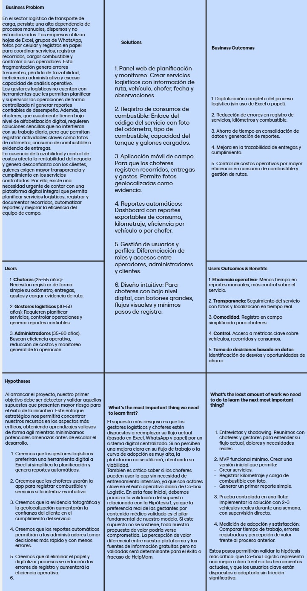

---

### 1.3. Segmentos Objetivo

CoWare ha identificado dos segmentos objetivos principales que representan los usuarios clave dentro del ecosistema del transporte de carga:

**Segmento Primario: Gerencia de Empresas de Transporte de Carga**

Este segmento comprende a las genrecias de pequeñas y medianas empresas (PyMES) del sector logístico que operan flotas de 5 a 30 vehículos, principalmente enfocadas en transporte interprovincial y distribución urbana. Estas empresas se caracterizan por:

- **Perfil organizacional**: Empresas familiares o de estructura tradicional que han dependido de procesos manuales (formularios en papel, Excel, WhatsApp) pero reconocen la necesidad de modernizarse para mantenerse competitivas.

- **Necesidades específicas**: Buscan digitalizar su operación para reducir errores administrativos, mejorar el control de costos operativos, aumentar la trazabilidad de servicios y ofrecer mayor transparencia a sus clientes finales.

- **Roles decisores**: Gerentes de operaciones, coordinadores logísticos y propietarios que requieren información precisa y oportuna para la toma de decisiones, control de flota y generación de reportes gerenciales.

- **Motivaciones clave**: Competir efectivamente con grandes operadores logísticos, optimizar recursos, reducir conflictos internos por discrepancias de datos y fortalecer la confianza con sus clientes.

**Segmento Secundario: Conductores de Unidades de Carga**

Este segmento incluye a los operadores de campo que ejecutan físicamente los servicios de transporte, con experiencia variable en el sector y diferentes niveles de familiaridad tecnológica:

- **Perfil demográfico**: Conductores con experiencia de 3 a 15 años en el sector, edades entre 25 y 55 años, con niveles educativos diversos y habilidades tecnológicas que van desde básicas hasta intermedias.

- **Responsabilidades operativas**: Encargados de registrar eventos críticos del viaje (kilometraje inicial/final, consumo de combustible, entregas realizadas), proporcionar evidencia fotográfica de operaciones y mantener comunicación constante con coordinadores.

- **Necesidades funcionales**: Requieren herramientas simples e intuitivas que no interfieran con su concentración en la conducción, que funcionen en zonas de conectividad limitada y que les proporcionen protección mediante evidencia objetiva de su trabajo.

- **Motivaciones personales**: Facilitar su trabajo diario, evitar conflictos por discrepancias de datos, obtener reconocimiento por desempeño y tener acceso a información que les permita mejorar profesionalmente.


## Capítulo II: Requirements & Analysis

### 2.1. Competidores

Competidor 1: Samsara
Samsara es una plataforma de IoT y telemática para gestión de flotas que ofrece GPS en tiempo real, registro automático de odómetro y combustible, programación de rutas, alertas de mantenimiento y reportes detallados de eficiencia operativa. Está presente en LATAM y cuenta con integraciones fáciles de desplegar en vehículos.

Competidor 2: Fleet Complete
Fleet Complete proporciona soluciones de rastreo GPS, monitoreo de consumo de combustible, gestión de conductores y planificación de servicios. Su enfoque está en la eficiencia de la operación diaria, con dashboards personalizables y API para conectar con ERPs.

Competidor 3: Sendd
Sendd es una startup peruana de última milla que permite programar rutas de entrega, hacer seguimiento en tiempo real y capturar prueba de entrega (fotos, firmas). Aunque no controla combustible, su fortaleza está en la experiencia local y en la usabilidad de su app móvil.

#### 2.1.1. Análisis competitivo

### Competitive Analysis Landscape

**¿Por qué llevar a cabo este análisis?**  
Para identificar cómo otras soluciones gestionan rutas, odómetro, combustible, prueba fotográfica y reportes, y descubrir oportunidades de diferenciación para **CoBox**.

---

### Comparativa de Productos

| Productos            | **CoBox**                                                                 | **Samsara**                                                                 | **Fleet Complete**                                                            | **Sendd**                                                                 |
|----------------------|--------------------------------------------------------------------------------------|------------------------------------------------------------------------------|--------------------------------------------------------------------------------|----------------------------------------------------------------------------|
| **Perfil**           | Programación de servicios, captura de odómetro (foto), registro de combustible y geolocalización, reportes web & móvil. | IoT + telemática: GPS en tiempo real, odómetro automático, control de combustible, alertas de mantenimiento. | Rastreo GPS, monitoreo de combustible, gestión de conductores, planificación de rutas. | Rutas de última milla, seguimiento en tiempo real, proof of delivery (foto/firmas). |
| **Ventaja competitiva** | Flujo completo: unifica foto del odómetro, combustible y ruta en un solo proceso adaptado a transporte de carga. | Madurez de producto y hardware plug-and-play fácil de instalar. | Dashboards personalizables y API robusta para integraciones. | Experiencia local en Perú y UX optimizada para conductores. |

---

### Perfil de Marketing

| Aspecto                   | **CoBox**                                                              | **Samsara**                                   | **Fleet Complete**                                         | **Sendd**                                                 |
|---------------------------|----------------------------------------------------------------------------------|-----------------------------------------------|-------------------------------------------------------------|------------------------------------------------------------|
| **Mercado Objetivo**      | Empresas de transporte de carga refrigerada o seca, supermercados, laboratorios y distribución general. | Flotas medianas y grandes de transporte en LATAM. | Flotas corporativas que requieren integración con ERPs.    | Negocios de e‑commerce y paquetería en Lima y alrededores. |
| **Estrategias de Marketing** | Marketing B2B digital, demos gratuitas, alianzas con talleres y gremios de transporte. | Ferias de logística y partnerships con fabricantes de vehículos. | Partnerships con proveedores de ERP y consultoras.         | Promociones locales y boca a boca en cooperativas de delivery. |

---

### Perfil de Producto

| Aspecto                 | **CoBox**                                         | **Samsara**                                                  | **Fleet Complete**                                                  | **Sendd**                                               |
|-------------------------|-------------------------------------------------------------|---------------------------------------------------------------|---------------------------------------------------------------------|----------------------------------------------------------|
| **Productos & Servicios** | Programación de viajes, captura de odómetro, combustible y temperatura, reportes analíticos. | GPS tracking, scheduling, alertas de mantenimiento, reporte de combustible. | Rastreo GPS, monitoreo de combustible, gestión de conductores, planificación de rutas. | Prueba de entrega con foto/firmas, seguimiento en ruta. |
| **Precios & Costos**     | USD 25/equipo/mes + USD 100 instalación única.             | Desde USD 30/vehículo/mes, hardware incluido.                 | Desde USD 28/vehículo/mes, descuentos anuales.                      | USD 5/entrega + comisión, sin hardware ni suscripción fija. |
| **Canales de distribución** | Web & App móvil (iOS/Android).                            | Web, App móvil y dispositivo plug‑and‑play.                   | Web, App móvil e integraciones API.                                 | App móvil y portal web liviano.                         |

---

### Análisis SWOT

|                        | **CoBox**                                          | **Samsara**                                    | **Fleet Complete**                                 | **Sendd**                                      |
|------------------------|--------------------------------------------------------------|------------------------------------------------|---------------------------------------------------|------------------------------------------------|
| **Fortalezas**         | Integración odómetro + combustible + geolocalización en un solo sistema. | Hardware plug‑and‑play y ecosistema IoT completo. | Dashboards a medida y API robusta.                | Proof of delivery con foto y firmas.          |
| **Debilidades**        | MVP en fase temprana; base de usuarios pequeña.              | Costo inicial alto y curva de configuración.    | Requiere integración técnica y tiempo de onboarding. | No registra combustible ni odómetro.          |
| **Oportunidades**      | Integrar alertas predictivas y expandir a flotas generales.  | Añadir módulos de foto del odómetro y proof of delivery. | Ofrecer paquetes para pymes sin ERP.              | Expandir a gestión de combustible.            |
| **Amenazas**           | Competidores consolidados añadiendo funciones similares.     | Startups más ágiles con UX simplificado.       | Soluciones todo‑en‑uno emergentes.                | Plataformas integrales en LATAM.              |

---

### 2.2. Entrevistas

#### 2.2.1 Diseño de entrevistas

**Segmento 1: Gerencia de flota**

1. ¿Cuál es su rol y responsabilidades principales?  
2. ¿Cuántos vehículos administra y qué tipos de rutas realiza?  
3. ¿Cómo registra hoy el odómetro y el consumo de combustible?  
4. ¿Utiliza software o formularios en papel para programar y reportar servicios?  
5. ¿Qué problemas más frecuentes encuentra en la gestión de rutas y consumo?  
6. ¿Con qué frecuencia revisa los reportes de eficiencia de su flota?  
7. ¿Qué datos le gustaría recibir automáticamente después de cada viaje?  
8. ¿Cómo impactan las discrepancias de kilometraje o combustible en su operación diaria?  
9. ¿Qué tan dispuesto estaría a adoptar una app que integre fotos de odómetro y reportes automáticos?  
10. ¿Cuál es el presupuesto mensual aproximado que invertiría en este tipo de herramienta?  

**Segmento 2: Conductores/operadores de ruta**

1. ¿Cuál es su experiencia conduciendo rutas de carga?  
2. ¿Cómo registra actualmente el inicio y fin de cada viaje?  
3. ¿Toma fotos del odómetro o anota el kilometraje manualmente?  
4. ¿Cuánto tiempo le toma completar el registro de combustible y odómetro hoy?  
5. ¿Qué dificultades tiene al usar apps o formularios para reportar su viaje?  
6. ¿Preferiría usar una app móvil con botones claros para “Iniciar”, “Foto odómetro” y “Fin”?  
7. ¿Qué tan útil le resultaría una geolocalización automática de cada parada?  
8. ¿Le preocupa la precisión del kilometraje que ingresa?  
9. ¿Qué comentarios o sugerencias tendría para que la app sea fácil de usar en ruta?  
10. ¿Qué incentivos podrían motivarlo a completar su reporte diario a tiempo?  

#### 2.2.2 Registro de entrevistas

**Segmento 1: Gerencia de flota**

- **Entrevista #1**

<p align="center">
  
</p>

Roberto Martínez, gerente de una flota de 15 camiones, enfrenta problemas con el registro manual en papel, que genera errores, campos incompletos y pérdida de documentos. Este método retrasa la información 24-48 horas, dificultando decisiones oportunas. Las discrepancias en kilometraje afectan costos de combustible y mantenimiento, además de generar conflictos con conductores y clientes.

Coordina por WhatsApp, pero el desorden complica la gestión. Necesita una herramienta digital que proporcione datos en tiempo real, kilometraje exacto, consumo de combustible con evidencia, ubicación de paradas y confirmaciones fotográficas de entregas para mejorar trazabilidad y servicio al cliente.

Está dispuesto a invertir entre S/800 y S/1,200 mensuales si la solución ahorra tiempo administrativo y reduce costos operativos. Valora que incluya capacitación, soporte técnico y actualizaciones, dado su escepticismo por experiencias previas con herramientas poco confiables.

<div align="center">

| Detalle           | Información                    |
|-------------------|--------------------------------|
| **Entrevistador** | Jhon Alexander Galvez Chambi  |
| **Entrevistado**  | Roberto Martinez              |
| **Edad**          | 31 años                       |
| **Duración**      | 11:52 minutos                 |
| **Enlace**        | https://shorturl.at/prt7H     |

</div>

- **Entrevista #2**

<p align="center">
  
</p>

María Cabello Alzate, de 24 años y con cuatro años de experiencia en gestión de flotas en La Victoria (Chiclayo), supervisa alrededor de 25 camiones que cubren rutas regionales y de última milla. Actualmente, los choferes anotan el odómetro y el consumo de combustible en formularios impresos, envían fotos por WhatsApp y ella consolida manualmente todo en Excel, lo que provoca errores de transcripción, fotos de baja calidad o sin geolocalización y demoras de uno o dos días en disponer de información fiable. Para mejorar la eficiencia, María busca una plataforma que registre automáticamente el kilometraje, los litros cargados, la ubicación GPS de inicio y fin de ruta, y una fotografía clara del odómetro con fecha y hora. Revisa semanalmente un dashboard en Excel y presenta un informe mensual a la gerencia; estaría dispuesta a invertir entre USD 400 y USD 600 al mes si el sistema le permite ahorrar al menos esa misma cifra en tiempo y costos operativos, siempre y cuando la curva de aprendizaje sea mínima y los beneficios sean inmediatos.

<div align="center">

| Detalle          | Información                                |
|------------------|--------------------------------------------|
| **Entrevistador** | Joseph Pablo Rodriguez Parco           |
| **Entrevistado**  | Maria Cabello Alzate                   |
| **Edad**          | 24 años                                |
| **Duración**      | 5:00 minutos                               |
| **Enlace**        | https://shorturl.at/sRNaN |

</div>

- **Entrevista #3**

<br>

<p align="center">
  
</p>

El rol que tiene es ver la programación para las unidades, revisar el gps de cada unidad, estar al tanto de la operación de cada vehículo, maneja 38 vehículos lo cual tienen una ruta de lima a provincias, el registra el consumo de combustible a través de formatos que se llenan manualmente, la frecuencia que tiene de revisión es cada 2 días, lo que espera de una pagina web ver el consumo de combustible, el rendimiento del combustible, gastos de peajes y cosas esenciales para una buena gestión de sus unidades, nos dice que la aplicación seria de mucha utilidad ya que ellos hacen sus registros manualmente, lo que el quiere es la facilidad de accesibilidad de la web.


| Detalle          | Información                |
|------------------|----------------------------|
| **Entrevistador** | Raul Sanchez Cruz         |
| **Entrevistado**  | Jorge Perez               |
| **Edad**          | 44 años                   |
| **Duración**      | 3:16 minutos              |
| **Enlace**        | https://shorturl.at/I7pGH |

</div>

---

**Segmento 2: Conductores/operadores de ruta**

- **Entrevista #4**

<p align="center">
  
</p>

Miguel, conductor de carga con 8 años de experiencia en rutas de Lima y el interior, encuentra tedioso y propenso a errores su actual registro manual en papel. A menudo olvida anotar datos a tiempo y debe tomar fotos del odómetro, lo que complica el proceso por falta de luz, suciedad o prisa. Estima que dedica hasta 45 minutos diarios a estos registros.

Para él, una app ideal sería simple, con botones grandes, funcional sin internet y con confirmaciones visuales. Valora la geolocalización automática para justificar demoras y protegerse ante reclamos. También desea que la app registre el kilometraje con precisión para evitar dudas de la empresa.

Miguel busca una herramienta que simplifique su trabajo, ahorre tiempo y permita reportar incidentes fácilmente. Lo motivaría el reconocimiento público y objetivo de su buen desempeño, más allá de incentivos económicos.

<div align="center">

| Detalle          | Información                            |
|------------------|----------------------------------------|
| **Entrevistador** | Jhon Alexander Galvez Chambi          |
| **Entrevistado**  | Miguel Torres                         |
| **Edad**          | 26 años                               |
| **Duración**      | 7:31 minutos                          |
| **Enlace**        | https://shorturl.at/fVAKN             |

</div>


- **Entrevista #5**

<p align="center">
  
</p>

Alonso es un conductor de carga experimentado que actualmente registra sus viajes de forma manual en una libreta. Ha tenido malas experiencias con aplicaciones móviles debido a su lentitud, registros complejos y la cantidad de información que piden.

Busca una aplicación simple, rápida y sin necesidad de internet, que funcione con botones claros para iniciar y finalizar el viaje. Le gustaría una geolocalización automática para no olvidar las paradas y una alta precisión en el kilometraje, ya que su empresa es muy estricta al respecto. Como incentivo, le motivarían bonos, reconocimientos o la garantía de que no le descontarán por errores en sus reportes.

<div align="center">

| Detalle          | Información                  |
|------------------|----------------------------|
| **Entrevistador** | Joaquín Pedraza Maldonado   |
| **Entrevistado**  | Alonso Rafael               |
| **Edad**          |  23 años                    |
| **Duración**      |  3:58 minutos               |
| **Enlace**        | https://youtu.be/-YnaG3hX8B |

</div>

- **Entrevista #6**

<p align="center">
  
</p>

Carlos tiene más de 10 años de experiencia en transporte de carga dentro de Lima. Registra sus viajes en un cuaderno y envía mensajes por WhatsApp; además, toma fotos del odómetro, aunque llenar los reportes le toma unos 10 minutos.
Menciona que los principales problemas son la mala señal y la complejidad de los formularios. Le gustaría una app sencilla con botones claros e integración de geolocalización automática.
Le preocupa equivocarse en el kilometraje y sugiere que la app funcione también sin conexión. Como incentivo, considera útil un bono por puntualidad junto con un proceso más ágil.

<div align="center">

| Detalle          | Información                |
|------------------|----------------------------|
| **Entrevistador** |  Merly Salon Puerta       |
| **Entrevistado**  |  Carlos Gonzales          |
| **Edad**          |  29 años                  |
| **Duración**      |  3:45 minutos             |
| **Enlace**        | https://shorturl.at/x8AN2 |

</div>

#### 2.2.3. Análisis de entrevistas

##### Segmento: Empresas de Transporte de Carga (Gerencia de Flota)

Las entrevistas realizadas revelan que los gerentes y coordinadores de flota enfrentan desafíos operativos similares, independientemente del tamaño de su operación (15-38 vehículos).

<p align="center">
    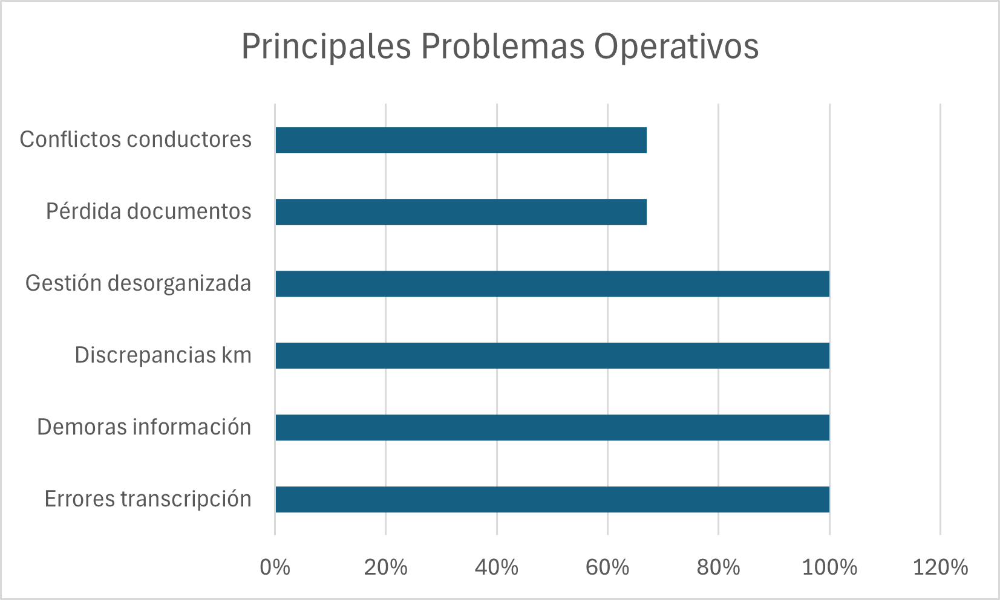
</p>

- **Problemas identificados:**
        - Procesos manuales actuales (papel, WhatsApp, Excel) generan:
                - Errores de transcripción.
                - Pérdida de información.
                - Demoras de 24-48 horas para obtener datos confiables.
        - Desorganización y conflictos internos debido a discrepancias en kilometraje y consumo de combustible.

<p align="center">
    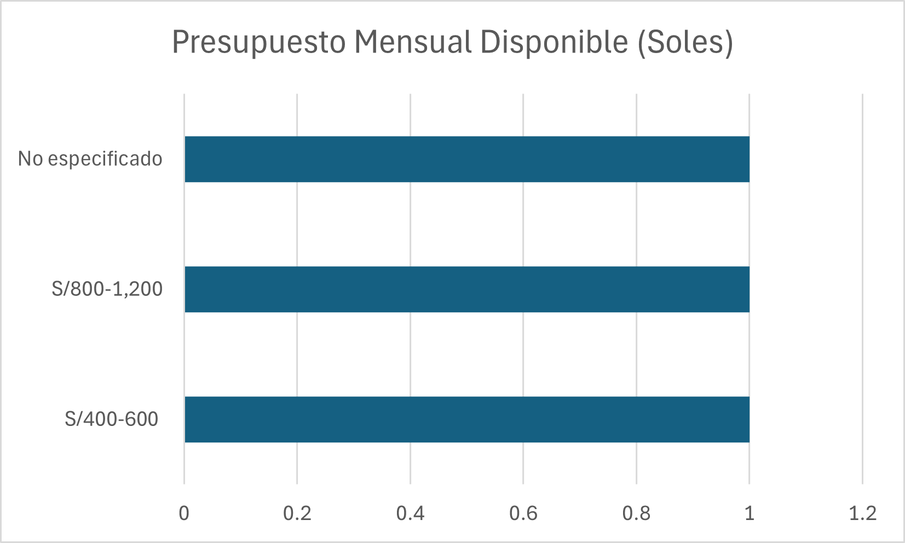
</p>

- **Disposición a invertir:**
        - Entre S/400 y S/1,200 mensuales, siempre que la solución:
                - Demuestre ahorro administrativo tangible.
                - Incluya capacitación y soporte técnico confiable.

<p align="center">
    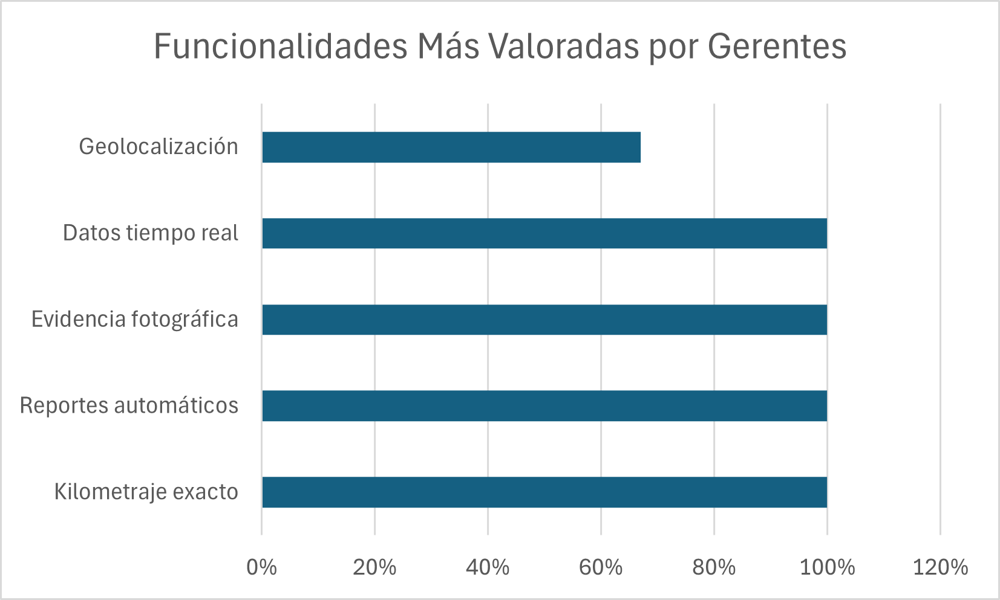
</p>

- **Necesidades clave:**
        - Herramientas que proporcionen:
                - Datos en tiempo real.
                - Evidencia fotográfica automática.
                - Trazabilidad completa para mejorar el control de costos y la relación con clientes.

##### Segmento: Conductores/Operadores de Ruta

Las entrevistas con conductores, independientemente de su experiencia (3-10 años), destacan los siguientes puntos:

<p align="center">
    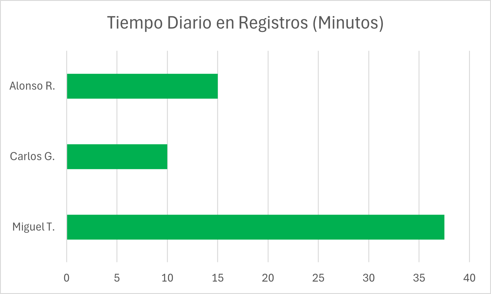
</p>

- **Problemas identificados:**
        - Registro manual percibido como:
                - Tedioso y propenso a errores.
                - Consumo excesivo de tiempo (10-45 minutos diarios).
                - Distracción de la conducción segura.

<p align="center">
    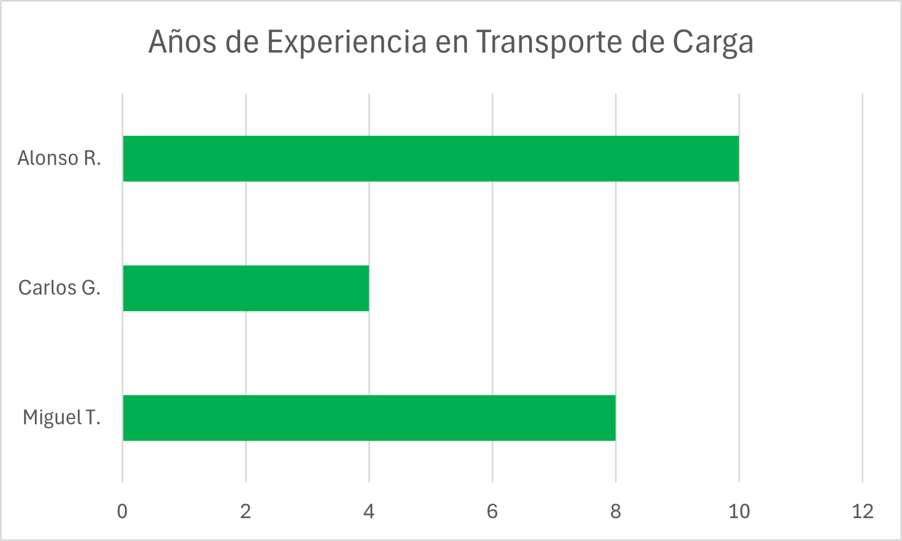
</p>

- **Preocupaciones compartidas:**
        - Precisión del kilometraje como fuente de estrés laboral, debido a la necesidad de justificar discrepancias sin evidencia objetiva.

<p align="center">
    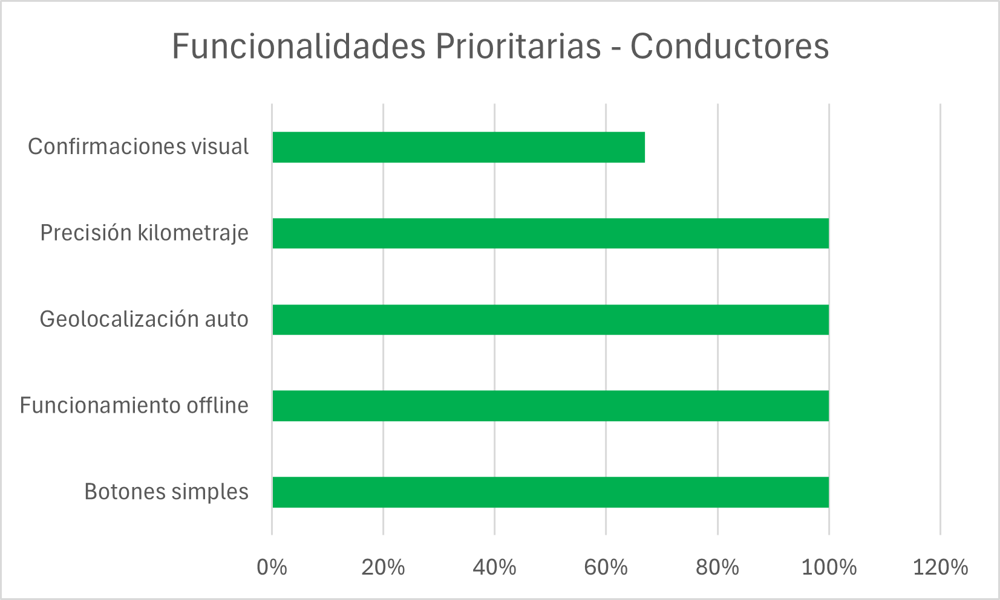
</p>

- **Necesidades clave:**
        - Aplicación que sea:
                - Simple, con botones grandes y confirmaciones visuales claras.
                - Funcional sin conexión a internet.
                - Capaz de proporcionar geolocalización automática para:
                        - Justificar demoras o desvíos.
                        - Proteger ante reclamos.

- **Actitud hacia herramientas digitales:**
        - Apertura a soluciones que simplifiquen su trabajo.
        - Preferencia por reconocimiento de desempeño sobre incentivos económicos complejos.

### 2.3. Needfinding

#### 2.3.1. User Personas

Un user persona es una representación ficticia y detallada de un grupo de usuarios que comparten características, necesidades y comportamientos similares. Se utiliza para comprender mejor las motivaciones, objetivos y problemas de los usuarios, ayudando a diseñar productos o servicios que satisfagan sus expectativas. El user persona se basa en datos reales obtenidos de investigaciones y entrevistas, pero se presenta de manera resumida para facilitar la toma de decisiones en el diseño. A continuacón presentamos las User Personas de nuestro proyecto Coo-box logistic:

Segmento 1: Gestores de Flota
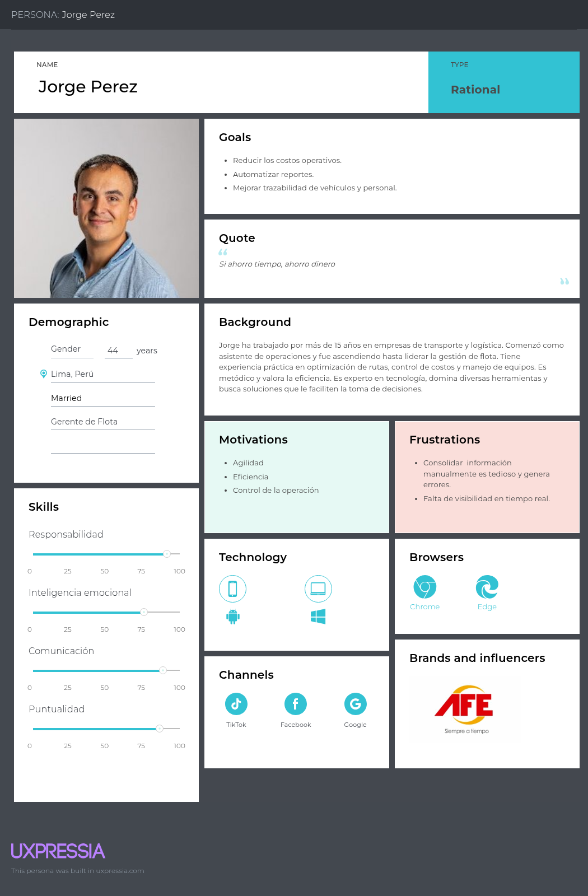
Segmento 2: Conductores de Transporte
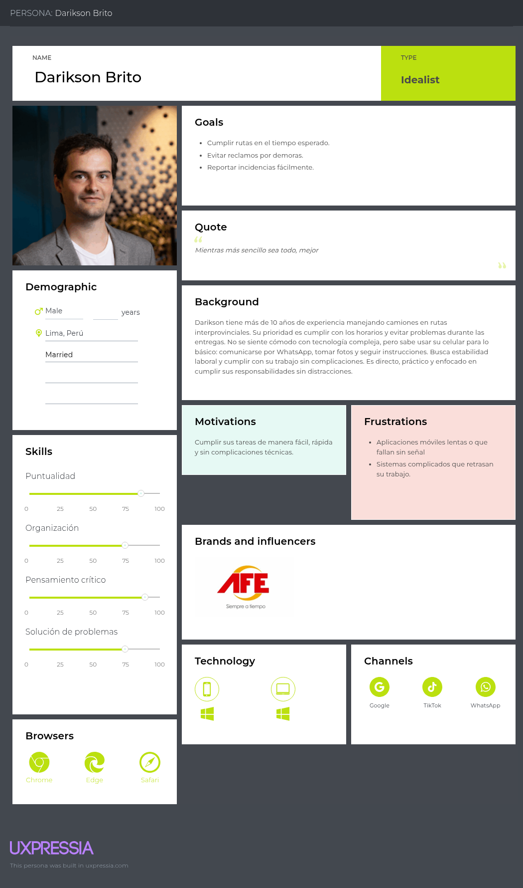


#### 2.3.2. User Task Matrix

| Tareas / User Persona     | Jorge Perez (Frec.) | Jorge Perez (Imp.) | Darikson Brito (Frec.) | Darikson Brito (Imp.) |
|---------------------------|---------------------|---------------------|-------------------------|------------------------|
| **Planificar rutas**      | Alta                | Alta                | N/A                     | N/A                    |
| **Coordinar entregas**    | Alta                | Alta                | Media                   | Alta                   |
| **Registrar kilometraje** | Media               | Alta                | Alta                    | Alta                   |
| **Reportar combustible**  | Media               | Alta                | Alta                    | Alta                   |
| **Consolidar datos**      | Alta                | Alta                | N/A                     | N/A                    |
| **Generar reportes**      | Media               | Alta                | N/A                     | N/A                    |
| **Foto del odómetro**     | Baja                | Media               | Media                   | Alta                   |
| **Usar apps móviles**     | Media               | Alta                | Baja                    | Alta                   |
| **Verificar entregas**    | Alta                | Alta                | Media                   | Alta                   |
| **Atender reclamos**      | Media               | Alta                | Baja                    | Media                  |

---

### Conclusiones:
- Ambos valoran **registrar kilometraje y consumo de combustible**.
- **Jorge Perez** (frecuente e importante) se enfoca en **análisis y consolidación**.
- **Darikson Brito** (frecuente e importante) se enfoca en **ejecución operativa**.
- La app debe enfocarse en **tareas compartidas y críticas**, optimizando especialmente la experiencia de registro de kilometraje, combustible y verificación de entregas.


#### 2.3.3. Empathy Maps
El Empathy Mapping es una herramienta utilizada para comprender mejor a los usuarios o clientes al explorar sus pensamientos, sentimientos, comportamientos y necesidades. Se organiza en secciones como ¿Qué escucha?, ¿Qué ve?, ¿Qué piensa y siente?, ¿Qué dice y hace?, Frustraciones y Motivaciones. Ayuda a los equipos de diseño a crear soluciones más alineadas con las experiencias y perspectivas de los usuarios. A continuación los mapas de empatía de los dos segmento de nuestro proyecto Coo-box Logistic:

Segmento 1: Gestores de Flota
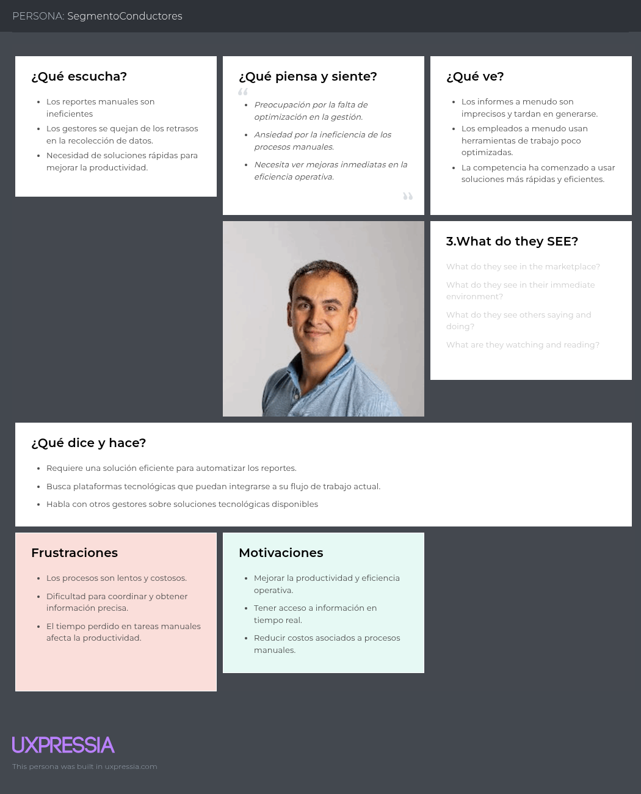
Segmento 2: Conductores de Transporte
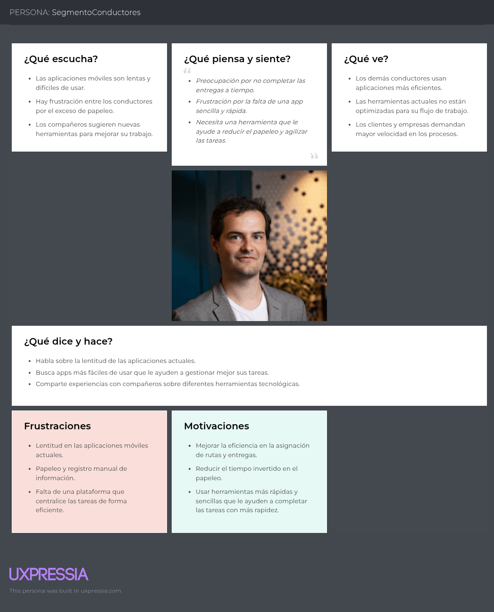

#### 2.3.4. As-is Scenario Mapping
Segmento 1: Gestores de Flota
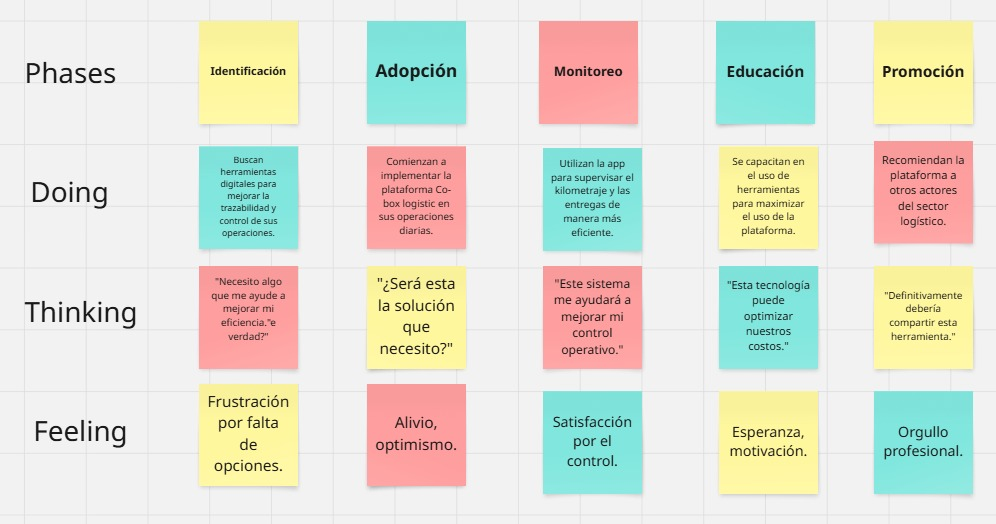
Segmento 2: Conductores de Transporte
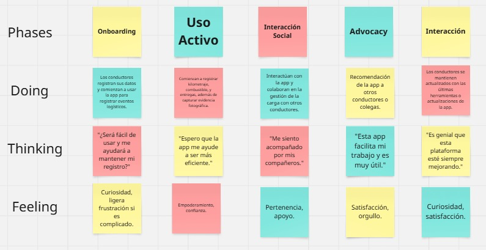


---

## Capítulo III: Requirements Specification

### 3.1. To-Be Scenario Mapping

Segmento 1: Gestores de Flota
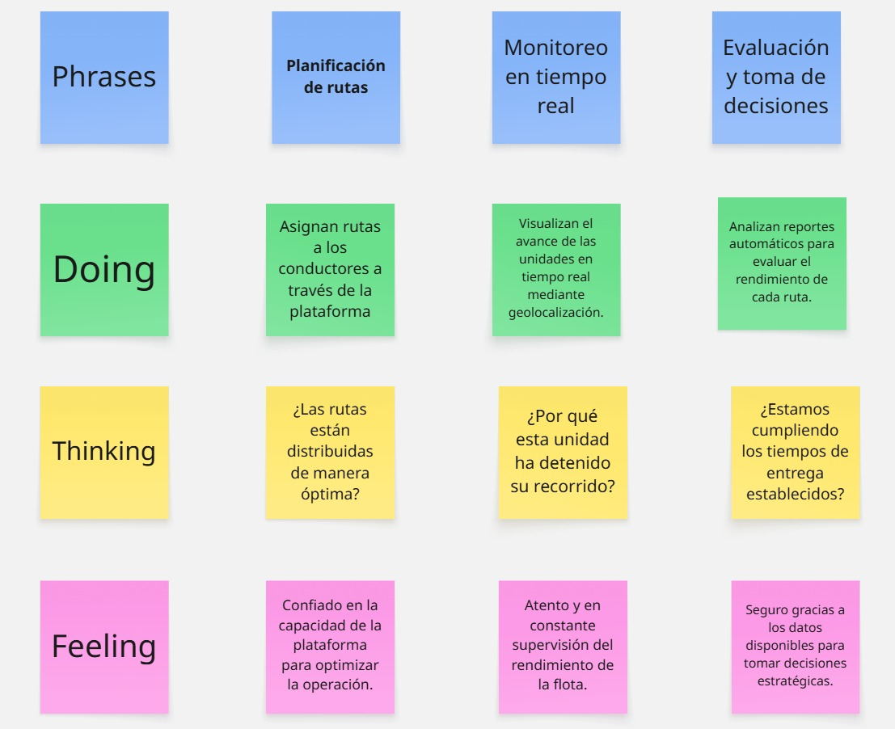
Segmento 2: Conductores de Transporte
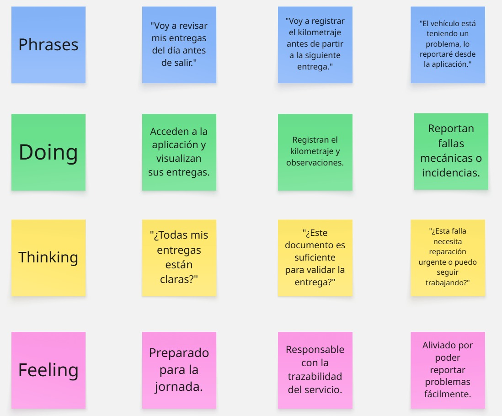

### 3.2. User Stories

### Epics

| Epics ID | Título                           | Descripción                                                                                     |
|----------|----------------------------------|-------------------------------------------------------------------------------------------------|
| EP01     | Gestión de flota                | Como gestor quiero tener control total de las unidades de transporte, rutas y mantenimientos. |
| EP02     | Gestión de entregas             | Como conductor quiero registrar y visualizar mis entregas para tener claridad en mis tareas.  |
| EP03     | Gestión de incidencias          | Como conductor o gestor quiero reportar y visualizar incidencias para actuar rápidamente.     |
| EP04     | Gestión de mantenimiento        | Como gestor quiero planificar y llevar control de los mantenimientos de cada vehículo.         |
| EP05     | Gestión de indicadores          | Como gestor quiero ver reportes e indicadores automáticos para evaluar el desempeño diario.    |
| EP-LP    | Sitio web estático              | Como visitante quiero conocer los servicios y características de la plataforma para decidir si contratar.|
| EP-API   | API RESTful                     | Como desarrollador quiero acceder a los servicios mediante endpoints para integrarlos con otras aplicaciones. |
### User Stories 
 <table>
    <thead>
        <tr>
            <th>Epic/Story ID</th>
            <th>Título</th>
            <th>Descripción</th>
            <th>Criterios de Aceptación</th>
            <th>Relacionada con (Epic ID)</th>
        </tr>
    </thead>
    <tbody>
        <tr>
            <td>US-01</td>
            <td>Consultar rutas asignadas</td>
            <td>Como gestor, quiero conocer las rutas asignadas a cada unidad para supervisar su cumplimiento operativo.</td>
            <td>
                Escenario 01: Consulta de rutas<br>
                Dado que el gestor accede al módulo de unidades<br>
                Cuando consulta una unidad específica<br>
                Entonces el sistema proporciona la información de ruta, horarios y destinos.
            </td>
            <td>EP01</td>
        </tr>
        <tr>
            <td>US-02</td>
            <td>Asignar unidades a rutas</td>
            <td>Como gestor, quiero asignar unidades de transporte a rutas específicas para controlar la operación.</td>
            <td>
                Escenario 01: Asignación de unidad<br>
                Dado que el gestor accede a la sección de asignaciones<br>
                Cuando selecciona una ruta y una unidad disponible<br>
                Entonces el sistema registra la asignación correctamente.
            </td>
            <td>EP01</td>
        </tr>
        <tr>
            <td>US-03</td>
            <td>Actualizar estado de unidad</td>
            <td>Como gestor, quiero marcar una unidad como disponible o en mantenimiento para una mejor gestión.</td>
            <td>
                Escenario 01: Actualización de estado<br>
                Dado que el gestor selecciona una unidad<br>
                Cuando modifica su estado a disponible o en mantenimiento<br>
                Entonces el sistema refleja correctamente el nuevo estado.
            </td>
            <td>EP01</td>
        </tr>
        <tr>
            <td>US-04</td>
            <td>Consultar historial de movimientos</td>
            <td>Como gestor, quiero revisar el historial de movimientos de una unidad para rastrear su actividad.</td>
            <td>
                Escenario 01: Revisión de historial<br>
                Dado que el gestor accede al detalle de una unidad<br>
                Cuando consulta el historial de movimientos<br>
                Entonces el sistema entrega una lista con fechas y tipos de movimiento.
            </td>
            <td>EP01</td>
        </tr>
        <tr>
            <td>US-05</td>
            <td>Consultar entregas asignadas</td>
            <td>Como conductor, quiero conocer las entregas asignadas del día para planificar mi jornada.</td>
            <td>
                Escenario 01: Revisión de entregas<br>
                Dado que el conductor ha iniciado sesión<br>
                Cuando accede a su información de entregas<br>
                Entonces el sistema presenta las entregas con datos de hora, cliente y dirección.
            </td>
            <td>EP02</td>
        </tr>
        <tr>
            <td>US-06</td>
            <td>Registrar evidencia de entrega</td>
            <td>Como conductor, quiero dejar constancia de entregas realizadas mediante evidencia para validarlas.</td>
            <td>
                Escenario 01: Registro de entrega<br>
                Dado que se finaliza una entrega<br>
                Cuando se adjunta la información de evidencia<br>
                Entonces el sistema almacena los datos con fecha, hora y ubicación.
            </td>
            <td>EP02</td>
        </tr>
        <tr>
            <td>US-07</td>
            <td>Revisar entregas completadas</td>
            <td>Como conductor, quiero consultar mis entregas pasadas para llevar control de mis actividades.</td>
            <td>
                Escenario 01: Consulta de historial<br>
                Dado que el conductor accede al módulo de entregas<br>
                Cuando filtra por fecha<br>
                Entonces el sistema muestra la información correspondiente.
            </td>
            <td>EP02</td>
        </tr>
        <tr>
            <td>US-08</td>
            <td>Registrar inicio de ruta</td>
            <td>Como conductor, quiero confirmar el inicio de mi ruta para registrar la hora de salida.</td>
            <td>
                Escenario 01: Registro de inicio<br>
                Dado que el conductor cuenta con entregas asignadas<br>
                Cuando inicia su jornada<br>
                Entonces el sistema registra la hora de salida.
            </td>
            <td>EP02</td>
        </tr>
        <tr>
            <td>US-09</td>
            <td>Reportar incidente</td>
            <td>Como conductor, quiero reportar incidentes durante la entrega para que el gestor pueda intervenir.</td>
            <td>
                Escenario 01: Registro de incidente<br>
                Dado que ocurre un problema en ruta<br>
                Cuando se reporta con evidencia<br>
                Entonces el sistema notifica al responsable correspondiente.
            </td>
            <td>EP03</td>
        </tr>
        <tr>
            <td>US-10</td>
            <td>Consultar incidencias</td>
            <td>Como gestor, quiero revisar las incidencias activas para tomar decisiones rápidas.</td>
            <td>
                Escenario 01: Revisión de incidencias<br>
                Dado que existen incidencias registradas<br>
                Cuando el gestor accede a la información<br>
                Entonces el sistema presenta datos como unidad, fecha y gravedad.
            </td>
            <td>EP03</td>
        </tr>
        <tr>
            <td>US-11</td>
            <td>Filtrar incidencias</td>
            <td>Como gestor, quiero filtrar las incidencias por gravedad para priorizar acciones.</td>
            <td>
                Escenario 01: Aplicación de filtros<br>
                Dado que hay múltiples incidencias<br>
                Cuando se selecciona un nivel de gravedad<br>
                Entonces el sistema presenta solo las que corresponden al filtro.
            </td>
            <td>EP03</td>
        </tr>
        <tr>
            <td>US-12</td>
            <td>Revisar historial de incidencias</td>
            <td>Como gestor, quiero analizar incidencias pasadas para tomar decisiones preventivas.</td>
            <td>
                Escenario 01: Consulta histórica<br>
                Dado que el gestor accede a registros anteriores<br>
                Cuando filtra por fechas<br>
                Entonces el sistema muestra detalles y estado de resolución.
            </td>
            <td>EP03</td>
        </tr>
        <tr>
            <td>US-13</td>
            <td>Programar mantenimiento</td>
            <td>Como gestor, quiero definir mantenimientos periódicos para evitar fallos imprevistos.</td>
            <td>
                Escenario 01: Planificación<br>
                Dado que el gestor selecciona una unidad<br>
                Cuando define la frecuencia de mantenimiento<br>
                Entonces el sistema agenda las fechas correspondientes.
            </td>
            <td>EP04</td>
        </tr>
        <tr>
            <td>US-14</td>
            <td>Registrar mantenimiento</td>
            <td>Como técnico, quiero documentar el mantenimiento realizado para dejar constancia.</td>
            <td>
                Escenario 01: Registro<br>
                Dado que el mantenimiento fue realizado<br>
                Cuando se documentan las acciones realizadas<br>
                Entonces el sistema almacena el informe en el historial.
            </td>
            <td>EP04</td>
        </tr>
        <tr>
            <td>US-15</td>
            <td>Consultar mantenimientos próximos</td>
            <td>Como gestor, quiero conocer las próximas fechas de mantenimiento para planificar con anticipación.</td>
            <td>
                Escenario 01: Consulta de agenda<br>
                Dado que hay mantenimientos programados<br>
                Cuando se accede al calendario<br>
                Entonces el sistema muestra las fechas por unidad.
            </td>
            <td>EP04</td>
        </tr>
        <tr>
            <td>US-16</td>
            <td>Recibir alertas de mantenimiento</td>
            <td>Como gestor, quiero recibir alertas de mantenimiento próximo para evitar retrasos.</td>
            <td>
                Escenario 01: Generación de alertas<br>
                Dado que se acerca una fecha de mantenimiento<br>
                Cuando faltan 3 días<br>
                Entonces el sistema envía una alerta automática.
            </td>
            <td>EP04</td>
        </tr>
        <tr>
            <td>US-17</td>
            <td>Generar reporte semanal</td>
            <td>Como gestor, quiero ver reportes semanales de entregas para evaluar el rendimiento del personal.</td>
            <td>
                Escenario 01: Visualización de reporte<br>
                Dado que ha concluido la semana<br>
                Cuando se accede al módulo de reportes<br>
                Entonces el sistema presenta estadísticas de cumplimiento por conductor.
            </td>
            <td>EP05</td>
        </tr>
        <tr>
            <td>US-18</td>
            <td>Evaluar eficiencia por unidad</td>
            <td>Como gestor, quiero conocer el rendimiento por unidad para tomar decisiones de uso.</td>
            <td>
                Escenario 01: Evaluación de rendimiento<br>
                Dado que hay datos de entregas y kilometraje<br>
                Cuando se accede al análisis<br>
                Entonces el sistema presenta eficiencia por unidad.
            </td>
            <td>EP05</td>
        </tr>
        <tr>
            <td>US-19</td>
            <td>Comparar desempeño entre conductores</td>
            <td>Como gestor, quiero comparar a los conductores para fomentar mejores prácticas.</td>
            <td>
                Escenario 01: Comparación de desempeño<br>
                Dado que existen registros suficientes<br>
                Cuando se selecciona un periodo<br>
                Entonces el sistema genera un ranking con métricas relevantes.
            </td>
            <td>EP05</td>
        </tr>
        <tr>
            <td>US-20</td>
            <td>Monitorear alertas críticas</td>
            <td>Como gestor, quiero visualizar alertas críticas del sistema para tomar acciones inmediatas.</td>
            <td>
                Escenario 01: Visualización de alertas<br>
                Dado que existen alertas activas<br>
                Cuando se accede al panel principal<br>
                Entonces el sistema muestra las de mayor prioridad destacadas.
            </td>
            <td>EP05</td>
        </tr>
                <tr>
            <td>US-21</td>
            <td>Consultar información de servicios</td>
            <td>Como visitante, quiero conocer los servicios disponibles para evaluar si se adecuan a mis necesidades.</td>
            <td>
                Escenario 01: Acceso a información<br>
                Dado que el visitante accede al sitio web<br>
                Cuando recorre la sección informativa<br>
                Entonces el sistema presenta descripciones claras de los servicios.<br><br>
                Escenario 02: Consulta de características<br>
                Dado que se requiere mayor detalle<br>
                Cuando se solicita información específica<br>
                Entonces el sistema entrega las características correspondientes.
            </td>
            <td>EP-LP</td>
        </tr>
        <tr>
            <td>US-22</td>
            <td>Solicitar demostración</td>
            <td>Como visitante, quiero registrar interés en una demostración para conocer mejor el sistema.</td>
            <td>
                Escenario 01: Registro exitoso<br>
                Dado que se ingresan datos válidos<br>
                Cuando se envía la solicitud<br>
                Entonces el sistema confirma la recepción y describe el siguiente paso.<br><br>
                Escenario 02: Registro inválido<br>
                Dado que se ingresan datos incompletos<br>
                Cuando se procesa la solicitud<br>
                Entonces el sistema informa los errores identificados.
            </td>
            <td>EP-LP</td>
        </tr>
        <tr>
            <td>US-23</td>
            <td>Consultar planes y precios</td>
            <td>Como visitante, quiero comparar los planes disponibles para elegir el que mejor se adapta.</td>
            <td>
                Escenario 01: Comparación de planes<br>
                Dado que se accede a la sección de precios<br>
                Cuando se consulta la información<br>
                Entonces el sistema presenta detalles y precios de cada plan.<br><br>
                Escenario 02: Elección de plan<br>
                Dado que se elige un plan<br>
                Cuando se solicita continuar<br>
                Entonces el sistema redirige a la sección correspondiente con el plan predefinido.
            </td>
            <td>EP-LP</td>
        </tr>
        <tr>
            <td>US-24</td>
            <td>Solicitar asistencia</td>
            <td>Como visitante, quiero contactar con el soporte para resolver dudas sobre el servicio.</td>
            <td>
                Escenario 01: Envío de consulta<br>
                Dado que se redacta un mensaje de contacto<br>
                Cuando se envía la solicitud<br>
                Entonces el sistema registra la consulta y comunica un tiempo estimado de respuesta.<br><br>
                Escenario 02: Acceso a preguntas frecuentes<br>
                Dado que se buscan respuestas previas<br>
                Cuando se accede a la sección informativa<br>
                Entonces el sistema presenta las preguntas frecuentes disponibles.
            </td>
            <td>EP-LP</td>
        </tr>
        <tr>
            <td>US-25</td>
            <td>Consultar casos de éxito</td>
            <td>Como visitante, quiero revisar casos de éxito para conocer experiencias reales con el sistema.</td>
            <td>
                Escenario 01: Revisión de testimonios<br>
                Dado que se accede a la sección de experiencias<br>
                Cuando se selecciona un caso<br>
                Entonces el sistema presenta el contenido completo con resultados.<br><br>
                Escenario 02: Filtrado de casos<br>
                Dado que se requiere una vista segmentada<br>
                Cuando se filtra por industria<br>
                Entonces el sistema muestra solo los casos relacionados.
            </td>
            <td>EP-LP</td>
        </tr>
        <tr>
    <td>US-26</td>
    <td>Autenticación y gestión de roles</td>
    <td>Como administrador, quiero registrar usuarios, iniciar sesión y asignar roles según el perfil (gestor, conductor o técnico) para controlar los accesos dentro del sistema.</td>
    <td>
        Escenario 01: Registro de usuario<br>
        Dado que el administrador desea registrar un nuevo usuario<br>
        Cuando completa los datos requeridos y selecciona el rol correspondiente<br>
        Entonces el sistema crea el usuario y le asigna los permisos adecuados.<br><br>
        Escenario 02: Inicio de sesión<br>
        Dado que un usuario registrado accede al sistema<br>
        Cuando ingresa sus credenciales válidas<br>
        Entonces el sistema valida el acceso y retorna un token JWT.<br><br>
        Escenario 03: Asignación y actualización de roles<br>
        Dado que el administrador desea modificar permisos<br>
        Cuando selecciona un usuario existente y cambia su rol<br>
        Entonces el sistema actualiza la información y notifica el cambio.
    </td>
    <td>EP-API</td>
      </tr>
        <tr>
            <td>TS-01</td>
            <td>Autenticación API</td>
            <td>Como desarrollador, quiero implementar autenticación mediante JWT para proteger el acceso a la API.</td>
            <td>
                Escenario 01: Autenticación válida<br>
                Dado que se envían credenciales correctas<br>
                Cuando la API las procesa<br>
                Entonces retorna un token JWT y código 200.<br><br>
                Escenario 02: Autenticación fallida<br>
                Dado que las credenciales son incorrectas<br>
                Cuando se procesa la solicitud<br>
                Entonces se retorna error con código 401.<br><br>
                Escenario 03: Token expirado<br>
                Dado que se utiliza un token vencido<br>
                Cuando se realiza una solicitud<br>
                Entonces el sistema retorna error 401 por expiración.
            </td>
            <td>EP-API</td>
        </tr>
        <tr>
            <td>TS-02</td>
            <td>Gestión de unidades vía API</td>
            <td>Como desarrollador, quiero usar endpoints CRUD para gestionar unidades desde aplicaciones externas.</td>
            <td>
                Escenario 01: Consulta de unidades<br>
                Dado que se realiza una solicitud GET autorizada<br>
                Cuando se consulta /api/units<br>
                Entonces la API retorna la lista de unidades.<br><br>
                Escenario 02: Registro de unidad<br>
                Dado que se proporciona información válida<br>
                Cuando se envía una solicitud POST<br>
                Entonces la API registra la unidad y retorna código 201.<br><br>
                Escenario 03: Datos inválidos<br>
                Dado que la solicitud contiene errores<br>
                Cuando la API valida los datos<br>
                Entonces retorna error con código 400.
            </td>
            <td>EP-API</td>
        </tr>
        <tr>
            <td>TS-03</td>
            <td>Gestión de entregas vía API</td>
            <td>Como desarrollador, quiero usar endpoints para registrar y consultar entregas desde apps móviles.</td>
            <td>
                Escenario 01: Registro de entrega<br>
                Dado que se proporciona información válida<br>
                Cuando se envía una solicitud POST<br>
                Entonces la API guarda la entrega y retorna su ID.<br><br>
                Escenario 02: Consulta de entregas<br>
                Dado que se desea consultar entregas por conductor<br>
                Cuando se usa un filtro adecuado<br>
                Entonces la API retorna los resultados correspondientes.<br><br>
                Escenario 03: Actualización de estado<br>
                Dado que se requiere cambiar el estado de una entrega<br>
                Cuando se envía una solicitud PATCH<br>
                Entonces el estado se actualiza correctamente.
            </td>
            <td>EP-API</td>
        </tr>
        <tr>
            <td>TS-04</td>
            <td>Gestión de incidencias vía API</td>
            <td>Como desarrollador, quiero implementar endpoints para reportar y resolver incidencias del sistema.</td>
            <td>
                Escenario 01: Reporte de incidencia<br>
                Dado que se ingresa información válida<br>
                Cuando se envía a /api/incidents<br>
                Entonces la API registra el incidente y notifica.<br><br>
                Escenario 02: Consulta de incidencias activas<br>
                Dado que se requiere información filtrada<br>
                Cuando se usa active=true<br>
                Entonces la API devuelve solo las incidencias pendientes.<br><br>
                Escenario 03: Cierre de incidencia<br>
                Dado que se resuelve un incidente<br>
                Cuando se actualiza su estado<br>
                Entonces la API marca como resuelta y notifica al interesado.
            </td>
            <td>EP-API</td>
        </tr>
        <tr>
            <td>TS-05</td>
            <td>Consulta de estadísticas vía API</td>
            <td>Como desarrollador, quiero acceder a estadísticas desde la API para integrarlas en reportes externos.</td>
            <td>
                Escenario 01: Consulta de métricas<br>
                Dado que se realiza una solicitud GET con filtros<br>
                Cuando la API procesa los parámetros<br>
                Entonces retorna los datos agregados.<br><br>
                Escenario 02: Exportación de reportes<br>
                Dado que se solicita un reporte<br>
                Cuando se indica el formato (CSV, PDF)<br>
                Entonces la API entrega el archivo correspondiente.<br><br>
                Escenario 03: Consulta en tiempo real<br>
                Dado que se requiere información actualizada<br>
                Cuando se consulta el endpoint de tiempo real<br>
                Entonces la API entrega datos en vivo.
            </td>
            <td>EP-API</td>
        </tr>
    </tbody>
</table>

### 3.3. Impact Map
Segmento 1: Gestores de Flota
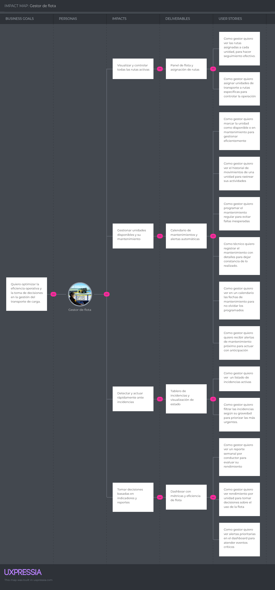
Segmento 2: Conductores de Transporte
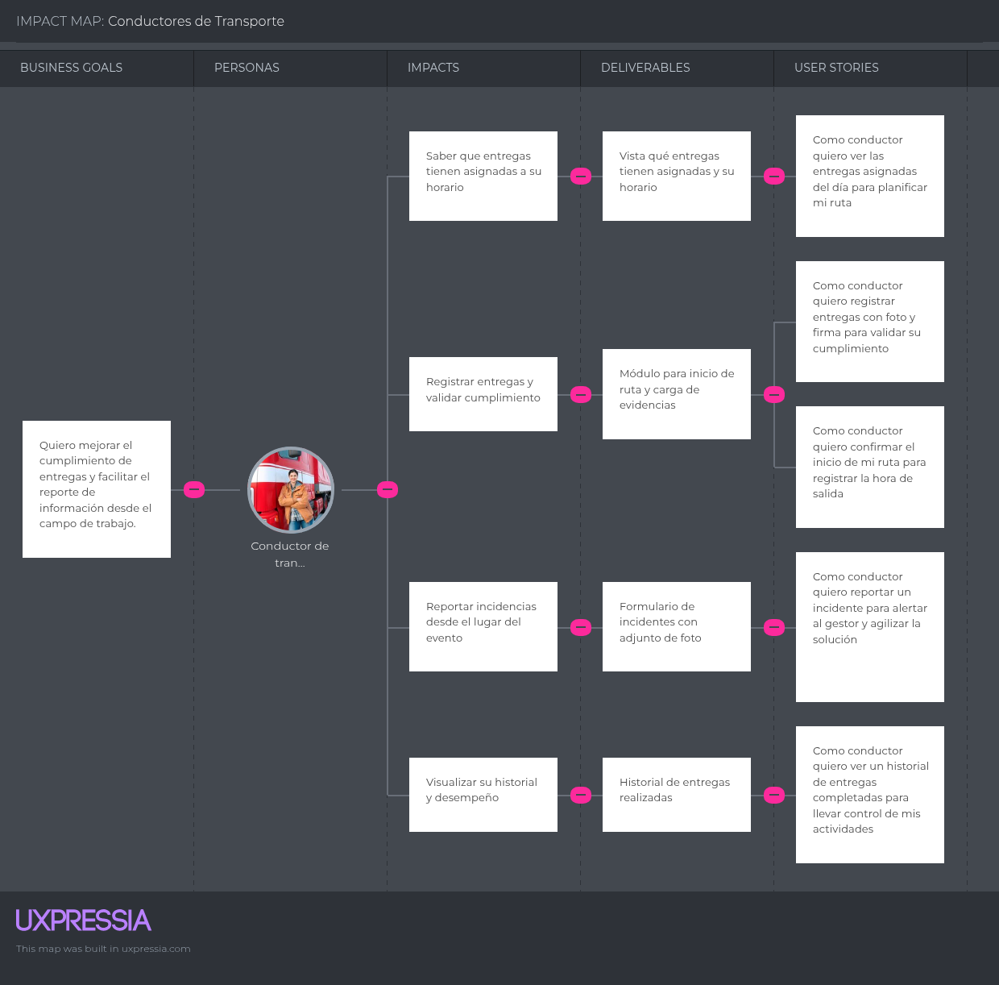

### 3.4. Product Backlog

| #  | Epic ID | User Story ID | Título | Descripción | Story Points | Orientación CRUD |
|----|----------|---------------|--------|--------------|---------------|------------------|
| 1  | **EP01 - Gestión de Flota** | US-01 | Consultar rutas asignadas | Como gestor, quiero conocer las rutas asignadas a cada unidad para supervisar su cumplimiento operativo. | 8 | Read |
| 2  | EP01 | US-02 | Asignar unidades a rutas | Como gestor, quiero asignar unidades de transporte a rutas específicas para controlar la operación. | 2 | Create |
| 3  | EP01 | US-03 | Actualizar estado de unidad | Como gestor, quiero marcar una unidad como disponible o en mantenimiento para una mejor gestión. | 5 | Update |
| 4  | EP01 | US-04 | Consultar historial de movimientos | Como gestor, quiero revisar el historial de movimientos de una unidad para rastrear su actividad. | 5 | Read |
| 5  | **EP02 - Gestión de Entregas** | US-05 | Consultar entregas asignadas | Como conductor, quiero conocer las entregas asignadas del día para planificar mi jornada. | 8 | Read |
| 6  | EP02 | US-06 | Registrar evidencia de entrega | Como conductor, quiero dejar constancia de entregas realizadas mediante evidencia. | 3 | Create |
| 7  | EP02 | US-07 | Revisar entregas completadas | Como conductor, quiero consultar mis entregas pasadas para llevar control de mis actividades. | 5 | Read |
| 8  | EP02 | US-08 | Registrar inicio de ruta | Como conductor, quiero confirmar el inicio de mi ruta para registrar la hora de salida. | 5 | Create |
| 9  | **EP03 - Gestión de Incidencias** | US-09 | Reportar incidente | Como conductor, quiero reportar incidentes durante la entrega para que el gestor pueda intervenir. | 8 | Create |
| 10 | EP03 | US-10 | Consultar incidencias activas | Como gestor, quiero revisar las incidencias activas para tomar decisiones rápidas. | 5 | Read |
| 11 | EP03 | US-11 | Filtrar incidencias por gravedad | Como gestor, quiero filtrar las incidencias por gravedad para priorizar acciones. | 3 | Read |
| 12 | EP03 | US-12 | Revisar historial de incidencias | Como gestor, quiero analizar incidencias pasadas para tomar decisiones preventivas. | 5 | Read |
| 13 | **EP04 - Gestión de Mantenimiento** | US-13 | Programar mantenimiento | Como gestor, quiero definir mantenimientos periódicos para evitar fallos imprevistos. | 8 | Update |
| 14 | EP04 | US-14 | Registrar mantenimiento realizado | Como técnico, quiero documentar el mantenimiento realizado para dejar constancia. | 3 | Create |
| 15 | EP04 | US-15 | Consultar mantenimientos próximos | Como gestor, quiero conocer las próximas fechas de mantenimiento para planificar. | 2 | Read |
| 16 | EP04 | US-16 | Recibir alertas de mantenimiento | Como gestor, quiero recibir alertas de mantenimiento próximo para evitar retrasos. | 5 | Read |
| 17 | **EP05 - Gestión de Indicadores/Reportes** | US-17 | Generar reporte semanal | Como gestor, quiero ver reportes semanales de entregas para evaluar el rendimiento del personal. | 5 | Read |
| 18 | EP05 | US-18 | Evaluar eficiencia por unidad | Como gestor, quiero conocer el rendimiento por unidad para tomar decisiones. | 2 | Read |
| 19 | EP05 | US-19 | Comparar desempeño entre conductores | Como gestor, quiero comparar a los conductores para fomentar mejores prácticas. | 3 | Read |
| 20 | EP05 | US-20 | Monitorear alertas críticas | Como gestor, quiero visualizar alertas críticas del sistema para tomar acciones inmediatas. | 1 | Read |
| 21 | **EP-LP - Sitio Web Estático** | US-21 | Consultar información de servicios | Como visitante, quiero conocer los servicios disponibles. | 3 | Read |
| 22 | EP-LP | US-22 | Solicitar demostración | Como visitante, quiero registrar interés en una demo. | 5 | Create |
| 23 | EP-LP | US-23 | Consultar planes y precios | Como visitante, quiero comparar los planes disponibles. | 3 | Read |
| 24 | EP-LP | US-24 | Solicitar asistencia | Como visitante, quiero contactar soporte para resolver dudas. | 2 | Create |
| 25 | EP-LP | US-25 | Consultar casos de éxito | Como visitante, quiero revisar casos de éxito reales. | 5 | Read |
| 26 | **EP-API - API RESTful** | TS-01 | Autenticación API | Como desarrollador, quiero implementar autenticación mediante JWT para proteger el acceso a la API. | 8 | Create/Validate |
| 27 | EP-API | TS-02 | Gestión de unidades vía API | Como desarrollador, quiero usar endpoints CRUD para gestionar unidades desde aplicaciones externas. | 5 | CRUD |
| 28 | EP-API | TS-03 | Gestión de entregas vía API | Como desarrollador, quiero usar endpoints para registrar y consultar entregas desde apps móviles. | 5 | CRUD |
| 29 | EP-API | TS-04 | Gestión de incidencias vía API | Como desarrollador, quiero implementar endpoints para reportar y resolver incidencias del sistema. | 5 | CRUD |
| 30 | EP-API | TS-05 | Consulta de estadísticas vía API | Como desarrollador, quiero acceder a estadísticas desde la API para integrarlas en reportes externos. | 8 | Read |

## Capítulo IV: Product Architecture Design

En este capítulo el equipo aplica el método ADD v3 del Instituto de Ingeniería de Software (SEI).

### 4.1. Design Concepts, ViewPoints & ER Diagrams

#### 4.1.1. Principles Statements

Los siguientes principios arquitectónicos guían el diseño y desarrollo de la plataforma CoBox, asegurando que la solución sea escalable, mantenible y alineada con las mejores prácticas de la industria:

  1. *Separación de responsabilidades por dominio:* Cada contexto delimitado debe mantener una responsabilidad específica y bien definida, evitando el acoplamiento excesivo entre dominios de negocio. Esto facilita la escalabilidad y el mantenimiento independiente de cada módulo.
  2. *Comunicación asíncrona entre servicios:* Se priorizarán las comunicaciones asíncronas mediante message brokers sobre las llamadas síncronas directas, mejorando la resiliencia del sistema y permitiendo mejor manejo de cargas de trabajo variables típicas del sector logístico.
  3. *API First Design:* Todas las funcionalidades del sistema deben exponerse a través de APIs bien documentadas y versionadas, facilitando la integración con sistemas externos y el desarrollo de múltiples interfaces de usuario (web, móvil).
  4. *Tolerancia a fallos:* El sistema debe ser capaz de continuar operando parcialmente ante fallos de componentes específicos, especialmente crítico para operaciones en campo donde la conectividad puede ser intermitente.
  5. *Observabilidad y trazabilidad:* Implementar logging, métricas y trazas distribuidas para monitorear el comportamiento del sistema en tiempo real, esencial para el seguimiento de operaciones logísticas críticas.
  6. *Seguridad por diseño:* La autenticación, autorización y protección de datos sensibles deben estar integradas desde el diseño inicial, considerando la naturaleza crítica de la información logística y de ubicación.
  7. *Persistencia poliglota:* Utilizar las tecnologías de almacenamiento más adecuadas para cada tipo de dato (relacional para transacciones, espacial para geolocalización), optimizando el rendimiento según las necesidades específicas del dominio.

#### 4.1.2. Approaches Statements, Architectural Styles & Patterns

***Approaches Statements:***

  - *Domain-Driven Design (DDD):* Adoptamos DDD como enfoque principal para modelar la complejidad del dominio del transporte de carga, identificando bounded contexts claros como Fleet Management, Delivery Management, Incident Management, Maintenance Management y Analytics & Reporting. Este enfoque nos permite mantener el modelo de negocio alineado con el código y facilita la comunicación entre stakeholders técnicos y de negocio.

  - *Attribute-Driven Design (ADD):* Utilizamos ADD v3 para tomar decisiones arquitectónicas basadas en escenarios de calidad específicos, priorizando atributos como disponibilidad, rendimiento y escalabilidad, críticos para una plataforma de gestión logística en tiempo real.

***Architectural Styles:***

  - *Cliente-Servidor:* Establece una separación clara entre las aplicaciones cliente (web y móvil) y los servicios backend, permitiendo múltiples tipos de clientes que consuman los mismos servicios de negocio.

  - *Microservicios:* Cada bounded context se implementa como un microservicio independiente, permitiendo escalabilidad granular, deployments independientes y tecnologías específicas por servicio según las necesidades del dominio.

***Design Patterns:***

  - *API Gateway:* Actúa como punto único de entrada para todas las comunicaciones cliente-servidor, manejando autenticación, rate limiting, routing y agregación de respuestas. Especialmente importante para gestionar las diferentes necesidades de acceso entre conductores y gestores de flota.

  - *Model-View-Controller (MVC):* Implementado en cada microservicio para separar la lógica de presentación, de negocio y de acceso a datos, facilitando el mantenimiento y testing de cada componente.

#### 4.1.3. Context Diagram

El diagrama de contexto de CoBox muestra cómo la plataforma de gestión logística interactúa con sus usuarios principales y sistemas externos. La plataforma sirve como el sistema central que conecta a tres tipos de usuarios con diferentes necesidades: administradores del sistema que gestionan la configuración general, gestores de flota que coordinan operaciones y toman decisiones basadas en datos, y conductores que ejecutan las entregas y registran información en campo.

El sistema también se integra con servicios externos críticos como proveedores de mapas y geolocalización para el seguimiento en tiempo real, servicios de notificaciones para alertas importantes, y sistemas de almacenamiento en la nube para el manejo de evidencias fotográficas. Esta arquitectura permite que CoBox centralice la gestión logística mientras mantiene conectividad con el ecosistema tecnológico necesario para operaciones de transporte modernas.

<p align="center">
  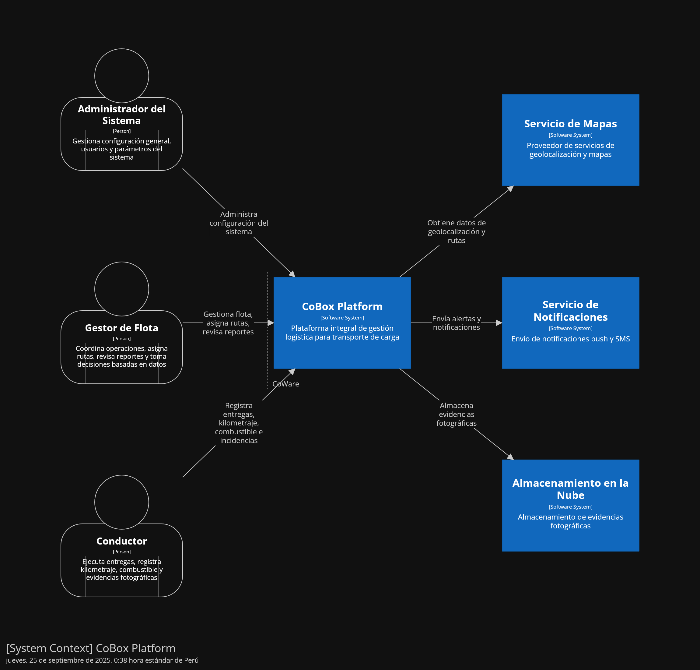
</p>

#### 4.1.4. Approach driven ViewPoints Diagrams

- Diagrama de contenedores:

  

- Diagrama de componentes:

  
  
  

  
 
  

  

- Diagramas de Actividad:

  

  
 
  

  

- Diagramas de Estado:

  

  
 
  

  

  - Diagrama de Clases:
  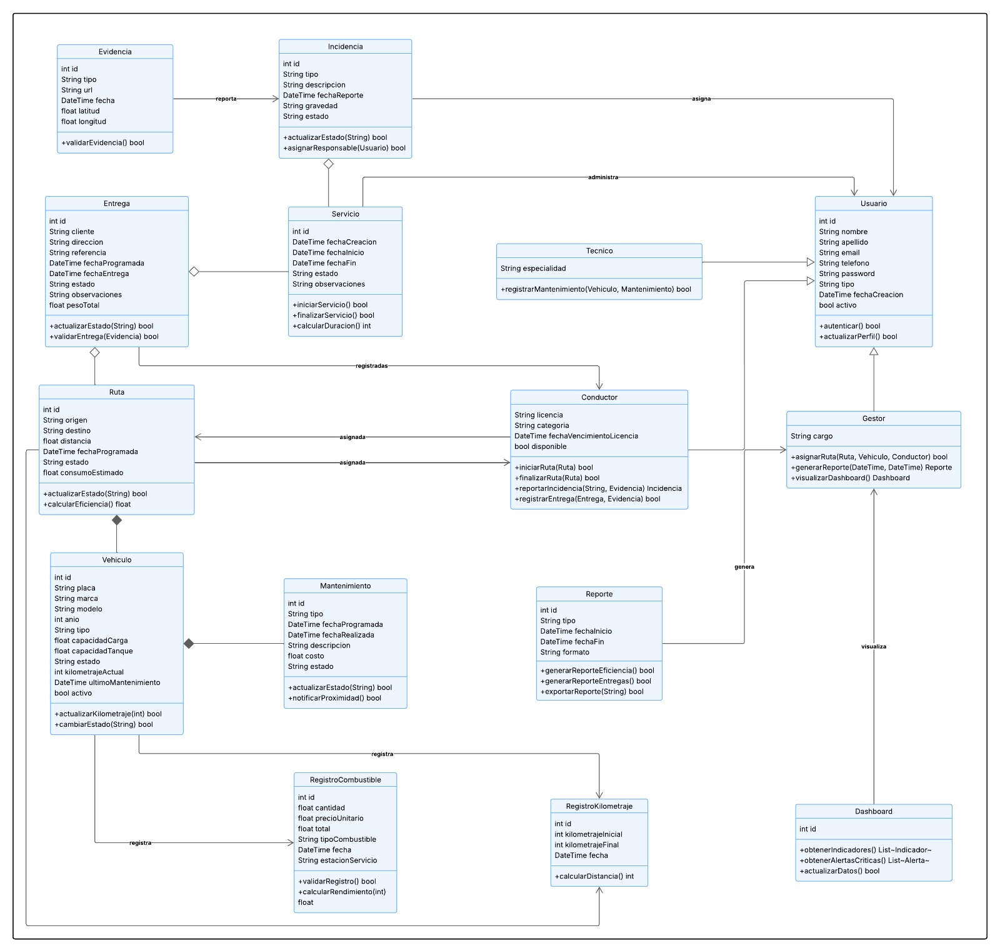

  

#### 4.1.5. Relational/Non Relational Database Diagram

 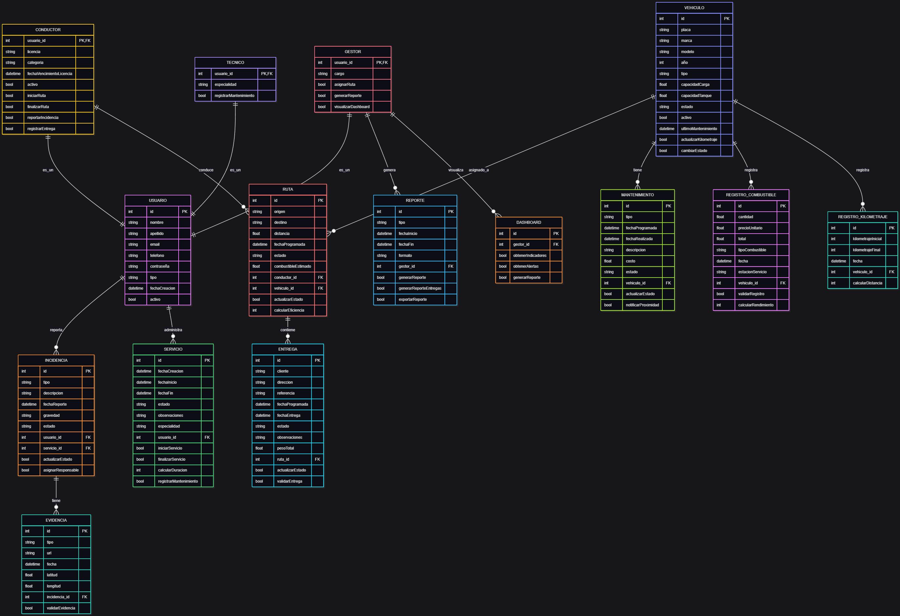

#### 4.1.6. Design Patterns

El Factory Pattern se utiliza para centralizar la creación de objetos, permitiendo instanciar diferentes tipos de usuarios como Conductor, Técnico o Gestor sin exponer la lógica de construcción. Esto hace que el sistema sea más limpio y fácil de mantener cuando se agregan nuevos tipos de usuarios.

El Strategy Pattern permite definir distintas estrategias de mantenimiento, como el preventivo o el correctivo, y cambiar entre ellas dinámicamente según las necesidades del sistema. De esta manera, los algoritmos se mantienen flexibles y reutilizables sin alterar la estructura principal.

El Observer Pattern se emplea para implementar un sistema de notificaciones, donde los objetos que generan cambios de estado (por ejemplo, un vehículo que pasa a mantenimiento) informan automáticamente a los suscriptores interesados, logrando un fuerte desacoplamiento entre emisores y receptores.

El Command Pattern encapsula operaciones en objetos, como la acción de asignar una ruta a un vehículo. Esto facilita mantener un historial de acciones y permite deshacer operaciones, ofreciendo mayor control y trazabilidad dentro del sistema.

El Singleton Pattern garantiza que exista una sola instancia de un objeto global, como la configuración central del sistema. Con ello se evita la duplicidad y se asegura que todos los módulos trabajen con la misma referencia de configuración.

El Decorator Pattern añade funcionalidades adicionales a los vehículos, como GPS o seguro, sin necesidad de modificar directamente las clases base. Esto ofrece gran flexibilidad al extender comportamientos de forma dinámica.

El Facade Pattern proporciona una interfaz unificada y sencilla para operaciones complejas del sistema. De este modo, los usuarios y otros componentes pueden interactuar sin conocer la lógica interna, lo que simplifica la integración.

El Template Method Pattern define la estructura para la generación de reportes, estableciendo pasos fijos pero permitiendo personalizar algunos de ellos según el tipo de reporte requerido. Esto asegura consistencia y a la vez flexibilidad.

El State Pattern maneja los distintos estados de un vehículo, como Disponible, En Ruta o En Mantenimiento, haciendo que el comportamiento del objeto cambie automáticamente según el estado actual en el que se encuentre.

Finalmente, todos estos patrones aportan beneficios como flexibilidad al extender el sistema, mantenibilidad gracias a un código organizado y desacoplado, reusabilidad de componentes y escalabilidad, preparando la arquitectura para el crecimiento futuro.

#### 4.1.7. Tactics

**Optimización de Código y Arquitectura**

El código de CoBox puede optimizarse con pruebas de rendimiento que identifiquen procesos pesados, como la generación de reportes masivos, el cálculo de kilometrajes o la validación de entregas. El uso de patrones de diseño, como Factory para crear usuarios según su rol, Observer para notificaciones en tiempo real, Command para mantener historial de operaciones y State para el manejo dinámico de estados de vehículos, ayuda a mantener un sistema limpio y flexible. Además, separar la lógica en módulos o microservicios (vehículos, logística, usuarios, reportes) favorece la escalabilidad y facilita el mantenimiento a largo plazo.<br>

**Tácticas de Disponibilidad**

Validación y redundancia en datos críticos: Garantizar que información clave (Vehículo, Ruta, Entrega) sea consistente para prevenir fallas operativas y pérdidas de asignaciones.

Registro histórico (logging persistente): Entidades como Mantenimiento, Incidencia y RecorridoKilométrico mantienen trazabilidad, permitiendo recuperar estados previos tras incidentes.

Monitoreo activo de vehículos: Usando los atributos de la entidad Vehículo (estado, cambioEstado), se aplican mecanismos tipo heartbeat para detectar fallas o desconexiones a tiempo <br><br>
**Tácticas de Mantenibilidad**

Modularización de funciones: Separar en módulos claros (Usuarios, Vehículos, Mantenimiento, Logística) facilita actualizaciones y reduce impacto en otros componentes.

Uso de entidades base y especializadas: Con Usuario como entidad general y sus subtipos (Conductor, Técnico, Gestor), se asegura bajo acoplamiento y alta cohesión.

Extensibilidad estructural: La normalización permite añadir nuevos roles o tipos de mantenimiento sin romper la arquitectura existente.<br>

**Tácticas de Usabilidad**

Notificaciones en tiempo real: Basadas en Reporte, Incidencia y Mantenimiento, mantienen informados a conductores y gestores de cambios inmediatos.

Interfaces simplificadas mediante patrones: Aplicando Facade, el usuario interactúa con vistas claras, sin lidiar con la complejidad de múltiples tablas como Ruta + Entrega + Reporte.

Historial consultable y trazable: A través de Evidencia e Incidencia, se ofrece retroalimentación clara sobre operaciones pasadas y decisiones tomadas.

### 4.2. Architectural Drivers

Los drivers arquitectónicos de CoBox surgen de la necesidad de garantizar que la plataforma de colaboración en la nube sea segura, escalable, confiable y fácil de usar para startups y equipos de trabajo distribuidos. Estos drivers guían las decisiones técnicas y de diseño, asegurando que la solución responda a los objetivos de negocio, las necesidades de los usuarios y las restricciones identificadas.

Los principales drivers son:
- **Trazabilidad operativa en tiempo real**: garantizar visibilidad completa de ubicación, estado y progreso de unidades y entregas.
- **Eficiencia operativa**: optimizar recursos de transporte, reducir costos de combustible y mejorar productividad de conductores.
- **Seguridad de datos logísticos**: proteger información sensible de rutas, clientes, evidencias fotográficas y ubicaciones GPS.
- **Escalabilidad de flota**: soportar el crecimiento de vehículos, conductores y volumen de entregas sin comprometer rendimiento.
- **Disponibilidad operativa**: asegurar que el sistema funcione ininterrumpidamente, especialmente crítico para operaciones de campo.
- **Usabilidad para conductores**: ofrecer interfaces simples y funcionales para usuarios con diferentes niveles de experiencia tecnológica.
- **Auditabilidad y cumplimiento normativo**: mantener registros completos de todas las operaciones para satisfacer regulaciones del sector transporte.
- **Interoperabilidad**: facilitar integración con sistemas ERP existentes y servicios externos (GPS, notificaciones, almacenamiento).
- **Rendimiento bajo conectividad limitada**: garantizar funcionamiento offline en zonas rurales con sincronización posterior.
- **Mantenibilidad del código**: facilitar actualizaciones, debugging y extensión de funcionalidades mediante patrones de diseño apropiados.

---

#### 4.1.8. Design Purpose

El propósito fundamental del proceso de diseño arquitectónico de CoBox es definir la estructura técnica de la plataforma de colaboración en la nube de forma coherente con los objetivos de negocio y los requisitos funcionales y no funcionales identificados.  
Este diseño busca establecer un marco robusto que permita una implementación eficiente y adaptable, asegurando seguridad, escalabilidad y facilidad de uso.

Los propósitos clave incluyen:
- **Traducir requisitos y objetivos de negocio en decisiones técnicas**: transformar las necesidades de startups y equipos distribuidos en componentes técnicos concretos (gestión de proyectos, sincronización de archivos, colaboración en tiempo real).  
- **Satisfacer drivers arquitectónicos**: garantizar que la arquitectura soporte usabilidad, seguridad, rendimiento, escalabilidad y confiabilidad, considerando las restricciones de recursos y dependencias externas.  
- **Definir entidades arquitectónicas y sus interacciones**: identificar módulos principales (Usuarios, Proyectos, Archivos, Notificaciones, Integraciones) y las interfaces de comunicación entre ellos.  
- **Promover coherencia y mantenibilidad**: aplicar principios de diseño y patrones arquitectónicos (DDD, microservicios, RBAC, API Gateway) que faciliten la evolución futura del sistema.  
- **Crear modelos y vistas arquitectónicas**: representar la solución en diagramas C4 (Contexto, Contenedor, Componente) y UML (Clases, ERD) como documentación guía para el desarrollo.  
- **Seguir un proceso iterativo**: utilizar ADD (Attribute-Driven Design) y validar las decisiones arquitectónicas en función de los drivers, adaptando la solución conforme se avanza en las etapas de desarrollo.  

---

#### 4.1.9. Primary Functionality (Primary User Stories)

Las siguientes historias de usuario representan las funcionalidades **principales y críticas** de CoBox, ya que constituyen la base para la colaboración segura, escalable y eficiente en proyectos de trabajo distribuidos.

| User Story ID | Título                          | Descripción |
|---------------|---------------------------------|-------------|
| US05 | Consultar entregas asignadas | Funcionalidad central que permite a conductores planificar su jornada y optimizar rutas diarias, siendo la base de la operación logística. |
| US01 | Visualizar rutas asignadas | Esencial para gestores para supervisar y coordinar operaciones de flota en tiempo real, garantizando control operativo. |
| US09 | Reportar incidente durante entrega | Crítica para trazabilidad y respuesta rápida ante problemas operativos que afecten entregas y la reputación del servicio. |
| US13 | Programar mantenimiento preventivo | Fundamental para disponibilidad de la flota, evitando paradas no planificadas y optimizando vida útil de vehículos. |
| TS01 | Autenticación API | Base de seguridad del sistema, protegiendo datos sensibles y cumpliendo con regulaciones de privacidad. |
| TS05 | Endpoints de estadísticas | Soporte para análisis y toma de decisiones basada en datos, habilitando la eficiencia operativa.|
| US17 | Ver reporte semanal de entregas | Fundamental para análisis de rendimiento y toma de decisiones basada en datos.|
| US06 | Registrar entrega con evidencia | Vital para validación y prueba de cumplimiento de servicios ante clientes finales.|

---

#### 4.1.10. Quality Attribute Scenarios

### Escenario de Trazabilidad (Seguimiento de Entregas)
- **Componente**: Módulo de Delivery Management  
- **Fuente**: Conductor registrando entrega completada  
- **Estímulo**: Captura de evidencia fotográfica y confirmación de entrega  
- **Entorno**: Operación en campo con conectividad móvil variable  
- **Artefacto**: Sistema de registro de entregas con geolocalización  
- **Respuesta**: Registro exitoso con timestamp, ubicación GPS y evidencia almacenada, notificación automática al gestor en menos de 30 segundos  

### Escenario de Seguridad (Control de Acceso por Roles)
- **Componente**: Módulo de Autenticación RBAC  
- **Fuente**: Conductor intentando acceder a datos de otros conductores  
- **Estímulo**: Solicitud de información fuera de su ámbito de permisos  
- **Entorno**: Sistema en operación con múltiples usuarios concurrentes  
- **Artefacto**: API Gateway con validación JWT y control de roles  
- **Respuesta**: Acceso denegado con código 403, registro en audit log y alerta de seguridad  

### Escenario de Disponibilidad (Fallo de Microservicio)
- **Componente**: Fleet Management Service  
- **Fuente**: Fallo crítico del servicio de gestión de flota  
- **Estímulo**: Caída completa del microservicio por sobrecarga  
- **Entorno**: Operación en horario pico con 50 vehículos activos  
- **Artefacto**: Load balancer e instancias redundantes  
- **Respuesta**: Failover automático a instancia secundaria en menos de 2 minutos, sin pérdida de datos de ubicación  

### Escenario de Rendimiento (Consulta de Reportes)
- **Componente**: Analytics & Reporting Service  
- **Fuente**: Gestor solicitando reporte semanal de 100 vehículos  
- **Estímulo**: Generación de dashboard con 10,000 registros de entregas  
- **Entorno**: Sistema bajo carga normal con 20 usuarios concurrentes  
- **Artefacto**: Base de datos optimizada con índices y cache Redis  
- **Respuesta**: Dashboard generado y renderizado en menos de 5 segundos con datos actualizados  

### Escenario de Escalabilidad (Crecimiento de Flota)
- **Componente**: Sistema completo de microservicios  
- **Fuente**: Incorporación de 50 nuevos vehículos en un mes  
- **Estímulo**: Aumento del 100% en volumen de transacciones y usuarios  
- **Entorno**: Infraestructura cloud con auto-scaling habilitado  
- **Artefacto**: Contenedores Kubernetes con métricas de CPU y memoria  
- **Respuesta**: Escalado automático de recursos manteniendo tiempo de respuesta < 3 segundos  

### Escenario de Usabilidad (Conductor Novato)
- **Componente**: Aplicación móvil para conductores  
- **Fuente**: Conductor con experiencia tecnológica básica  
- **Estímulo**: Registro de primera entrega del día  
- **Entorno**: En ruta, con presión de tiempo y distracciones del tráfico  
- **Artefacto**: Interfaz móvil simplificada con botones grandes  
- **Respuesta**: Conductor completa registro exitosamente en menos de 2 minutos sin asistencia  

### Escenario de Interoperabilidad (Integración ERP)
- **Componente**: API Gateway y conectores externos  
- **Fuente**: Sistema ERP de cliente solicitando datos de entregas  
- **Estímulo**: Sincronización diaria de 500 registros de entregas  
- **Entorno**: Integración B2B con sistema legacy del cliente  
- **Artefacto**: REST API con formato JSON estandarizado  
- **Respuesta**: Datos transferidos exitosamente con 99.9% de integridad y trazabilidad completa  

---

#### 4.1.11. Constraints

Las restricciones representan los límites y condiciones bajo los cuales el sistema debe ser diseñado, desarrollado y operado. Estas limitaciones provienen de factores externos como normativas legales, recursos disponibles y dependencias tecnológicas, así como de factores internos relacionados con el equipo de desarrollo y los usuarios. Identificarlas permite establecer un marco realista para la implementación y gestión del proyecto, asegurando que las decisiones técnicas y estratégicas se adapten a las capacidades y al entorno en el que la solución será desplegada.

| ID  | Constraint |
|-----|------------|
| C-1 | Funcionamiento offline requerido para operaciones en zonas rurales con conectividad limitada. |
| C-2 | Limitaciones presupuestarias de PyMEs del sector transporte para inversión tecnológica inicial. |
| C-3 | Dependencia de servicios GPS externos (Google Maps, Mapbox) para geolocalización precisa. |
| C-4 | Variabilidad en niveles de alfabetización digital entre conductores de diferentes generaciones. |
| C-5 | Regulaciones del sector transporte que requieren trazabilidad documental de entregas. |
| C-6 | Necesidad de integración con sistemas ERP existentes en empresas establecidas. |
| C-7 | Restricciones de dispositivos móviles con capacidades limitadas de hardware y batería. |
| C-8 | Normativas de protección de datos (Ley de Protección de Datos Personales del Perú) que limitan el almacenamiento y procesamiento de información de ubicación. |
| C-9 | Limitaciones de infraestructura de telecomunicaciones en rutas rurales que afectan la calidad y velocidad de transmisión de datos. |
| C-10 | Restricciones de tiempo de implementación debido a la necesidad de mantener operaciones continuas sin interrumpir el servicio de transporte activo. |

---

#### 4.1.12. Architectural Concerns

Las preocupaciones arquitectónicas representan los riesgos, incertidumbres y desafíos que pueden afectar la estabilidad, seguridad, escalabilidad y usabilidad del sistema. Estos aspectos deben ser considerados desde las primeras fases del diseño arquitectónico, ya que influyen en la capacidad de la plataforma para evolucionar, responder a cambios en la demanda y garantizar una experiencia de usuario satisfactoria. Identificar y documentar estas preocupaciones facilita la planificación de soluciones preventivas o correctivas, ayudando al equipo a reducir riesgos y mejorar la resiliencia del sistema.

| ID | Architectural Concern |
|----|------------------------|
| AC-1 | Riesgo de que los datos sensibles no estén adecuadamente protegidos, comprometiendo la seguridad. |
| AC-2 | Posible falta de experiencia del equipo en tecnologías específicas (microservicios, contenedores, CI/CD). |
| AC-3 | Incertidumbre en la correcta representación del dominio frente a las operaciones reales de los usuarios. |
| AC-4 | La arquitectura podría no escalar eficientemente ante un rápido crecimiento de usuarios y proyectos. |
| AC-5 | La experiencia de usuario podría no ser suficientemente intuitiva, afectando la adopción de la plataforma. |
| AC-6 | Mantener un rendimiento óptimo ante cargas simultáneas elevadas puede ser un desafío. |
| AC-7 | Riesgo de baja disponibilidad o recuperación lenta ante fallos críticos. |
| AC-8 | Crecimiento rápido de usuarios podría generar cuellos de botella en la base de datos. |
| AC-9 | Soporte insuficiente para equipos distribuidos geográficamente, limitando la colaboración en tiempo real. |
| AC-10 | Ausencia de pruebas automatizadas puede retrasar la detección temprana de errores. |
| AC-11 | Falta de mecanismos de auditoría y trazabilidad para acciones clave dentro de los proyectos. |
| AC-12 | Estrategia de backup y recuperación insuficiente en caso de desastres o caídas del sistema. |

-----

### 4.3. ADD Iterations

#### 4.2.1 Iteration 1: Análisis
##### 4.2.1.1 Architectural Design Backlog 1

Ciertos elementos clave de la arquitectura serán esenciales para asegurar la escalabilidad, confiabilidad y adopción de la plataforma Co-box Logistic

#### Seguridad

| Historia de Usuario | Tareas | Criterios de Aceptación |
|----------------------|--------|--------------------------|
| **US-01 (Consultar rutas asignadas):** Como gestor, quiero conocer las rutas asignadas a cada unidad para supervisar su cumplimiento. | - Implementar autenticación JWT en la API.<br>- Configurar autorización basada en roles (gestor, conductor, visitante).<br>- Validar tokens expirados y manejo de errores 401/403.<br>- Notificación inmediata al gestor cuando se registre un incidente. | - Acceso solo con credenciales válidas.<br>- Los conductores solo pueden reportar incidencias propias.<br>- El sistema bloquea accesos no autorizados y registra intentos fallidos. |
| **US-09 (Reportar incidente):** Como conductor, quiero reportar incidentes durante la entrega para que el gestor pueda intervenir. | - Implementar autenticación JWT en la API.<br>- Notificación inmediata al gestor cuando se registre un incidente. | - Acceso solo con credenciales válidas.<br>- El sistema bloquea accesos no autorizados y registra intentos fallidos.<br>- Los conductores solo pueden reportar incidencias propias. |

---

#### Alta Disponibilidad

| Historia de Usuario | Tareas | Criterios de Aceptación |
|----------------------|--------|--------------------------|
| **US-19 (Comparar desempeño entre conductores):** Como gestor, quiero comparar conductores para fomentar mejores prácticas. | - Configurar balanceador de carga en Azure.<br>- Implementar redundancia en servicios de WebSockets y mensajería en tiempo real.<br>- Backups diarios de base de datos en Blob Storage. | - El sistema se recupera en menos de 10 min en caso de caída.<br>- 100 usuarios concurrentes reciben alertas sin interrupciones.<br>- Reportes semanales disponibles incluso en escenarios de falla parcial. |
| **US-20 (Monitorear alertas críticas):** Como gestor, quiero visualizar alertas críticas del sistema para tomar acciones inmediatas. | - Configurar balanceador de carga en Azure.<br>- Implementar redundancia en servicios de WebSockets y mensajería en tiempo real. | - El sistema se recupera en menos de 10 min en caso de caída.<br>- 100 usuarios concurrentes reciben alertas sin interrupciones. |

---

#### Usabilidad
| Historia de Usuario | Tareas | Criterios de Aceptación |
|----------------------|--------|--------------------------|
| **US-05 (Consultar entregas asignadas):** Como conductor, quiero conocer las entregas del día para planificar mi jornada. | - Menú de navegación con máximo 5 opciones principales.<br>- Iconografía clara para conductores con bajo nivel de digitalización. | - Un conductor novato puede consultar entregas en menos de 2 minutos. |
| **US-32 (Timeline de progreso):** Como gestor, quiero ver el progreso fácilmente. | - Gráfico de barras interactivo.<br>- Actualización en tiempo real al mover o completar entregas. | - Los gráficos de progreso se actualizan sin recarga manual de la página. |

##### 4.2.1.2 Establish Iteration Goal by Selecting Drivers  

En esta iteración, seleccionaremos los **drivers clave** que servirán como base para definir metas que aseguren la utilidad, escalabilidad y confiabilidad de la plataforma **Co-box Logistic**, dirigida a empresas de transporte y logística.  

---

##### Metas de la Iteración  

| Meta | Objetivo | Acciones Clave |
|------|----------|----------------|
| **Trazabilidad en Tiempo Real** | Garantizar que las empresas puedan visualizar en tiempo real la ubicación y el estado de las unidades y entregas, facilitando la toma de decisiones inmediatas. | - Integrar geolocalización en tiempo real de las unidades.<br>- Permitir actualización automática del estado de entregas.<br>- Incorporar alertas push para cambios críticos. |
| **Eficiencia Operativa** | Optimizar los recursos de transporte y reducir los costos operativos mediante un control preciso de unidades, combustible y desempeño del personal. | - Implementar registro automatizado de kilometraje y consumo.<br>- Desarrollar dashboards con métricas de eficiencia.<br>- Incorporar reportes semanales de desempeño. |
| **Seguridad de Datos y Operaciones** | Proteger la información de entregas, clientes y unidades, garantizando integridad y acceso solo a los roles correspondientes. | - Implementar autenticación JWT con validación de roles.<br>- Cifrar datos sensibles en tránsito y en reposo.<br>- Establecer políticas de acceso diferenciadas. |

---

##### Objetivo de la Iteración  

- **Trazabilidad:** Fortalecer el control en tiempo real de las operaciones logísticas mediante geolocalización y alertas críticas.  
- **Eficiencia:** Mejorar la planificación y el rendimiento de la flota con métricas y reportes automatizados.  
- **Seguridad:** Robustecer la protección de datos de clientes, entregas y unidades mediante autenticación y cifrado.  

---

##### 4.2.1.3 Choose One or More Elements of the System to Refine  

Para avanzar en el desarrollo de **Co-box Logistic** y de acuerdo con los drivers y metas definidos en la iteración, se han seleccionado los siguientes elementos del sistema para ser refinados.  

---

| Área | Elemento a Refinar | Razón para el Refinamiento | Esperado |
|------|---------------------|----------------------------|----------|
| **Trazabilidad en Tiempo Real** | Módulo de geolocalización y notificaciones | Permitir al gestor supervisar la ubicación exacta de unidades y entregas, con alertas inmediatas en caso de desvíos o incidencias. | Mapas en tiempo real, actualización automática de entregas y generación de alertas push. |
| **Eficiencia Operativa** | Dashboards de rendimiento y consumo | Facilitar la optimización de costos y tiempos mediante indicadores de combustible, kilometraje y desempeño por unidad/conductor. | Paneles visuales con métricas de eficiencia, reportes semanales descargables (PDF, Excel) y comparativas entre conductores/unidades. |
| **Seguridad de Accesos y Datos** | Sistema de autenticación y permisos de acceso | Asegurar que los datos estén protegidos y que cada usuario acceda únicamente a la información pertinente a su rol. | Autenticación JWT, cifrado de datos sensibles en tránsito/reposo y validación de roles diferenciados (gestor, conductor, visitante). |

##### 4.2.1.4 Choose One or More Design Concepts That Satisfy the Selected Drivers  

Para garantizar que la arquitectura de **Co-box Logistic** satisfaga adecuadamente las necesidades clave del negocio y los objetivos de calidad, se han identificado e incorporado conceptos de diseño específicos que abordan los principales drivers arquitectónicos. A continuación, se presentan las soluciones adoptadas para los ejes críticos de **seguridad, trazabilidad y eficiencia**:  

---

##### Seguridad  

#### Modelo RBAC (Role-Based Access Control)  
- **Descripción:** Se propone la implementación de un modelo de control de acceso basado en roles, donde los usuarios (gestor, conductor, visitante) tengan permisos diferenciados según su perfil.  
- **Justificación:** Permite garantizar que cada rol acceda únicamente a la información y operaciones que le corresponden, minimizando riesgos de accesos no autorizados.  

##### API Gateway Seguro  
- **Descripción:** Incorporar un API Gateway como punto centralizado de control, encargado de gestionar autenticación, autorización y enrutamiento de peticiones hacia los microservicios internos.  
- **Justificación:** Proporciona una capa adicional de seguridad y control en las comunicaciones, protegiendo datos sensibles de clientes, entregas y unidades frente a amenazas externas.  

---

##### Trazabilidad  

##### Sistema de Geolocalización en Tiempo Real  
- **Descripción:** Uso de servicios de mapas y sockets para monitorear en vivo la ubicación de cada unidad de transporte y el estado de sus entregas.  
- **Justificación:** Responde al driver de **visibilidad operativa**, ofreciendo a gestores y clientes información en tiempo real para tomar decisiones rápidas y confiables.  

---

##### Eficiencia  

##### Dashboards de Rendimiento  
- **Descripción:** Paneles interactivos que muestran métricas de consumo de combustible, kilometraje y entregas completadas por unidad/conductor.  
- **Justificación:** Favorecen la toma de decisiones informadas, reducen costos y mejoran la asignación de recursos, alineándose con el driver de **eficiencia operativa**.  

---

##### 4.2.1.5 Instantiate Architectural Elements, Allocate Responsibilities, and Define Interfaces  

En esta sección se describe el proceso de **instanciación de elementos arquitectónicos**, la asignación de responsabilidades y la definición de interfaces que permitirán la interacción entre los distintos componentes del sistema **Co-box Logistic**.  

---

##### Instanciación de Elementos Arquitectónicos  

| Elemento | Responsabilidad | Interfaces |
|----------|-----------------|------------|
| **Módulo de Gestión de Rutas y Entregas** | Asignar rutas, registrar entregas, controlar estados (en tránsito, entregado, con incidencia). | API REST para gestión de rutas; interfaz web/móvil para conductores y gestores. |
| **Módulo de Geolocalización en Tiempo Real** | Mostrar en mapa la ubicación de unidades y generar alertas en caso de desviaciones. | WebSockets para streaming de ubicación; integración con mapas externos (ej. Mapbox/Google Maps). |
| **Módulo de Control de Accesos (RBAC)** | Gestionar autenticación JWT y permisos diferenciados por rol (gestor, conductor, visitante). | API de autenticación; middleware de autorización para endpoints internos. |
| **API Gateway** | Punto de entrada seguro que centraliza autenticación, autorización y enrutamiento a microservicios. | Exposición de endpoints `/api/v1/...`; validación de tokens en cada request. |
| **Sistema de Reportes y Métricas** | Generar informes de eficiencia, consumo y desempeño semanal/mensual. | Exportación en PDF/Excel; dashboards visuales en frontend. |
| **Interfaz de Usuario Web y Móvil** | Proporcionar una experiencia intuitiva a gestores y conductores para operar el sistema. | Frontend React/Phaser conectado a APIs; notificaciones push. |

---


##### 4.2.1.6. Sketch Views (C4 & UML) and Record Design Decisions

**Sketch Views**

- ***Diagrama C4 - Container Level***

<div align="center">
    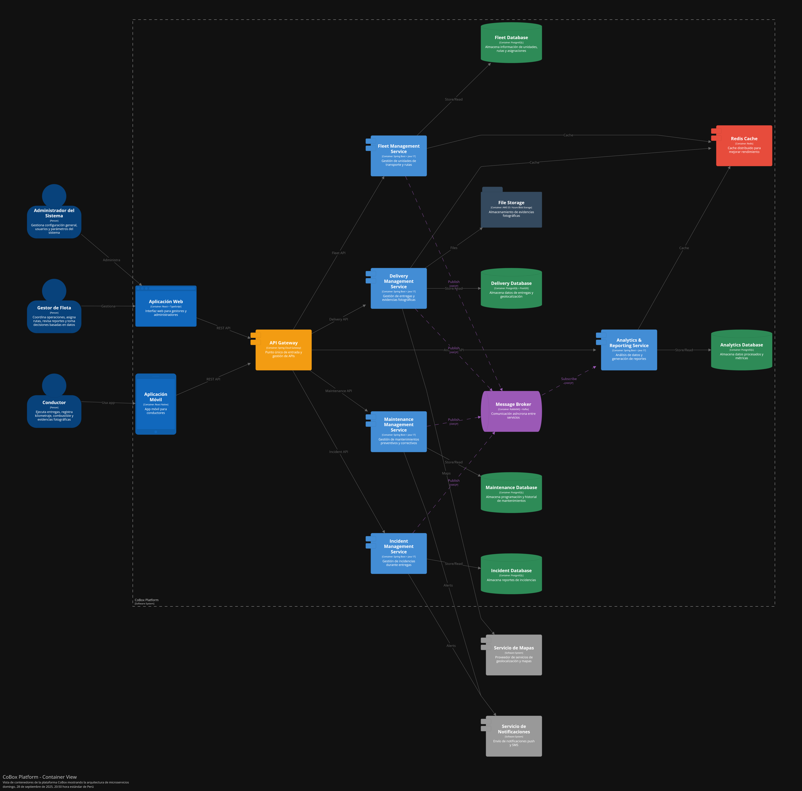
</div>

- ***Diagrama UML - Modelo de Dominio***

<div align="center">
    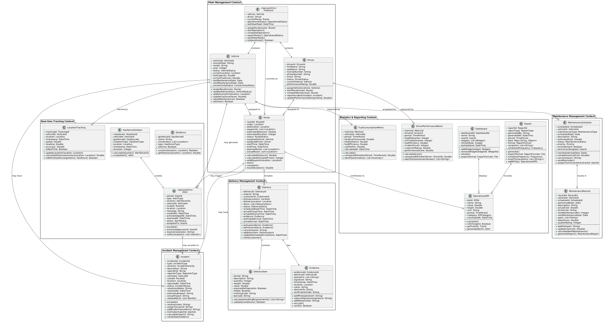
</div>

<div align="center">
    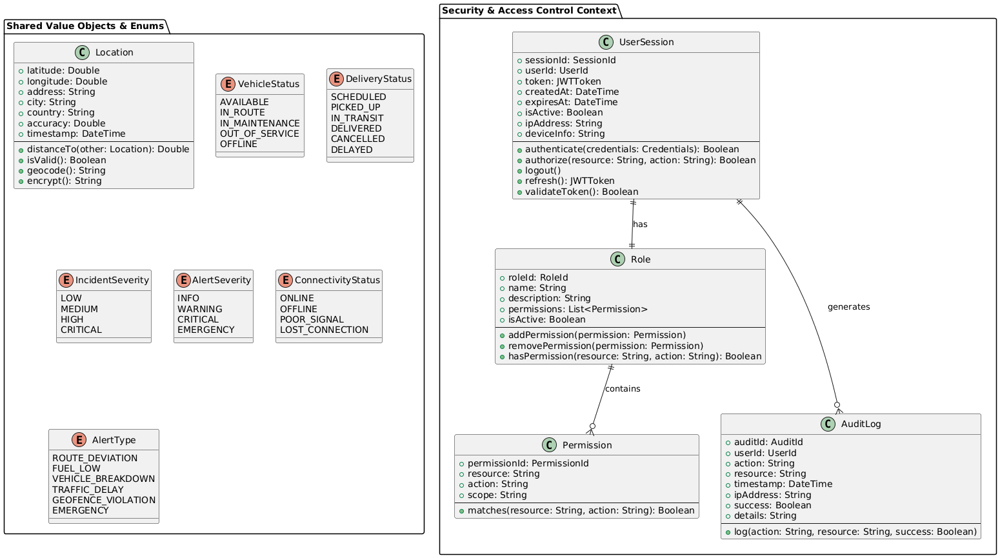
</div>

**Decisiones de Diseño Registradas**

| ID     | Título                                      | Estado   | Contexto                                                                 | Decisión                                                                                      | Consecuencias |
|--------|---------------------------------------------|----------|--------------------------------------------------------------------------|-----------------------------------------------------------------------------------------------|---------------|
| DD-001 | Arquitectura de Microservicios              | Aceptada | Necesidad de escalabilidad independiente por bounded context según DDD. | Implementar cada bounded context (7 contextos identificados) como microservicio independiente. | - Escalabilidad granular por dominio <br> - Deployments independientes <br> - Tecnologías específicas por servicio <br> - Complejidad de comunicación entre servicios <br> - Overhead de infraestructura |
| DD-002 | API Gateway como Punto de Entrada           | Aceptada | Múltiples clientes (web, móvil) y necesidad de seguridad centralizada. | Utilizar Spring Cloud Gateway con autenticación JWT integrada. | - Punto único de control de seguridad <br> - Rate limiting centralizado <br> - Routing inteligente <br> - Punto único de falla potencial <br> - Latencia adicional |
| DD-003 | Comunicación Asíncrona con Message Brokers  | Aceptada | Eventos del dominio requieren procesamiento desacoplado para alertas críticas. | Implementar RabbitMQ para comandos síncronos y Kafka para eventos de dominio. | - Mejor resiliencia del sistema <br> - Procesamiento asíncrono de alertas <br> - Escalabilidad de procesamiento <br> - Complejidad de gestión de mensajería <br> - Eventual consistency |
| DD-004 | PostgreSQL + PostGIS para Datos Geoespaciales | Aceptada | Multiple contexts requieren consultas espaciales: tracking, fleet, deliveries, incidents. | Utilizar PostgreSQL con PostGIS en servicios que manejan ubicación geográfica. | - Consultas geoespaciales optimizadas <br> - Consistencia entre servicios <br> - Ecosistema maduro <br> - Duplicación de datos geoespaciales entre servicios |
| DD-005 | Redis para Caching Distribuido              | Aceptada | Necesidad de cache para tracking en tiempo real y dashboards de rendimiento. | Implementar Redis como cache distribuido compartido entre microservicios. | - Mejora en tiempo de respuesta para dashboards <br> - Reducción de carga en tracking queries <br> - Sesiones distribuidas <br> - Complejidad de invalidación <br> - Punto de falla compartido |
| DD-006 | Sistema de Seguridad RBAC               | Aceptada | Driver crítico de "Seguridad de Datos y Operaciones" del ADD. | Implementar Spring Security con JWT + roles diferenciados (gestor, conductor, visitante). | - Control granular de acceso <br> - Auditabilidad completa <br> - Cumplimiento normativo <br> - Complejidad de gestión de roles <br> - Overhead en cada request |
| DD-007 | Real-time Location Tracking             | Aceptada | Driver clave "Trazabilidad en Tiempo Real" requiere seguimiento continuo. | WebSockets + integración con Mapbox/Google Maps para streaming de ubicaciones. | - Visibilidad operativa en tiempo real <br> - Alertas inmediatas de desviaciones <br> - Alto consumo de ancho de banda <br> - Complejidad de manejo de desconexiones |
| DD-008 | Analytics Stack para Dashboards         | Aceptada | Driver "Eficiencia Operativa" requiere métricas y KPIs en tiempo real. | Implementar stack analytics con Spring Boot + Chart.js para dashboards interactivos. | - Insights operativos inmediatos <br> - Comparativas de rendimiento <br> - Toma de decisiones basada en datos <br> - Complejidad de agregación de datos <br> - Carga computacional adicional |
| DD-009 | File Storage para Evidencias            | Aceptada | Evidencias fotográficas y firmas digitales requieren almacenamiento seguro. | Utilizar AWS S3/Azure Blob Storage con cifrado para evidencias. | - Escalabilidad de almacenamiento <br> - Cifrado de evidencias críticas <br> - Integración con CDN <br> - Costos por almacenamiento <br> - Dependencia de proveedor cloud |

---

> Este diagrama de contenedores muestra la arquitectura completa de **CoBox** a nivel de contenedores, incluyendo todas las aplicaciones, servicios, bases de datos y sus interacciones, proporcionando una vista técnica clara para el desarrollo e implementación del sistema.


##### 4.2.1.7. Analysis of Current Design and Review Iteration Goal (Kanban Board)

**Análisis del Diseño Actual**

Después de completar la Iteración 1 del método ADD v3, se ha establecido una arquitectura base para CoBox que aborda los drivers arquitectónicos principales identificados. El análisis revela los siguientes aspectos críticos:

- **Fortalezas del Diseño Actual**

    - Arquitectura de microservicios alineada con DDD: Los 7 bounded contexts identificados (Security & Access Control, Fleet Management, Real-time Tracking, Delivery Management, Incident Management, Maintenance Management, Analytics & Reporting) tienen responsabilidades claras y separadas, facilitando el desarrollo independiente y la escalabilidad granular.

    - Seguridad robusta implementada: La combinación de JWT + RBAC + API Gateway proporciona un control de acceso granular que satisface el driver crítico de "Seguridad de Datos y Operaciones", con auditabilidad completa mediante AuditLog.

    - Trazabilidad en tiempo real lograda: La integración de WebSockets + PostgreSQL/PostGIS + servicios de mapas externos permite el seguimiento continuo de vehículos y alertas automáticas, cumpliendo el driver de "Trazabilidad en Tiempo Real".

    - Base sólida para eficiencia operativa: Los contextos de Analytics & Reporting proporcionan la infraestructura necesaria para dashboards interactivos y métricas de rendimiento que apoyan la toma de decisiones basada en datos.

- **Áreas de Mejora Identificadas**

    - Complejidad de gestión de consistencia: La distribución de datos geoespaciales entre múltiples servicios (Fleet, Tracking, Delivery, Incident) puede generar inconsistencias temporales que requieren estrategias de sincronización más robustas.

    - Overhead de infraestructura: La arquitectura requiere gestión de 13 contenedores principales (5 microservicios + 5 bases de datos + cache + message broker + file storage + API Gateway), lo que incrementa la complejidad operativa.

    - Escalabilidad del tracking en tiempo real: El streaming continuo de ubicaciones vía WebSockets puede generar cuellos de botella bajo alta concurrencia de vehículos activos simultáneamente.

**Review Iteration Goal**

Enlace del Tablero Kanban: https://trello.com/invite/b/68d9f5f5d50cbf348362a137/ATTI21acff966c1ec6ff3ab494eef5abc9a545059BA0/cobox-add-architecture-analysis

<div align="center">
    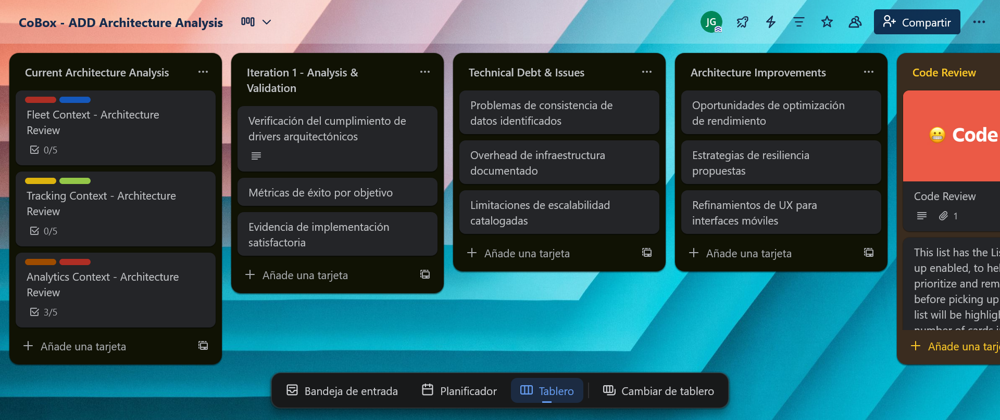
</div>

-----

## Capítulo V: Product Implementation, Validation & Deployment

### 5.1. Testing Suites & General Patterns

#### 5.1.1. Backend Application Core Testing Suite

Se han implementado pruebas unitarias puras del dominio para validar la lógica de negocio y el comportamiento de los agregados clave: Order, Fleet, Incident, y MaintenanceOrder.
Stack Tecnológico
Herramientas Utilizadas
- Framework de Pruebas	JUnit 5 (Jupiter)
- Librería de Asertos	AssertJ (Para aserciones fluidas y legibles)
- Patrón de Datos de Prueba	Mothers (Clases dedicadas para la creación controlada de objetos de prueba válidos)

Este conjunto de pruebas se enfoca exclusivamente en la capa de dominio (negocio) de la aplicación, aislado de cualquier framework, asegurando la verificación de las reglas intrínsecas del modelo.

<div align="center">
    
</div>

<div align="center">
    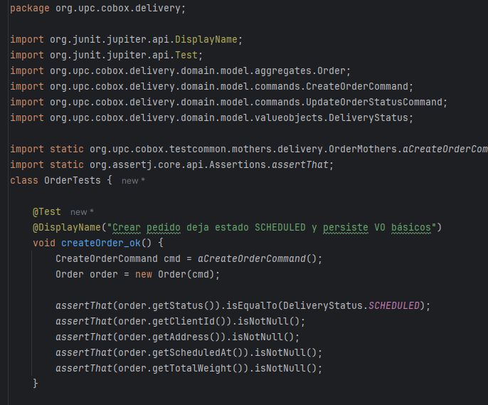
</div>

<div align="center">
    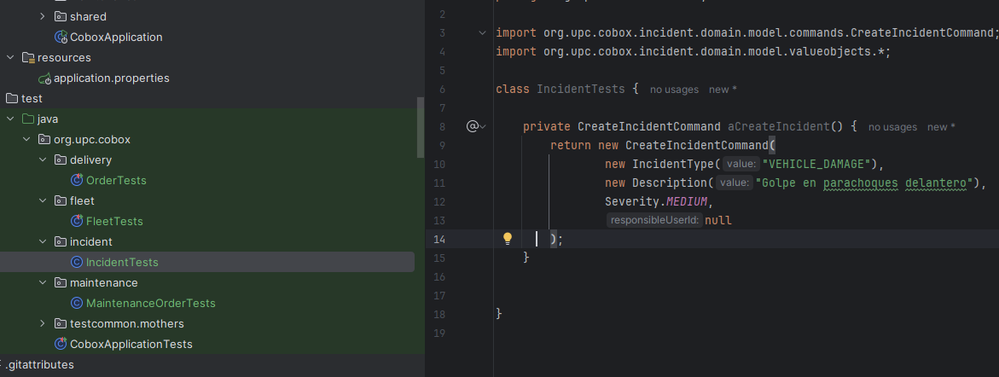
</div>

<div align="center">
    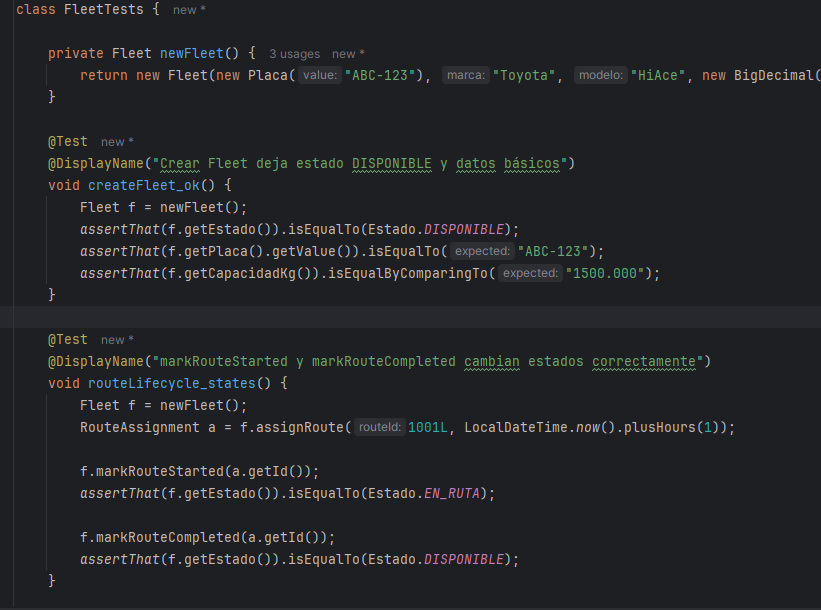
</div>


#### 5.1.2. Pattern Based Backend Application(s)

La aplicación backend de **CoBox** fue diseñada bajo los principios de **Domain-Driven Design (DDD)** y **Clean Architecture**, aplicando diversos patrones de diseño que fortalecen la cohesión interna, la extensibilidad y la mantenibilidad del sistema.
A continuación, se describen los principales patrones empleados, junto con su propósito, localización dentro del sistema y beneficios asociados.

---

##### Patrón Singleton

**Propósito:**
Garantiza que una clase posea una única instancia durante todo el ciclo de vida de la aplicación, proporcionando un punto de acceso global y controlado.

**Aplicación en CoBox:**

* En servicios base como `HttpClientService` o las configuraciones de `Axios` (en el frontend), donde se define una instancia única con la `baseURL` para cada *bounded context* (`Fleet`, `Deliveries`, `Reports`, `Auth`).
* En el backend, se aplica en componentes como `DatabaseConnectionService` y `WebSocketManager`, asegurando una sola conexión activa por servicio y evitando duplicaciones de recursos.

**Ventajas:**

* **Control centralizado:** Mantiene una instancia compartida para recursos globales (configuración, conexiones, tokens).
* **Consistencia de estado:** Garantiza una única fuente de verdad.
* **Optimización de recursos:** Minimiza el consumo de memoria y la inicialización redundante en procesos concurrentes.

**Utilidades:**
Ideal para servicios que requieren mantener un **estado compartido y persistente**, tales como:

* Configuración única de clientes HTTP (`Axios`, `HttpClient`).
* Conexión a bases de datos o brokers de mensajería.
* Administración de sesiones o *sockets* de geolocalización en tiempo real.

---

##### Patrón Factory Method

**Propósito:**
Proporciona una interfaz genérica para la creación de objetos, permitiendo que las subclases definan las instancias específicas que se deben generar.

**Aplicación en CoBox:**

* En los servicios de generación de reportes mediante una `ReportFactory`, que produce distintos tipos de reportes (`FuelReport`, `PerformanceReport`, `DeliverySummaryReport`) según filtros y métricas.
* En la creación de eventos logísticos mediante un `EventFactory`, responsable de instanciar eventos como `DeliveryStartedEvent`, `DeliveryCompletedEvent` o `VehicleMaintenanceEvent`.

**Ventajas:**

* **Desacoplamiento:** El código cliente no depende de clases concretas.
* **Escalabilidad:** Permite incorporar nuevos tipos de reportes o eventos sin modificar la lógica base.
* **Reutilización:** Centraliza la creación de objetos complejos a través de una interfaz común.

**Utilidades:**
Adecuado para casos donde se generan múltiples objetos relacionados, tales como:

* Reportes logísticos con diferentes formatos o fuentes de datos.
* Creación de comandos o eventos dentro de los flujos de entrega y mantenimiento.

---

##### Patrón Observer

**Propósito:**
Establece una relación de suscripción entre objetos, de forma que cuando uno cambia su estado, notifica automáticamente a todos sus observadores.

**Aplicación en CoBox:**

* En el módulo `NotificationsService` y en el flujo de `Deliveries`.
  Cuando una entrega cambia de estado ("En ruta", "Entregado", "Fallido"), se emite un evento que notifica al *dashboard* de supervisión, a los clientes suscritos y a otros servicios (`Reports`, `Fleet`).
* También se emplea para el envío de alertas automáticas relacionadas con mantenimiento o kilometraje excesivo.

**Ventajas:**

* **Desacoplamiento funcional:** Los módulos se comunican sin dependencias directas.
* **Reactividad:** Mantiene sincronizados los componentes en tiempo real.
* **Escalabilidad:** Permite agregar nuevos observadores sin modificar emisores existentes.

**Utilidades:**
Fundamental en sistemas orientados a eventos, como:

* Notificaciones automáticas de entregas o incidencias.
* Actualización en tiempo real del mapa de geolocalización.
* Alertas preventivas de mantenimiento o consumo anómalo de combustible.

---

##### Patrón Builder

**Propósito:**
Facilita la construcción de objetos complejos paso a paso, ofreciendo una interfaz fluida y flexible sin sobrecargar los constructores.

**Aplicación en CoBox:**

* En la creación de reportes personalizados a través de un `ReportBuilder`, que permite agregar secciones específicas (rendimiento, consumo, entregas, evidencias).
* En la configuración dinámica de rutas mediante un `RouteBuilder`, encargado de construir objetos `Route` con parámetros opcionales (conductor, vehículo, puntos de control, tiempos estimados).

**Ventajas:**

* **Claridad y legibilidad:** Estructura la construcción de objetos complejos.
* **Flexibilidad:** Soporta múltiples representaciones del mismo objeto (diario, semanal, mensual).
* **Mantenibilidad:** Facilita incorporar nuevos atributos sin alterar el diseño base.

**Utilidades:**
Apto para objetos con múltiples pasos de configuración, como:

* Reportes logísticos y de desempeño.
* Rutas personalizadas con parámetros variables.
* Dashboards adaptados a distintos roles (conductor, gestor, cliente).

---

##### Patrón Saga

**Propósito:**
Coordina transacciones distribuidas entre varios servicios mediante una secuencia de pasos, aplicando operaciones compensatorias en caso de fallos.

**Aplicación en CoBox:**

* En los flujos logísticos que involucran múltiples *bounded contexts* (`Orders`, `Fleet`, `Deliveries`, `Billing`).
  Por ejemplo, durante una entrega, se registran la asignación del vehículo, el inicio de ruta, la confirmación y la facturación. Si ocurre un error en una etapa, el patrón Saga ejecuta compensaciones para preservar la consistencia global.

**Ventajas:**

* **Consistencia distribuida:** Asegura integridad de datos en flujos multi-servicio.
* **Recuperación automática:** Revierten fallos sin comprometer el flujo completo.
* **Resiliencia:** Aumenta la tolerancia a fallos del sistema.

**Utilidades:**
Clave en procesos de negocio distribuidos, como:

* Gestión del ciclo completo de una entrega.
* Procesos de mantenimiento con varias fases.
* Coordinación entre logística y facturación.

---

##### Patrón API Gateway

**Propósito:**
Centraliza el acceso a todos los microservicios, actuando como un único punto de entrada para peticiones externas y aplicando políticas de seguridad y enrutamiento.

**Aplicación en CoBox:**

* Implementado mediante `CoWareGateway`, que gestiona peticiones hacia `Auth`, `Deliveries`, `Tracking`, `Evidence` y `Reports`.
  Este gateway maneja la autenticación JWT, la autorización basada en roles y las políticas de seguridad (CORS, rate limiting).

**Ventajas:**

* **Seguridad y control centralizado:** Gestiona autenticación, logs y reglas de acceso.
* **Escalabilidad:** Permite agregar o versionar microservicios sin afectar el cliente.
* **Eficiencia:** Simplifica la comunicación y reduce la latencia cliente-servidor.

**Utilidades:**
Indispensable en arquitecturas de microservicios donde se requiere:

* Un punto único de autenticación y gestión de tokens.
* Administración de rutas y cabeceras globales.
* Políticas unificadas de seguridad y monitoreo.

---

##### Patrón Event-Driven (Basado en eventos)

**Propósito:**
Permite la comunicación asíncrona entre microservicios mediante la publicación y suscripción de eventos, promoviendo un diseño altamente desacoplado y reactivo.

**Aplicación en CoBox:**

* En la interacción entre `Deliveries`, `Fleet`, `Notifications` y `Reports`.
  Cuando se completa una entrega, `Deliveries` publica el evento `DeliveryCompleted`, que los demás servicios consumen para actualizar dashboards, generar reportes o enviar notificaciones.

**Ventajas:**

* **Escalabilidad:** Facilita la incorporación de nuevos consumidores sin modificar el código existente.
* **Desacoplamiento:** Los servicios se comunican a través de eventos, no de llamadas directas.
* **Reactividad:** Permite respuestas inmediatas ante cambios del sistema.

**Utilidades:**
Fundamental para sistemas logísticos y distribuidos:

* Publicación de eventos de entregas, recargas o incidencias.
* Sincronización de reportes en segundo plano.
* Alertas automáticas para supervisores o clientes.

#### 5.1.3. Pattern Based Custom Software Library

#### Implementación de DDD (Domain-Driven Design)

El diseño impulsado por el dominio (DDD) es un enfoque arquitectónico que organiza el desarrollo de software en torno a los **dominios del negocio**, dividiendo la aplicación en **Bounded Contexts** y capas bien definidas.  
En **CoWare**, se ha adoptado DDD como la base de la arquitectura, permitiendo representar fielmente los procesos del sector logístico mediante una estructura modular y escalable.

La aplicación se ha organizado en los siguientes **Bounded Contexts** principales:

- **Fleet Management**: administración de vehículos, choferes, mantenimiento y kilometraje.  
- **Deliveries Management**: registro, seguimiento y confirmación de entregas.  
- **Tracking & Evidence**: geolocalización en tiempo real y almacenamiento de evidencias fotográficas.  
- **Reports & Analytics**: generación automática de reportes operativos y de desempeño.  
- **IAM (Identity & Access Management)**: autenticación, autorización y gestión de roles de usuario.  
- **Shared Kernel**: módulo común que incluye utilidades, constantes, eventos compartidos y configuraciones base.

Cada **Bounded Context** refleja un subdominio del negocio logístico y se estructura en las cuatro capas recomendadas por DDD: **Aplicación**, **Dominio**, **Infraestructura** e **Interfaces**.

---

#### Ejemplo aplicado al Bounded Context: Deliveries Management

El **Bounded Context Deliveries** se encarga de gestionar todo el flujo de entregas, desde la asignación del vehículo hasta la confirmación final del servicio.  
Este contexto aplica las capas de DDD de la siguiente forma:

- **Capa de Aplicación:**  
  Contiene los casos de uso como `CreateDeliveryService`, `CompleteDeliveryService` y `UploadEvidenceService`.  
  Estos servicios orquestan la lógica de negocio, coordinando la interacción entre las entidades de dominio y los repositorios.  
  También gestionan eventos de integración para notificar a otros contextos (como Reports o Notifications).

- **Capa de Dominio:**  
  Define las entidades centrales (`Delivery`, `VehicleAssignment`, `Evidence`) y los objetos de valor (`DeliveryStatus`, `Location`, `PhotoMetadata`).  
  Aquí se encuentran las reglas de negocio, como la validación de estados de entrega, el control de kilometraje y las condiciones para marcar un servicio como completado.

- **Capa de Infraestructura:**  
  Implementa la persistencia y la comunicación entre microservicios.  
  Se utiliza **Spring Data JPA** para la interacción con la base de datos **MySQL**, y **RabbitMQ** o **Kafka** para la mensajería de eventos asíncronos.  
  Además, se integran servicios de almacenamiento en la nube (por ejemplo, **Azure Blob Storage**) para guardar las evidencias fotográficas.

- **Capa de Interfaces:**  
  Expone los endpoints REST del contexto, como `POST /api/v1/deliveries` o `PATCH /api/v1/deliveries/{id}/complete`, que permiten a la aplicación frontend registrar y actualizar entregas.  
  También incluye controladores WebSocket para actualizaciones en tiempo real del estado de las rutas.

---

#### Ventajas de usar DDD en CoWare

- **Separación de responsabilidades:** Cada capa y contexto tiene funciones claras, lo que mejora el mantenimiento y la calidad del código.  
- **Alineación con el negocio:** Los Bounded Contexts reflejan directamente los procesos logísticos reales, como entregas, monitoreo, mantenimiento o reportes.  
- **Escalabilidad:** Cada contexto puede desplegarse y evolucionar de forma independiente, facilitando la adopción de una arquitectura de microservicios.  
- **Reutilización:** Las reglas de negocio en la capa de dominio pueden ser aplicadas por diferentes interfaces (web, móvil, API externa).  
- **Tolerancia a cambios:** Permite agregar nuevas funcionalidades, como un módulo de facturación o analítica avanzada, sin afectar los demás contextos.

---

#### Utilidades de DDD en este proyecto

- **Organización y mantenibilidad:** La estructura modular facilita el trabajo en equipo y la integración de nuevas funcionalidades.  
- **Claridad conceptual:** Cada contexto representa un área de negocio concreta, evitando confusiones y solapamientos de lógica.  
- **Pruebas más simples:** Al estar las reglas de negocio aisladas, las pruebas unitarias y de integración pueden ejecutarse con mayor precisión.  
- **Adaptabilidad:** Se pueden implementar diferentes interfaces de usuario (panel web, app móvil de conductor, dashboards administrativos) sin modificar la lógica de negocio.  
- **Extensibilidad:** Nuevos contextos, como “Billing” o “Client Management”, pueden agregarse fácilmente sin romper el sistema existente.

#### 5.1.4. Framework Pattern Driven Refactoring Report

El proceso de refactorización de **CoBox** se fundamenta en la aplicación sistemática de **patrones de diseño y arquitectura**, con el propósito de garantizar **cohesión interna, bajo acoplamiento y alta mantenibilidad** en todos los *bounded contexts*.
Entre los patrones empleados destacan el **Data Transfer Object (DTO)** y el **Command Query Responsibility Segregation (CQRS)**, ambos esenciales para mejorar la organización del flujo de datos, la escalabilidad y la claridad del código fuente.

---

##### Implementación del patrón DTO (Data Transfer Object)

El patrón **DTO (Data Transfer Object)** se utiliza para **transferir información entre capas del sistema** sin exponer directamente las entidades del dominio.
Los DTO son objetos simples y serializables, sin lógica de negocio, que facilitan la comunicación entre el backend y las interfaces cliente, mejorando la eficiencia y la seguridad en la transferencia de datos.

---

###### Argumentos para su adopción en CoBox

* **Optimización del tráfico de red:**
  En una plataforma logística como **CoBox**, que maneja datos de entregas, vehículos, reportes y mantenimientos, los DTO permiten **agrupar información relevante en un solo objeto** antes de enviarla al cliente.
  Esto reduce la cantidad de llamadas a la API y mejora el rendimiento, especialmente en endpoints que combinan información de varios módulos.

* **Desacoplamiento entre capas:**
  Los DTO establecen una **barrera de abstracción** entre la capa de dominio y la capa de presentación, evitando que los modelos internos se expongan directamente.
  De esta forma, los cambios estructurales en las entidades (`Delivery`, `Vehicle`, `MaintenanceOrder`, etc.) no afectan la API pública ni las integraciones existentes.

* **Seguridad y control de datos:**
  Permiten **filtrar información sensible** (por ejemplo, identificadores internos o tokens de sesión) antes de enviarla a los clientes, reforzando las políticas de seguridad del sistema.

---

###### Ejemplo aplicado al Bounded Context: Deliveries

En el *bounded context* **Deliveries**, se implementa un DTO llamado `DeliveryResource`, diseñado para transportar únicamente los datos necesarios de una entrega al frontend, sin exponer el modelo completo del dominio `Delivery`.

```java
package com.coware.deliveries.interfaces.rest.resources;

public record DeliveryResource(
    Long id,
    String deliveryCode,
    String status,
    String driverName,
    String vehiclePlate,
    String deliveryDate
) {}
```

Este recurso encapsula los atributos estrictamente requeridos por la interfaz cliente, garantizando un **intercambio de datos ligero, seguro y desacoplado** de la estructura interna del dominio.

---

##### Implementación del patrón CQRS (Command Query Responsibility Segregation)

El patrón **CQRS** separa las operaciones de **lectura (Query)** de las operaciones de **escritura (Command)**, mejorando la escalabilidad, la claridad del código y el control sobre los flujos de datos.
En el contexto de **CoBox**, este patrón se aplica principalmente en el **Bounded Context Maintenance**, encargado de gestionar las órdenes y programaciones de mantenimiento de la flota.

---

###### Aplicación en el Bounded Context: Maintenance

En **Maintenance**, el patrón CQRS permite distinguir entre los servicios que **modifican el estado del sistema** y aquellos que **recuperan información**.
Esta separación facilita la validación de reglas de negocio y mejora la capacidad de auditoría y testing.

* **Comandos (Command Services):**
  Los comandos se encargan de ejecutar acciones que alteran el estado del dominio, tales como la creación, actualización o cierre de órdenes de mantenimiento.
  Ejemplos:

  * `CreateMaintenanceOrderCommand`
  * `UpdateMaintenanceScheduleCommand`
  * `CompleteMaintenanceOrderCommand`

  Estos comandos son procesados por el servicio de aplicación:

  ```java
  @Service
  @Transactional
  public class MaintenanceScheduleCommandServiceImpl implements MaintenanceScheduleCommandService {
      private final MaintenanceScheduleRepository scheduleRepository;
      private final MaintenanceOrderRepository orderRepository;

      public MaintenanceScheduleCommandServiceImpl(
              MaintenanceScheduleRepository scheduleRepository,
              MaintenanceOrderRepository orderRepository) {
          this.scheduleRepository = scheduleRepository;
          this.orderRepository = orderRepository;
      }

      @Override
      public Long handle(CreateMaintenanceOrderCommand command) {
          MaintenanceOrder order = new MaintenanceOrder(command.vehicleId(), command.scheduledDate());
          return orderRepository.save(order).getId();
      }
  }
  ```

* **Consultas (Query Services):**
  Las consultas se implementan en servicios independientes que **no modifican el estado**, y están optimizadas para recuperar datos de manera eficiente.
  Ejemplo:

  ```java
  @Service
  public class MaintenanceScheduleQueryServiceImpl implements MaintenanceScheduleQueryService {
      private final MaintenanceScheduleRepository scheduleRepository;

      public MaintenanceScheduleQueryServiceImpl(MaintenanceScheduleRepository scheduleRepository) {
          this.scheduleRepository = scheduleRepository;
      }

      @Override
      public Optional<MaintenanceSchedule> findByVehicleId(Long vehicleId) {
          return scheduleRepository.findByVehicleId(vehicleId);
      }
  }
  ```

---

###### Beneficios del patrón CQRS en CoBox

* **Separación de responsabilidades:** Aísla la lógica de lectura y escritura, reduciendo el acoplamiento y aumentando la claridad del código.
* **Escalabilidad y rendimiento:** Permite optimizar las consultas sin afectar la lógica de negocio que maneja comandos.
* **Mantenibilidad:** Facilita la incorporación de nuevas operaciones sin alterar el núcleo del dominio.
* **Trazabilidad:** Mejora la auditoría del sistema al diferenciar explícitamente las acciones que modifican el estado del sistema de las que solo consultan información.
* **Preparación para microservicios:** Esta separación conceptual permite dividir fácilmente los servicios de lectura y escritura en microservicios independientes en etapas posteriores.

---

##### Conclusión del proceso de refactorización

La incorporación de patrones como **DTO** y **CQRS** en la arquitectura DDD de CoBox ha permitido **fortalecer la modularidad, mejorar la calidad del código y preparar la base técnica** para la próxima migración hacia una arquitectura de microservicios.
Ambos patrones se complementan al ofrecer **claridad en los flujos de datos**, **seguridad en las interacciones** y **flexibilidad para evolucionar el sistema sin afectar los módulos existentes**.

### 5.2. Software Configuration Management

La **Gestión de Configuración de Software (SCM, por sus siglas en inglés)** es una disciplina fundamental que permite **identificar, controlar y rastrear todos los componentes del software** a lo largo de su ciclo de vida.
Su propósito es garantizar que los cambios en el código fuente, la documentación y los artefactos del proyecto se administren de forma organizada, evitando inconsistencias y preservando la integridad entre versiones.

En el caso de **CoBox**, esta práctica resulta esencial debido a la naturaleza modular del sistema —basado en *bounded contexts* bajo el paradigma DDD— y a su progresiva transición hacia una **arquitectura de microservicios**.
La SCM permite mantener la coherencia entre entornos de desarrollo, pruebas y producción, asegurando una evolución controlada del producto digital.

El objetivo principal de la SCM en CoBox es **mantener la estabilidad del sistema**, **facilitar la colaboración entre desarrolladores** y **garantizar un despliegue controlado, reproducible y seguro**.

---

#### 5.2.1. Software Development Environment Configuration

##### Directrices de Desarrollo para CoBox

Esta sección presenta las **convenciones, herramientas y prácticas** adoptadas en el desarrollo de **CoBox**, una plataforma web inteligente orientada a la **gestión logística, trazabilidad y mantenimiento preventivo de flotas**.
El entorno de desarrollo ha sido diseñado para mantener una estructura de código coherente, escalable y alineada con los principios de **Domain-Driven Design (DDD)** y **Clean Architecture**.

---

##### Definición de Requisitos Funcionales

Previo al desarrollo, se establecieron los principales objetivos funcionales del sistema:

* **Gestión de Entregas y Rutas:** Registro, seguimiento y confirmación de entregas con evidencia fotográfica y control de kilometraje.
* **Monitoreo en Tiempo Real:** Geolocalización de unidades activas mediante integración con APIs de mapas.
* **Reportes Automáticos:** Generación de indicadores de rendimiento, mantenimiento y desempeño operativo.
* **Control de Flota:** Administración de vehículos, mantenimiento preventivo y disponibilidad por estado.
* **Gestión de Usuarios y Roles:** Sistema de autenticación y autorización con **JWT**, con roles diferenciados (gestor, conductor, administrador).
* **Optimización de Costos:** Consolidación de datos operativos para detectar ineficiencias logísticas.

---

##### Elección del Stack Tecnológico

###### Frontend

* **Tecnología:** React 18
* **Motivo de elección:**
  React ofrece una arquitectura declarativa basada en componentes, ideal para construir interfaces dinámicas, reactivas y reutilizables.
  Permite una integración sencilla con el backend mediante `Axios` y control de estado a través de Context API o React Query.
* **Ventajas:**

  * Excelente soporte para **Single Page Applications (SPA)** mediante React Router.
  * Ecosistema maduro y mantenido activamente.
  * Compatibilidad con frameworks como **Next.js** para SSR/SSG.
  * Integración natural con **TypeScript** para un tipado más seguro.

###### Backend

* **Tecnología:** Spring Boot (Java 21)
* **Motivo de elección:**
  Spring Boot proporciona una estructura robusta y flexible para construir **microservicios RESTful** en conformidad con las capas de DDD.
  Ofrece integración nativa con **Spring Data JPA**, **Spring Security (JWT)** y control transaccional eficiente.
* **Ventajas:**

  * Facilidad de despliegue en plataformas cloud como AWS.
  * Ecosistema extensible con dependencias maduras (Spring Cloud, Validation, Lombok).
  * Alta estabilidad y escalabilidad para entornos productivos.

###### Base de Datos

* **Tecnología:** PostgreSQL (AWS RDS)
* **Motivo de elección:**
  PostgreSQL ofrece un motor relacional sólido y altamente compatible con **Spring Data JPA**, con soporte para transacciones ACID y operaciones complejas.
* **Ventajas:**

  * Alta disponibilidad y replicación en AWS RDS.
  * Compatibilidad con JSONB y consultas avanzadas.
  * Seguridad y cifrado en reposo y en tránsito.

---

##### Configuración del Entorno de Desarrollo

* **IDE Principal:** IntelliJ IDEA Ultimate

  * **Propósito:** Desarrollo, depuración y ejecución de los proyectos backend (Spring Boot) y frontend (React).
  * **Ruta:** [https://www.jetbrains.com/idea/download](https://www.jetbrains.com/idea/download)
  * **Ventajas:** Integración con Git, Maven y Docker; refactorización avanzada; inspección de código estática; y soporte para entornos full stack.

* **Gestores de Dependencias:**

  * **Backend:** Maven
  * **Frontend:** NPM
  * **Objetivo:** Asegurar versiones consistentes de librerías y mantener la reproducibilidad del entorno de desarrollo.

* **Lenguajes principales:**

  * **Java 21 (backend)**
  * **TypeScript (frontend)**

---

##### Control de Versiones y Colaboración

* **Herramienta:** GitHub

  * **URL:** [https://github.com](https://github.com)
  * **Motivo:** Control de versiones distribuido y colaboración centralizada entre desarrolladores.
  * **Flujo adoptado:** **GitFlow**, con ramas:

    * `main` → versión estable y desplegable.
    * `develop` → rama activa de integración.
    * `feature/*` → ramas temporales por funcionalidad.
    * `release/*` → preparación de entregas.
    * `hotfix/*` → corrección de incidencias críticas.
  * **Commits:** Convenciones basadas en **Conventional Commits**.
  * **Versionado:** Aplicación de **Semantic Versioning (SemVer 2.0.0)** para releases.

---

##### Despliegue del Backend

* **Plataforma:** AWS Elastic Beanstalk

  * **Propósito:** Despliegue automatizado del backend Spring Boot.
  * **Ventajas:** Integración directa con GitHub, balanceo de carga automático y gestión escalable de entornos.
  * **Integraciones:**

    * **AWS RDS (PostgreSQL)** como base de datos persistente.
    * **S3** para almacenamiento de archivos y evidencias.
    * **CloudWatch** para monitoreo de logs y métricas.

* **Workflows de Deploy:**

  * Implementados mediante **GitHub Actions**, con etapas de build, test y deployment automatizado.
  * Configuración de *secrets* para credenciales y variables de entorno.

---

##### Product UX/UI Design

* **Herramienta:** Figma

  * **Propósito:** Creación de prototipos de interfaz y flujos de usuario para el panel administrativo y la app del conductor.
  * **Ruta:** [https://www.figma.com](https://www.figma.com)
  * **Ventajas:** Colaboración en tiempo real, diseño de componentes reutilizables y consistencia visual en todo el producto.

---

##### Software Development Practices

Durante el desarrollo de **CoBox**, se implementaron prácticas y estándares reconocidos en la industria:

* **HTML5 / CSS3:** Estructura semántica y estilos adaptativos para garantizar accesibilidad y experiencia responsive.

  * Referencia: [https://developer.mozilla.org/docs/Web/HTML](https://developer.mozilla.org/docs/Web/HTML)

* **TypeScript (React):** Tipado estático, componentes funcionales y Hooks para mejorar mantenibilidad y detectar errores en tiempo de compilación.

  * Referencia: [https://www.typescriptlang.org/](https://www.typescriptlang.org/)

* **Spring Boot (Java 21):** Desarrollo de microservicios REST, autenticación JWT, validación con `@Valid`, control global de excepciones y uso de `@Transactional` para consistencia de datos.

  * Referencia: [https://spring.io/projects/spring-boot](https://spring.io/projects/spring-boot)

* **Domain-Driven Design (DDD):** División del dominio en *bounded contexts*, uso de entidades, agregados, value objects, servicios de dominio y eventos de integración.

  * Referencia: Evans, Eric. *Domain-Driven Design: Tackling Complexity in the Heart of Software*. Addison-Wesley, 2004.

* **Clean Architecture & SOLID:** Principios para garantizar independencia entre capas, responsabilidad única y flexibilidad para refactorización.

  * Referencia: Martin, Robert C. *Clean Architecture*. Prentice Hall, 2017.

* **GitFlow Workflow:** Organización del ciclo de vida del código fuente en ramas controladas y versionadas.

  * Referencia: Driessen, Vincent. *A successful Git branching model*, 2010.

---

#### 5.2.2 Source Code Management

#### Gestión de Cambios en el Código Fuente con GitHub

El equipo de desarrollo de **CoBox** ha definido una estrategia sólida para la **gestión de cambios en el código fuente**, utilizando **GitHub** como plataforma principal de **control de versiones** y colaboración.  
Esta práctica garantiza la trazabilidad de los cambios, la organización del flujo de trabajo y la correcta integración entre los diferentes módulos que componen el sistema: frontend, backend y servicios de apoyo.

Se han configurado **repositorios remotos** para almacenar el código de cada componente de la plataforma, permitiendo un desarrollo colaborativo y controlado entre los integrantes del equipo.

**Repositorios del proyecto:**

- **Landing Page:** https://github.com/G1-FundamentosArqui-6336/Landing-Page
- **Frontend:** https://github.com/G1-FundamentosArqui-6336/frontend
- **Backend:** https://github.com/G1-FundamentosArqui-6336/backend
---

#### Estructura del Repositorio

Para asegurar un desarrollo ordenado y colaborativo, los repositorios de CoBox implementan una **estructura basada en ramas (branches)** según las etapas del flujo de trabajo.  
Esta metodología permite mantener la versión estable en producción mientras se desarrollan nuevas funcionalidades en paralelo.

Las ramas principales son:

- **main:** Contiene la versión estable y lista para producción. Todo el código en esta rama ha pasado pruebas funcionales y de integración.  
- **develop:** Reúne las características en desarrollo que serán integradas posteriormente en la rama `main`.  
- **feature/**: Ramas derivadas de `develop` para crear nuevas funcionalidades específicas.  
- **release/**: Ramas destinadas a la preparación de una nueva versión antes del despliegue final.  

---

#### Modelo de Trabajo: GitFlow

Se aplica el modelo **GitFlow**, propuesto por **Vincent Driessen**, el cual estructura el proceso de desarrollo mediante ramas específicas que representan las distintas fases del ciclo de vida del software.  
Este modelo facilita el trabajo colaborativo, la integración continua y la trazabilidad de versiones.

**Resumen de ramas GitFlow utilizadas:**
- `main`: código estable en producción.  
- `develop`: rama de integración de nuevas funcionalidades.  
- `feature/*`: desarrollo de nuevas características (por ejemplo, `feature/geolocation-module`).  
- `release/*`: pruebas previas al lanzamiento (por ejemplo, `release/v1.2.0`).  

---

#### Convenciones de Commits

El equipo adopta el estándar **Conventional Commits**, con el fin de mantener un historial de cambios claro, estructurado y automatizable.  
Cada mensaje de commit incluye un prefijo que describe la naturaleza del cambio, permitiendo generar **versionado semántico** y reportes de cambios (changelogs) de forma automática.

**Ejemplos de convenciones utilizadas:**

| Tipo | Descripción | Ejemplo |
|------|--------------|----------|
| **feat** | Nueva funcionalidad | `feat: agregar módulo de monitoreo de rutas` |
| **fix** | Corrección de errores | `fix: resolver error en cálculo de kilometraje` |
| **docs** | Actualización de documentación | `docs: actualizar guía de instalación del backend` |
| **style** | Cambios de formato o estilo sin afectar la lógica | `style: ajustar sangrías en componente delivery-card` |
| **refactor** | Mejoras internas sin alterar el comportamiento | `refactor: optimizar servicio de geolocalización` |
| **test** | Añadir o modificar pruebas | `test: crear pruebas unitarias para VehicleService` |

Este estándar mejora la comunicación entre los desarrolladores y facilita la revisión de cambios, manteniendo un historial limpio y fácil de entender.

---

#### Documentación del Proyecto

Toda la documentación de **CoBox** se encuentra en los archivos `README.md` ubicados en la raíz de cada repositorio.  
Estos archivos incluyen:

- Descripción general del módulo.  
- Requisitos del entorno de desarrollo.  
- Instrucciones para instalación y despliegue.  
- Guía para contribuir al proyecto.  
- Ejemplos de uso de la API o comandos principales.

---

#### 5.2.3. Source Code Style Guide & Conventions

Esta guía establece las **convenciones, estructuras y principios de estilo** aplicados en el desarrollo del código fuente de **CoBox**.
Su objetivo es garantizar **coherencia, mantenibilidad y escalabilidad** en todos los componentes del sistema, tanto en el **frontend (React + TypeScript)** como en el **backend (Spring Boot + Java 21)**.
La aplicación disciplinada de estas convenciones asegura un código limpio, legible y fácil de mantener por cualquier miembro del equipo o colaborador externo.

---

##### Lenguajes y Tecnologías Base

* **HTML5:** Estructura semántica y accesible del contenido web.
* **CSS3 / SCSS:** Definición modular de estilos con diseño responsivo.
* **TypeScript (React):** Tipado estático, componentes funcionales y validación temprana de errores.
* **Java 21 (Spring Boot):** Lógica de negocio, seguridad y persistencia bajo principios DDD.
* **JSON / REST:** Intercambio de datos entre frontend y backend mediante APIs RESTful.

---

### Frontend Code Style — React + TypeScript

##### Estructura de Proyecto

El frontend de CoBox sigue una **arquitectura modular y escalable**, organizada por **bounded contexts** y subdividida en tres capas principales: `data`, `domain` y `presentation`.

```bash
src/
 ├── deliveries/
 │    ├── data/          # Conexión API, repositorios y mapeadores
 │    ├── domain/        # Modelos, entidades y lógica de negocio
 │    └── presentation/  # Componentes UI, vistas y navegación
 ├── shared/             # Componentes y utilidades comunes
 └── app/                # Configuración global (routes, providers)
```

##### Convenciones de Nomenclatura

| Tipo de elemento      | Convención                         | Ejemplo                              |
| --------------------- | ---------------------------------- | ------------------------------------ |
| Componentes React     | PascalCase                         | `DeliveryCard.tsx`, `HomeScreen.tsx` |
| Hooks personalizados  | camelCase prefijado con `use`      | `useAuth()`, `useFetchDeliveries()`  |
| Archivos de estilos   | kebab-case                         | `delivery-card.scss`                 |
| Interfaces y tipos    | PascalCase prefijado con `I` o `T` | `IUser`, `TDeliveryStatus`           |
| Variables y funciones | camelCase                          | `handleSubmit`, `isLoggedIn`         |
| Constantes globales   | UPPER_CASE                         | `BASE_URL`, `MAX_RETRIES`            |

##### Reglas de Código y Formateo

* **Indentación:** 2 espacios por nivel.
* **Longitud máxima de línea:** 100 caracteres.
* **Imports ordenados:** primero librerías externas, luego internas, y finalmente estilos.
* **Hooks:** deben ser llamados al inicio del cuerpo de un componente.
* **JSX limpio:** evitar anidaciones excesivas y utilizar componentes reutilizables.
* **PropTypes o tipos explícitos:** todos los componentes deben especificar tipos de props y estado.

##### Ejemplo de Componente

```tsx
import React from "react";
import { Delivery } from "../../domain/models/Delivery";

interface DeliveryCardProps {
  delivery: Delivery;
}

export const DeliveryCard: React.FC<DeliveryCardProps> = ({ delivery }) => (
  <article className="delivery-card">
    <h3>{delivery.code}</h3>
    <p>Status: {delivery.status}</p>
    <p>Driver: {delivery.driverName}</p>
  </article>
);
```

##### Estilo y Buenas Prácticas de UI

* **CSS modularizado:** un archivo `.scss` por componente.
* **Variables de color y tipografía** definidas globalmente en `/shared/styles/_variables.scss`.
* **Responsive Design:** uso de *flexbox*, *grid* y *media queries* adaptativas.
* **Testing UI:** validación mediante **React Testing Library** y **Jest**.

---

### Backend Code Style — Java 21 + Spring Boot

##### Estructura de Proyecto (DDD)

El backend sigue una organización basada en **bounded contexts**, cada uno estructurado conforme a las capas DDD:

```bash
src/main/java/org/upc/cobox/
 ├── maintenance/               # Bounded Context: Maintenance
 │    ├── application/          # Servicios y comandos de aplicación
 │    ├── domain/               # Entidades, value objects, agregados, eventos
 │    ├── infrastructure/       # Persistencia y adaptadores externos
 │    └── interfaces/           # Controladores REST, DTOs y mapeadores
 └── shared/                    # Utilidades comunes (event bus, base classes)
```

##### Nomenclatura

| Tipo de elemento   | Convención                                   | Ejemplo                                          |
| ------------------ | -------------------------------------------- | ------------------------------------------------ |
| Paquetes           | lowercase                                    | `org.upc.cobox.maintenance.domain`               |
| Clases y Entidades | PascalCase                                   | `MaintenanceOrder`, `VehicleAssignment`          |
| Métodos            | camelCase                                    | `createOrder()`, `validateRule()`                |
| Constantes         | UPPER_CASE                                   | `MAX_TOLERANCE_PERCENTAGE`                       |
| Variables          | camelCase                                    | `maintenanceRule`, `orderRepository`             |
| DTOs               | PascalCase con sufijo `Resource` o `Request` | `MaintenanceOrderResource`, `CreateOrderRequest` |
| Eventos            | PascalCase con sufijo `Event`                | `MaintenanceOrderCreatedEvent`                   |

##### Estilo y Reglas de Código

* **Indentación:** 4 espacios por nivel.
* **Longitud máxima de línea:** 120 caracteres.
* **Anotaciones:** alineadas sobre el método o clase correspondiente.
* **Excepciones:** personalizadas dentro del contexto de dominio (`InvalidMaintenanceStateException`).
* **Documentación:** uso de **KDoc/Javadoc** en clases públicas y métodos clave.
* **Logs:** emplear `Slf4j` para registro estructurado.
* **Validaciones:** usar `javax.validation` (`@NotNull`, `@Size`, `@Min`, etc.) en DTOs y comandos.

##### Ejemplo de Servicio Aplicando DDD

```java
@Service
@Transactional
public class MaintenanceScheduleCommandServiceImpl implements MaintenanceScheduleCommandService {

    private final MaintenanceScheduleRepository scheduleRepository;
    private final MaintenanceOrderRepository orderRepository;

    public MaintenanceScheduleCommandServiceImpl(MaintenanceScheduleRepository scheduleRepository,
                                                 MaintenanceOrderRepository orderRepository) {
        this.scheduleRepository = scheduleRepository;
        this.orderRepository = orderRepository;
    }

    @Override
    public Long handle(CreateMaintenanceOrderCommand command) {
        MaintenanceOrder order = new MaintenanceOrder(command.vehicleId(), command.scheduledDate());
        return orderRepository.save(order).getId();
    }
}
```

##### Testing y Cobertura

* **Framework de pruebas:** JUnit 5 + Mockito.
* **Estrategia:** pruebas unitarias por capa (domain, application, infrastructure).
* **Cobertura mínima:** 80% por módulo.
* **Tests de integración:** validados con `@SpringBootTest`.
* **Nombrado:** `ClassNameTest` (por ejemplo, `MaintenanceOrderServiceTest`).

---

### Convenciones Transversales

##### Commits y Versionado

* **Mensajes de commit:** seguir el formato de **Conventional Commits**:

  ```
  feat: add new delivery tracking endpoint
  fix: resolve maintenance schedule persistence issue
  refactor: simplify order repository interface
  ```
* **Versionado semántico:**

  * `MAJOR.MINOR.PATCH` → ejemplo: `v1.3.2`
  * Cambios mayores indican ruptura de compatibilidad.

##### Documentación

* Cada módulo debe incluir un archivo `README.md` con:

  * Descripción del contexto.
  * Dependencias principales.
  * Pasos de ejecución local y despliegue.
  * Enlaces a documentación adicional.

##### Principios de Código Limpio

* **Responsabilidad Única (SRP):** cada clase y método debe tener un único propósito.
* **Open/Closed Principle:** el código debe ser extensible sin modificarse.
* **DRY (Don’t Repeat Yourself):** evitar duplicidad mediante abstracción y reutilización.
* **YAGNI (You Aren’t Gonna Need It):** implementar solo lo necesario.
* **Fail Fast:** validaciones tempranas ante errores.

---

### Referencias Técnicas

* **TypeScript Style Guide – Google:** [https://google.github.io/styleguide/tsguide.html](https://google.github.io/styleguide/tsguide.html)
* **Airbnb React/JSX Style Guide:** [https://airbnb.io/javascript/react](https://airbnb.io/javascript/react)
* **Oracle Java Code Conventions:** [https://www.oracle.com/java/technologies/javase/codeconventions-150003.pdf](https://www.oracle.com/java/technologies/javase/codeconventions-150003.pdf)
* **Spring Boot Reference Guide:** [https://docs.spring.io/spring-boot/docs/current/reference/html](https://docs.spring.io/spring-boot/docs/current/reference/html)
* **DDD & Clean Code Principles:**

  * Evans, Eric. *Domain-Driven Design: Tackling Complexity in the Heart of Software*.
  * Martin, Robert C. *Clean Architecture*.
* **Conventional Commits:** [https://www.conventionalcommits.org](https://www.conventionalcommits.org)
* **Semantic Versioning 2.0.0:** [https://semver.org](https://semver.org)

#### 5.2.4. Software Deployment Configuration

Esta sección resume —de forma concisa y operativa— el flujo de **despliegue del backend (Spring Boot, Java 21) en AWS** usando **Elastic Beanstalk (EB)** y **PostgreSQL en RDS**, con **GitHub Actions** para CI/CD.
Se incluye una nota breve para la *landing* en Netlify.

> **Stack**: Spring Boot (21) · PostgreSQL · AWS EB + RDS · GitHub Actions · Maven

---

##### 1) RDS PostgreSQL (nueva instancia)

**Configuración mínima**

* Engine: **PostgreSQL 17** · Template: **Free tier** · Class: **db.t3.micro** · Storage: **20 GB gp2**
* DB identifier: `cobox` *(único)*
* Master user: `cl_admin` · Password: *(guardar en secreto)*
* **VPC**: default (la misma del ecosistema actual) · **Public access**: **Yes**
* **DB name**: `cobox_bd`
* **Security Group**: crear `cobox-backend-rds-sg` (abriremos reglas abajo)

**Inbound temporal (desarrollo/local)**

```
Type: PostgreSQL | Protocol: TCP | Port: 5432 | Source: 0.0.0.0/0
Desc: Acceso temporal de desarrollo
```

> Luego se restringe para permitir **solo** el SG del entorno de EB.

<div align="center">
    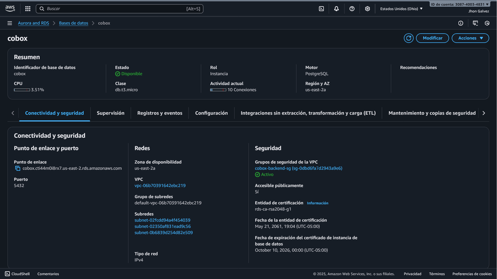
</div>

---

##### 2) Elastic Beanstalk (Java 21)

**Crear aplicación/entorno**

* Application: `cobox-backend` *(único)*
* Environment: `cobox-backend-env` *(único)*
* Platform: **Java – Corretto 21 (Amazon Linux 2023)**
* Preset: **Single instance (free tier)**
* Code: **Sample application**

**Configure more options → Software (Environment properties)**

```properties
SERVER_PORT=5000
SPRING_DATASOURCE_URL=jdbc:postgresql://<RDS-ENDPOINT>:5432/nuevo_backend
SPRING_DATASOURCE_USERNAME=nuevo_admin
SPRING_DATASOURCE_PASSWORD=<TU_PASSWORD>
SPRING_JPA_HIBERNATE_DDL_AUTO=update
SPRING_JPA_SHOW_SQL=false
SPRING_JPA_PROPERTIES_HIBERNATE_DIALECT=org.hibernate.dialect.PostgreSQLDialect
```

* Instances: `t3.micro`
* Roles/Profiles: **aws-elasticbeanstalk-service-role** / **aws-elasticbeanstalk-ec2-role**
* Network: VPC default, subnets públicas, **Public IP: enabled**

<div align="center">
    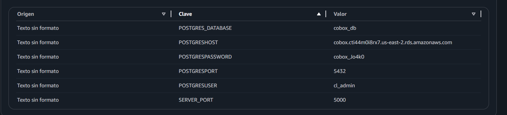
</div>

<div align="center">
    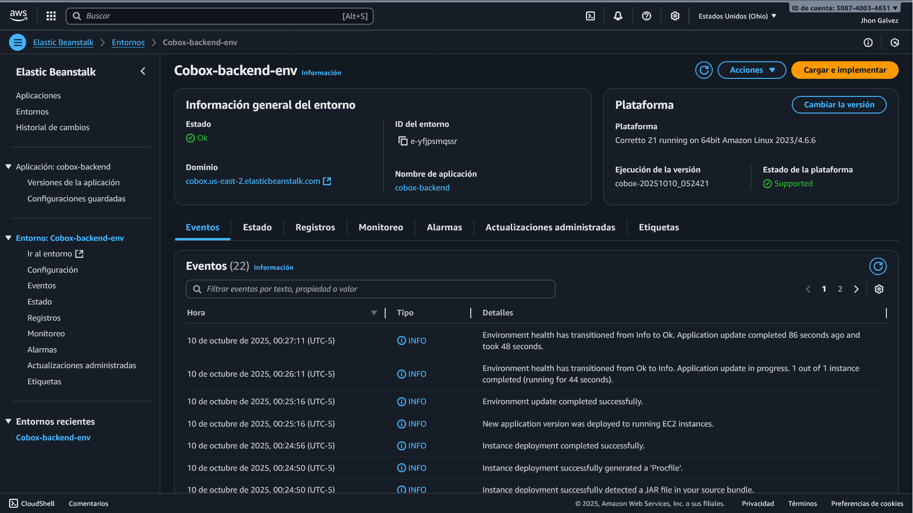
</div>

---

##### 3) Conectar Security Groups (RDS ↔ EB)

1. Identifica el **Security Group del entorno EB** (EC2 → Security Groups).
2. En `cobox-backend-rds-sg` agrega **Inbound**:

```
Type: PostgreSQL | Protocol: TCP | Port: 5432 | Source: <SG-ID-de-EB>
Desc: Acceso desde Elastic Beanstalk
```

<div align="center">
    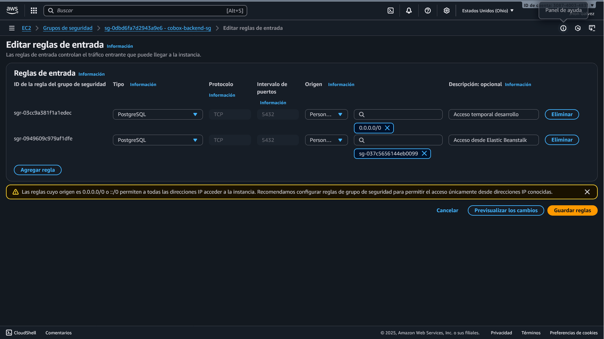
</div>

---

##### 4) GitHub Actions (CI/CD a EB)

**Secrets del repo**

* `AWS_ACCESS_KEY_ID` — usuario `github-actions-...`
* `AWS_SECRET_ACCESS_KEY`
* `AWS_ACCOUNT_ID` *(si usas bucket EB “regional” por cuenta)*

**Workflow `.github/workflows/aws-deploy.yml`**

```yaml
name: Deploy Spring Boot Cobox to AWS Elastic Beanstalk

on:
  push:
    branches:
      - main

jobs:
  build-and-deploy:
    runs-on: ubuntu-latest

    steps:
      - name: Checkout source code
        uses: actions/checkout@v4

      - name: Set up Java 21
        uses: actions/setup-java@v4
        with:
          distribution: 'corretto'  # Usa corretto para coincidir con AWS
          java-version: '21'

      - name: Build with Maven
        run: mvn clean package -DskipTests

      - name: Get timestamp
        id: time
        run: echo "timestamp=$(date +%Y%m%d_%H%M%S)" >> $GITHUB_OUTPUT

      - name: Deploy to Elastic Beanstalk
        uses: einaregilsson/beanstalk-deploy@v22
        with:
          aws_access_key: ${{ secrets.AWS_ACCESS_KEY_ID }}
          aws_secret_key: ${{ secrets.AWS_SECRET_ACCESS_KEY }}
          application_name: cobox-backend
          environment_name: Cobox-backend-env
          version_label: cobox-${{ steps.time.outputs.timestamp }}
          region: ${{ secrets.AWS_REGION }}
          deployment_package: target/cobox-0.0.1-SNAPSHOT.jar
```

<div align="center">
    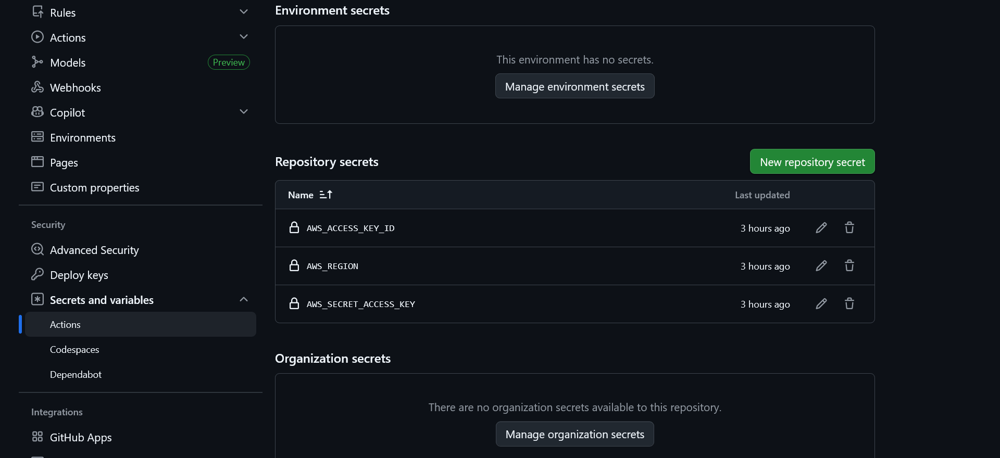
</div>

<div align="center">
    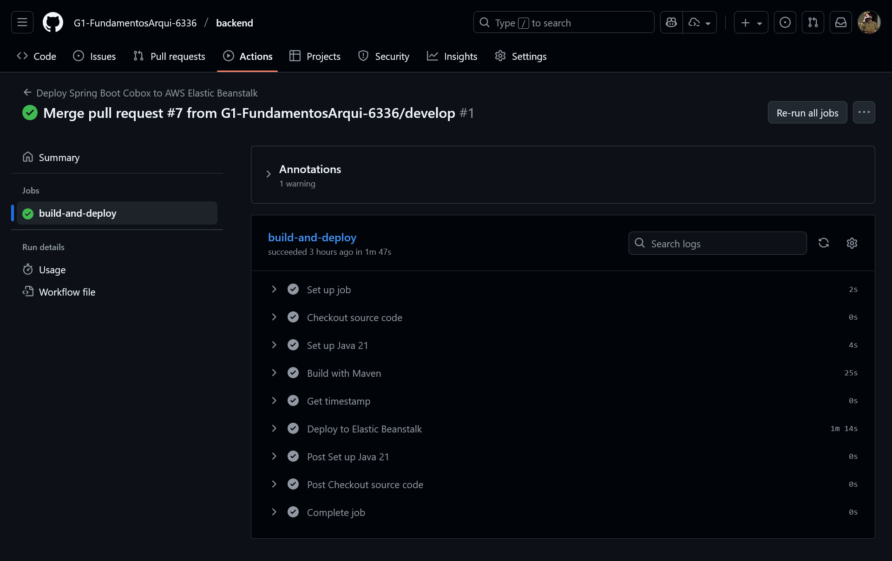
</div>

---

##### 5) Spring Boot: variables y *health check*

**`application.properties` (usar env vars)**

```properties
server.port=${SERVER_PORT:8080}
spring.datasource.url=${SPRING_DATASOURCE_URL}
spring.datasource.username=${SPRING_DATASOURCE_USERNAME}
spring.datasource.password=${SPRING_DATASOURCE_PASSWORD}
spring.jpa.hibernate.ddl-auto=${SPRING_JPA_HIBERNATE_DDL_AUTO:update}
spring.jpa.show-sql=${SPRING_JPA_SHOW_SQL:false}
spring.jpa.properties.hibernate.dialect=${SPRING_JPA_PROPERTIES_HIBERNATE_DIALECT}
```

---

##### 6) Landing Page (Netlify) — *resumen operativo*

* **Netlify ↔ GitHub**: conectar el repo de la *landing* desde el **Netlify Dashboard**.
* Incluir `netlify.toml` para *build* y *publish* automáticos, por ejemplo:

```toml
[build]
  command = "npm run build"
  publish  = "dist"   # o "build" según framework
[build.environment]
  NODE_VERSION = "20"
```

* Cada **push a main** dispara el deploy automático.

<div align="center">
    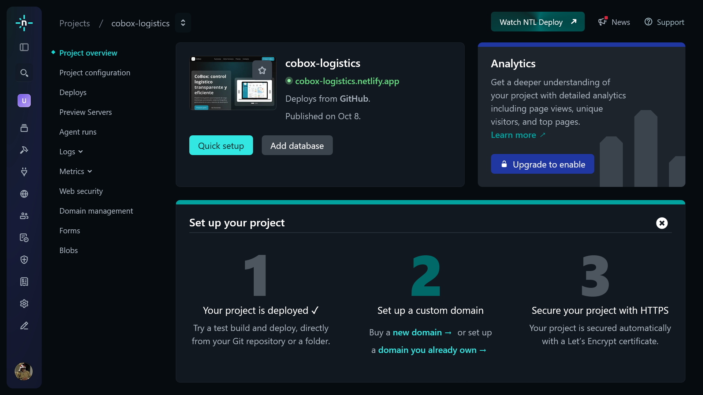
</div>

<div align="center">
    
</div>

---

### 5.3. Microservices Implementation

#### 5.3.1. Sprint 1

Durante el Sprint 1, nos centramos principalmente en el desarrollo del BackEnd de CoBox utilizando Java, junto con la optimización de la Landing Page.
Este sprint resultó clave para establecer las primeras funcionalidades base del sistema, sentando las bases técnicas para los siguientes ciclos de desarrollo.

##### 5.3.1.1. Sprint Backlog 1

Para el primer sprint backlog, recopilamos las historias de usuario enfocadas en el desarrollo del BackEnd.
Con el fin de organizar y gestionar eficientemente el trabajo, dividimos cada historia en tareas específicas y alcanzables, asignándolas a los integrantes del equipo mediante la herramienta Trello.
Durante este sprint, nos concentramos en completar las historias planificadas, aprovechando las funcionalidades colaborativas de Trello para monitorear el avance, coordinar esfuerzos y resolver los desafíos surgidos durante el desarrollo.

[](https://postimg.cc/Ty3vcnSJ)

<table>
<tr>
    <th colspan="3">Sprint #</th>
    <th colspan="10">Sprint 1</th>
</tr>
<tr>
    <td colspan="3">User Story</td>
    <td colspan="10">Work-Item/Task</td>
</tr>
<tr>
    <td>Id</td>
    <td colspan="2">Title</td>
    <td>Id</td>
    <td colspan="2">Title</td>
    <td colspan="3">Description</td>
    <td>Estimation</td>
    <td colspan="2">Assigned To</td>
    <td>Status (To-do / InProcess / To-Review / Done)</td>
</tr>

<!-- Ramiro Guzmán - Fleet -->
<tr>
    <td>US-01</td>
    <td colspan="2">Consultar rutas asignadas</td>
    <td>WI-01</td>
    <td colspan="2">Implementar endpoint GET /routes</td>
    <td colspan="3">Permite al gestor consultar las rutas asignadas por unidad de transporte.</td>
    <td>5</td>
    <td colspan="2">Ramiro Alexander Guzmán Chávez</td>
    <td>To-do</td>
</tr>
<tr>
    <td>US-02</td>
    <td colspan="2">Asignar unidades a rutas</td>
    <td>WI-02</td>
    <td colspan="2">Desarrollar formulario de asignación</td>
    <td colspan="3">Permite vincular unidades y rutas operativas.</td>
    <td>3</td>
    <td colspan="2">Ramiro Alexander Guzmán Chávez</td>
    <td>To-do</td>
</tr>
<tr>
    <td>US-03</td>
    <td colspan="2">Actualizar estado de unidad</td>
    <td>WI-03</td>
    <td colspan="2">Crear servicio PUT /vehicles/{id}/status</td>
    <td colspan="3">Actualiza el estado operativo de cada unidad.</td>
    <td>2</td>
    <td colspan="2">Ramiro Alexander Guzmán Chávez</td>
    <td>To-do</td>
</tr>
<tr>
    <td>US-04</td>
    <td colspan="2">Consultar historial de movimientos</td>
    <td>WI-04</td>
    <td colspan="2">Diseñar vista de historial de flota</td>
    <td colspan="3">Permite revisar los movimientos y cambios de estado de las unidades.</td>
    <td>3</td>
    <td colspan="2">Ramiro Alexander Guzmán Chávez</td>
    <td>To-do</td>
</tr>

<!-- David Pérez - Delivery -->
<tr>
    <td>US-05</td>
    <td colspan="2">Consultar entregas asignadas</td>
    <td>WI-05</td>
    <td colspan="2">Implementar módulo de entregas pendientes</td>
    <td colspan="3">Muestra al conductor las entregas del día con detalles de cliente y dirección.</td>
    <td>3</td>
    <td colspan="2">David Alexander Pérez García</td>
    <td>To-do</td>
</tr>
<tr>
    <td>US-06</td>
    <td colspan="2">Registrar evidencia de entrega</td>
    <td>WI-06</td>
    <td colspan="2">Configurar carga de imágenes y ubicación GPS</td>
    <td colspan="3">Permite validar entregas con evidencia fotográfica y hora.</td>
    <td>5</td>
    <td colspan="2">David Alexander Pérez García</td>
    <td>To-do</td>
</tr>
<tr>
    <td>US-07</td>
    <td colspan="2">Revisar entregas completadas</td>
    <td>WI-07</td>
    <td colspan="2">Desarrollar historial de entregas</td>
    <td colspan="3">Permite consultar entregas finalizadas con filtros por fecha.</td>
    <td>2</td>
    <td colspan="2">David Alexander Pérez García</td>
    <td>To-do</td>
</tr>
<tr>
    <td>US-08</td>
    <td colspan="2">Registrar inicio de ruta</td>
    <td>WI-08</td>
    <td colspan="2">Registrar hora de salida del conductor</td>
    <td colspan="3">Permite registrar el inicio de jornada de reparto.</td>
    <td>2</td>
    <td colspan="2">David Alexander Pérez García</td>
    <td>To-do</td>
</tr>

<!-- Joaquín Pedraza - Incident -->
<tr>
    <td>US-09</td>
    <td colspan="2">Reportar incidente</td>
    <td>WI-09</td>
    <td colspan="2">Crear endpoint POST /incidents</td>
    <td colspan="3">Permite registrar incidentes con descripción y evidencia.</td>
    <td>3</td>
    <td colspan="2">Joaquín Pedraza Maldonado</td>
    <td>To-do</td>
</tr>
<tr>
    <td>US-10</td>
    <td colspan="2">Consultar incidencias</td>
    <td>WI-10</td>
    <td colspan="2">Diseñar vista de incidencias activas</td>
    <td colspan="3">Muestra las incidencias activas con prioridad y estado.</td>
    <td>3</td>
    <td colspan="2">Joaquín Pedraza Maldonado</td>
    <td>To-do</td>
</tr>
<tr>
    <td>US-11</td>
    <td colspan="2">Filtrar incidencias</td>
    <td>WI-11</td>
    <td colspan="2">Agregar filtros por gravedad</td>
    <td colspan="3">Permite priorizar las incidencias más críticas.</td>
    <td>2</td>
    <td colspan="2">Joaquín Pedraza Maldonado</td>
    <td>To-do</td>
</tr>
<tr>
    <td>US-12</td>
    <td colspan="2">Revisar historial de incidencias</td>
    <td>WI-12</td>
    <td colspan="2">Crear tabla histórica de incidencias</td>
    <td colspan="3">Permite analizar incidentes pasados y soluciones aplicadas.</td>
    <td>3</td>
    <td colspan="2">Joaquín Pedraza Maldonado</td>
    <td>To-do</td>
</tr>

<!-- Merly Salon - IAM -->
<tr>
    <td>US-26</td>
    <td colspan="2">Autenticación y gestión de roles</td>
    <td>WI-26</td>
    <td colspan="2">Implementar módulo IAM con JWT</td>
    <td colspan="3">Permite registrar usuarios, iniciar sesión y asignar roles según el perfil (gestor, conductor, técnico).</td>
    <td>5</td>
    <td colspan="2">Merly Salon Puerta</td>
    <td>To-do</td>
</tr>

<!-- Jhon Gálvez - Maintenance -->
<tr>
    <td>US-13</td>
    <td colspan="2">Programar mantenimiento</td>
    <td>WI-13</td>
    <td colspan="2">Crear agenda de mantenimiento</td>
    <td colspan="3">Permite definir mantenimientos periódicos según kilometraje o fecha.</td>
    <td>3</td>
    <td colspan="2">Jhon Alexander Galvez Chambi</td>
    <td>To-do</td>
</tr>
<tr>
    <td>US-14</td>
    <td colspan="2">Registrar mantenimiento</td>
    <td>WI-14</td>
    <td colspan="2">Diseñar formulario de mantenimiento</td>
    <td colspan="3">Registra actividades y observaciones realizadas por el técnico.</td>
    <td>3</td>
    <td colspan="2">Jhon Alexander Galvez Chambi</td>
    <td>To-do</td>
</tr>
<tr>
    <td>US-15</td>
    <td colspan="2">Consultar mantenimientos próximos</td>
    <td>WI-15</td>
    <td colspan="2">Implementar vista calendario de mantenimientos</td>
    <td colspan="3">Muestra mantenimientos pendientes por unidad y fecha.</td>
    <td>2</td>
    <td colspan="2">Jhon Alexander Galvez Chambi</td>
    <td>To-do</td>
</tr>
<tr>
    <td>US-16</td>
    <td colspan="2">Recibir alertas de mantenimiento</td>
    <td>WI-16</td>
    <td colspan="2">Programar alertas automáticas</td>
    <td colspan="3">Envía recordatorios automáticos cuando se acerca una fecha programada.</td>
    <td>2</td>
    <td colspan="2">Jhon Alexander Galvez Chambi</td>
    <td>To-do</td>
</tr>

</table>


##### 5.3.1.2. Development Evidence for Sprint Review


| Repository                                                                                   | Branch | Commit Id                        | Commit Message                             | Commit Message Body                                                                                                                                 | Committed on (Date) |
| -------------------------------------------------------------------------------------------- | ------ | -------------------------------- | ------------------------------------------ | --------------------------------------------------------------------------------------------------------------------------------------------------- | ------------------- |
| [github.com/upc-cobox/backend](https://github.com/upc-cobox/backend)             | main   | 7f3c92d1a8b1a2f9c6a1b45b8bcae92f | feat: added route query endpoint           | Implementación del endpoint **GET /routes** para consultar rutas asignadas por unidad de transporte. Incluye pruebas unitarias y DTOs de respuesta. | 07/10/25            |
| [github.com/upc-cobox/backend](https://github.com/upc-cobox/backend)             | main   | c42e91adf4e8742d9d5b8c35a41a3e56 | feat: added route assignment form          | Desarrollo del formulario para **asignar unidades a rutas** operativas. Incluye validaciones y actualización de estado de unidad.                   | 07/10/25            |
| [github.com/upc-cobox/](https://github.com/upc-cobox/backend)             | main   | 9a8cb4f1a3e26c65bc182b4eaa97c522 | feat: added vehicle status endpoint        | Creación del servicio **PUT /vehicles/{id}/status** para actualizar el estado operativo de cada unidad.                                             | 07/10/25            |
| [github.com/upc-cobox/backend](https://github.com/upc-cobox/blackend)             | main   | d98af0b7c9f71aa8f31b9a32268c8a55 | feat: added fleet history view             | Implementación de la vista “Historial de movimientos de flota” con filtros por fecha y estado.                                                      | 08/10/25            |
| [github.com/upc-cobox/backend](https://github.com/upc-cobox/backend)       | main   | e4a923b99e884ab3c5f5f782ddf41ab0 | feat: added pending deliveries module      | Implementación del módulo **de entregas pendientes** (US-05), con tabla y detalles de cliente.                                                      | 07/10/25            |
| [github.com/upc-cobox/backend](https://github.com/upc-cobox/backend)       | main   | 08c8b5e21cfb4e7f9e7a3c62b7b5c233 | feat: added delivery evidence capture      | Configuración de carga de imágenes y geolocalización GPS para registrar evidencia de entrega (US-06).                                               | 07/10/25            |
| [github.com/upc-cobox/backend](https://github.com/upc-cobox/backend)       | main   | 124ff7d82e4a99cd95f92b8f38f6f8af | feat: added delivery history filters       | Creación del historial de entregas completadas con filtros por fecha (US-07).                                                                       | 08/10/25            |
| [github.com/upc-cobox/backend](https://github.com/upc-cobox/backend)       | main   | 2b83a5fd8a64c924dbf52a13cf66a291 | feat: added route start record             | Registro de hora de salida del conductor al iniciar la jornada de reparto (US-08).                                                                  | 08/10/25            |
| [github.com/upc-cobox/backend](https://github.com/upc-cobox/backend)       | main   | b4c12a8a8b9f8ee17a5c0e2a4b4e7a99 | feat: added incident registration endpoint | Creación del endpoint **POST /incidents** para registrar incidentes con descripción y evidencia.                                                    | 08/10/25            |
| [github.com/upc-cobox/backend](https://github.com/upc-cobox/backend)       | main   | e7d9a2fc19b44db0a98c92e87a0fd1b7 | feat: added incident dashboard view        | Diseño de vista para consultar incidencias activas, priorizadas por nivel de gravedad (US-10).                                                      | 08/10/25            |
| [github.com/upc-cobox/backend](https://github.com/upc-cobox/backend)       | main   | 3f7e81cb32d447ad97c54aa86bb124c2 | feat: added severity filter for incidents  | Agregado de filtros por gravedad en el módulo de incidencias (US-11).                                                                               | 08/10/25            |
| [github.com/upc-cobox/backend](https://github.com/upc-cobox/backend)       | main   | 2c84b9d9fce34df681bc81b8b2a1d9a4 | feat: added incident history table         | Creación de tabla histórica de incidencias con análisis de causas y soluciones aplicadas (US-12).                                                   | 09/10/25            |
| [github.com/upc-cobox/backend](https://github.com/upc-cobox/backend)                 | main   | 13d2b8f1e64d41a78fb5efb4914a7a09 | feat: implemented IAM module with JWT      | Implementación de autenticación y gestión de roles mediante JWT (gestor, conductor, técnico).                                                       | 09/10/25            |
| [github.com/upc-cobox/backend](https://github.com/upc-cobox/backend) | main   | 4e3b7a981dd84f6c98f2d977d4d11661 | feat: added maintenance scheduler          | Creación de agenda para programar mantenimientos periódicos (US-13).                                                                                | 09/10/25            |
| [github.com/upc-cobox/](https://github.com/upc-cobox/backend) | main   | 71a93c823b1c4f8d97b5a94d2c1c5c92 | feat: added maintenance form view          | Formulario para registrar actividades y observaciones de mantenimiento (US-14).                                                                     | 09/10/25            |
| [github.com/upc-cobox/backend](https://github.com/upc-cobox/backend) | main   | 22fcb9e74acb4e0a8a5e51df7a6d39b8 | feat: added maintenance calendar           | Implementación del calendario de mantenimientos próximos con vista por unidad (US-15).                                                              | 09/10/25            |
| [github.com/upc-cobox/backend](https://github.com/upc-cobox/backend) | main   | bbbf46d79cc14aaf9a761db3d7b8e681 | feat: added maintenance reminder alerts    | Programación de alertas automáticas para recordar mantenimientos (US-16).                                                                           | 09/10/25            |

##### 5.3.1.3. Testing Suite Evidence for Sprint Review
<table border="1">
  <tr>
    <th>Repository</th>
    <th>Branch</th>
    <th>Commit Id</th>
    <th>Commit Message</th>
    <th>Commit Message Body</th>
    <th>Committed on (Date)</th>
  </tr>
  <tr>
    <td>github.com/upc-cobox/backend</td>
    <td>feat/develop</td>
    <td>50c74ca3a97421c41a49909d38d057569df07c16</td>
    <td>feat: Add FleetController</td>
    <td>RamiroGuzmanCh</td>
    <td>08/10/25</td>
  </tr>
  <tr>
    <td>github.com/upc-cobox/backend</td>
    <td>feat/develop</td>
    <td>20b8a45b00fecb8f85f9412a98ee6251f1399876</td>
    <td>feat(delivery/order-api): Add GET endpoints for delivered orders</td>
    <td>davidalexd</td>
    <td>08/10/25</td>
  </tr>
  <tr>
    <td>github.com/upc-cobox/backend</td>
    <td>feat/develop</td>
    <td>a294691fe518085a5ee07df5847548c4df861441</td>
    <td>feat: Add maintenance management bounded context</td>
    <td>Chaomeum</td>
    <td>08/10/25</td>
  </tr>
  <tr>
    <td>github.com/upc-cobox/backend</td>
    <td>feat/develop</td>
    <td>6f319f7cc223a2848d9c6ed3b9b757871ed84952</td>
    <td>Feat(Pedraza) Adedd Bounded Context Incident</td>
    <td>JoaquinPedraza1</td>
    <td>08/10/25</td>
  </tr>
  <tr>
    <td>github.com/upc-cobox/backend</td>
    <td>feat/develop</td>
    <td>27dceacea52a95e4db627485fb81c9e00b426275</td>
    <td>feat(init):template for backend cobox(included context iam and shared)</td>
    <td>MerlySalonP</td>
    <td>1/10/25</td>
  </tr>

</table>

##### 5.3.1.4. Execution Evidence for Sprint Review

Link de Backend Web Services desplegado: http://cobox.us-east-2.elasticbeanstalk.com/swagger-ui/index.html

Demo de Backend Web Services: 

Evidencia del funcionamiento del backend de la aplicación:
<div align="center">
    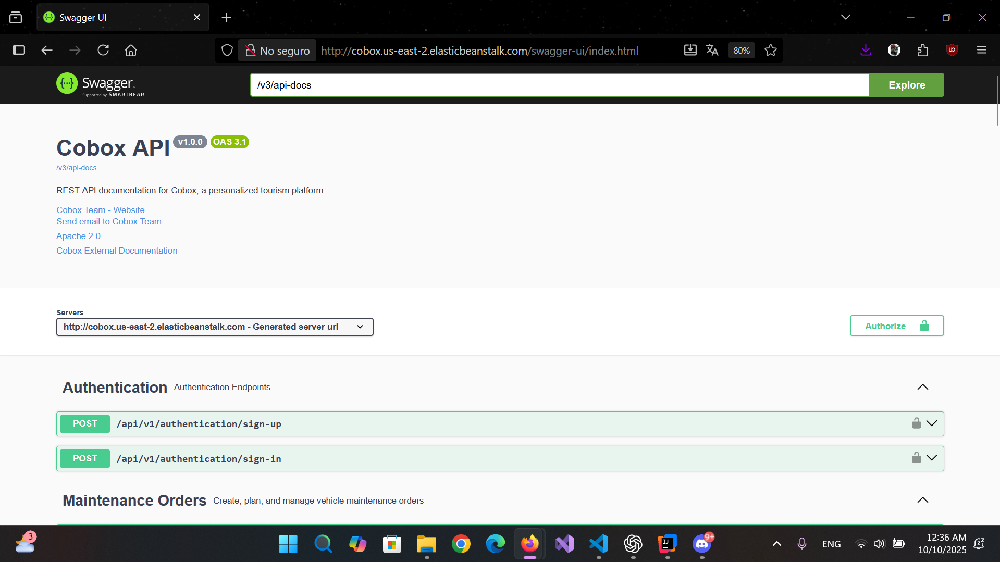
</div>

Evidencia del contexto Delivery Management:
<div align="center">
    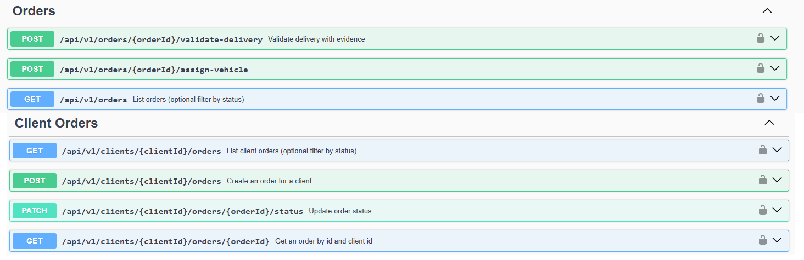
</div>

Evidencia del contexto Fleet Management:
<div align="center">
    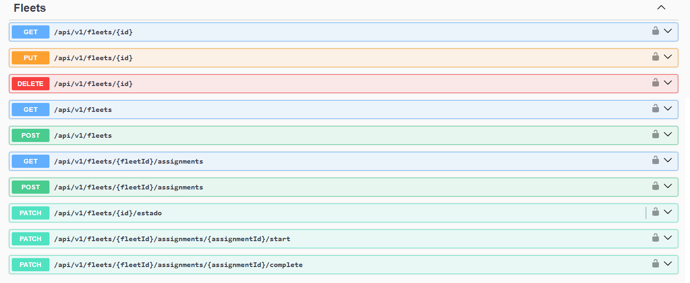
</div>

Evidencia del contexto Incident Management:
<div align="center">
    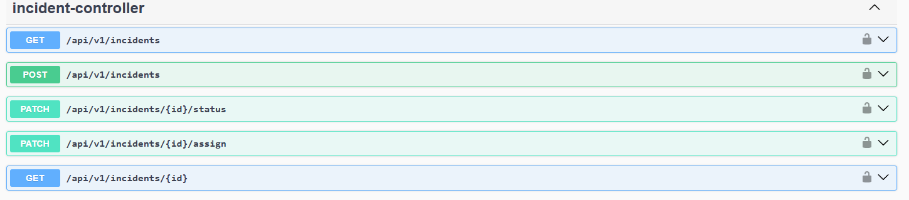
</div>

Evidencia del contexto Maintenance Management:
<div align="center">
    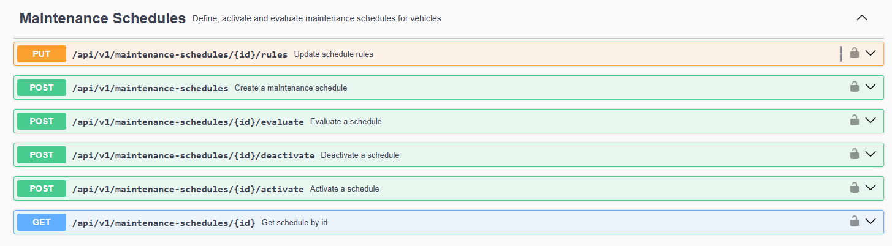
</div>

---

Durante este Sprint, el equipo terminó y lanzó con éxito la Landing Page, la cual se desarrolló en React y se desplegó usando Netlify. Esta página tiene como objetivo comunicar de manera clara las funcionalidades clave de nuestro producto y empresa.

Seccion Funciones:
<div align="center">
    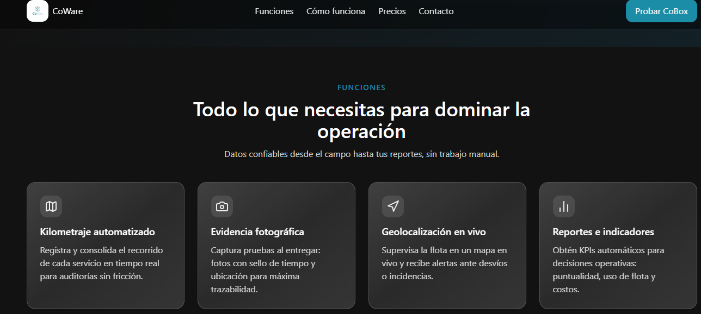
</div>

Seccion Cómo funciona:
<div align="center">
    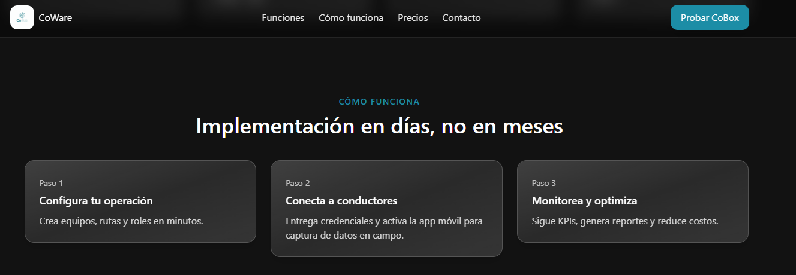
</div>

Seccion Precios:
<div align="center">
    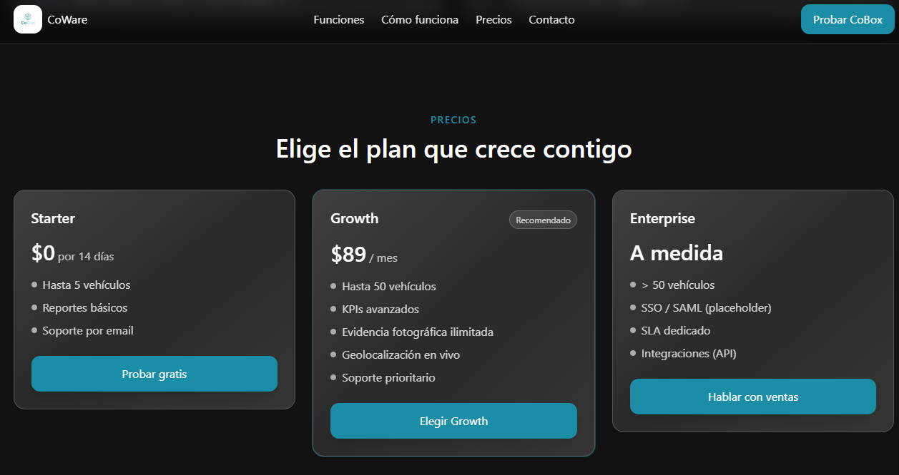
</div>

Seccion Contacto:
<div align="center">
    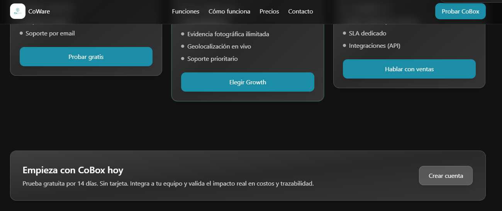
</div>

Landing page desplegado: [https://cobox-logistics.netlify.app]

##### 5.3.1.5. Microservices Documentation Evidence for Sprint Review

El sistema **CoBox** está diseñado bajo una arquitectura de **microservicios** con enfoque en **Domain-Driven Design (DDD)**.  
Cada módulo representa un *bounded context* con su propio dominio, lógica de negocio, base de datos y API independiente.  
Esto permite mantener un **bajo acoplamiento** y una **alta cohesión** entre los servicios.

---

**Principales microservicios del sistema:**

- **IAM:** Gestiona la autenticación y autorización de usuarios mediante tokens JWT.  
- **Fleet:** Administra conductores y vehículos, controlando su disponibilidad y estado.  
- **Delivery:** Gestiona pedidos, asignaciones y entregas.  
- **Incident:** Permite registrar y actualizar incidentes operativos.  
- **Maintenance:** Cubre la gestión de órdenes de mantenimiento de los vehículos.

---

Cada microservicio sigue un diseño basado en **agregados** y **objetos de valor**, donde las reglas de negocio se encapsulan dentro de las entidades del dominio.  
Por ejemplo, el agregado **Driver** controla los cambios de estado entre `AVAILABLE`, `BUSY` y `UNAVAILABLE`, asegurando la consistencia del sistema.

La comunicación entre servicios combina métodos **síncronos** (a través de **API REST**) y **asíncronos** (mediante **eventos de dominio**).  
Estos eventos permiten mantener la sincronización entre los contextos, como cuando un vehículo entra en mantenimiento o un incidente cambia de estado.

El microservicio **IAM** centraliza la seguridad del sistema, proporcionando autenticación basada en **JWT** y control de roles.  
Además, cada servicio implementa **auditoría** y **validaciones locales** para garantizar la integridad de sus datos.

---

En conjunto, esta estructura modular ofrece **escalabilidad**, **independencia de despliegue** y **claridad en la separación de responsabilidades**,  
asegurando que cada dominio evolucione de forma autónoma sin afectar a los demás componentes del sistema.


<div align="center">
    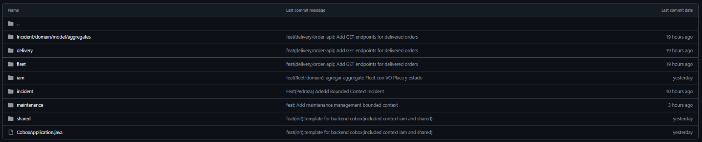
</div>

##### 5.3.1.6. Software Deployment Evidence for Sprint Review

Esta sección resume —de forma concisa y operativa— el flujo de **despliegue del backend (Spring Boot, Java 21) en AWS** usando **Elastic Beanstalk (EB)** y **PostgreSQL en RDS**, con **GitHub Actions** para CI/CD durante este Sprint 1.
Se incluye una nota breve para la *landing* en Netlify.

> **Stack**: Spring Boot (21) · PostgreSQL · AWS EB + RDS · GitHub Actions · Maven

---

##### 1) RDS PostgreSQL (nueva instancia)

**Configuración mínima**

* Engine: **PostgreSQL 17** · Template: **Free tier** · Class: **db.t3.micro** · Storage: **20 GB gp2**
* DB identifier: `cobox` *(único)*
* Master user: `cl_admin` · Password: *(guardar en secreto)*
* **VPC**: default (la misma del ecosistema actual) · **Public access**: **Yes**
* **DB name**: `cobox_bd`
* **Security Group**: crear `cobox-backend-rds-sg` (abriremos reglas abajo)

**Inbound temporal (desarrollo/local)**

```
Type: PostgreSQL | Protocol: TCP | Port: 5432 | Source: 0.0.0.0/0
Desc: Acceso temporal de desarrollo
```

> Luego se restringe para permitir **solo** el SG del entorno de EB.

<div align="center">
    
</div>

---

##### 2) Elastic Beanstalk (Java 21)

**Crear aplicación/entorno**

* Application: `cobox-backend` *(único)*
* Environment: `cobox-backend-env` *(único)*
* Platform: **Java – Corretto 21 (Amazon Linux 2023)**
* Preset: **Single instance (free tier)**
* Code: **Sample application**

**Configure more options → Software (Environment properties)**

```properties
SERVER_PORT=5000
SPRING_DATASOURCE_URL=jdbc:postgresql://<RDS-ENDPOINT>:5432/nuevo_backend
SPRING_DATASOURCE_USERNAME=nuevo_admin
SPRING_DATASOURCE_PASSWORD=<TU_PASSWORD>
SPRING_JPA_HIBERNATE_DDL_AUTO=update
SPRING_JPA_SHOW_SQL=false
SPRING_JPA_PROPERTIES_HIBERNATE_DIALECT=org.hibernate.dialect.PostgreSQLDialect
```

* Instances: `t3.micro`
* Roles/Profiles: **aws-elasticbeanstalk-service-role** / **aws-elasticbeanstalk-ec2-role**
* Network: VPC default, subnets públicas, **Public IP: enabled**

<div align="center">
    
</div>

<div align="center">
    
</div>

---

##### 3) Conectar Security Groups (RDS ↔ EB)

1. Identifica el **Security Group del entorno EB** (EC2 → Security Groups).
2. En `cobox-backend-rds-sg` agrega **Inbound**:

```
Type: PostgreSQL | Protocol: TCP | Port: 5432 | Source: <SG-ID-de-EB>
Desc: Acceso desde Elastic Beanstalk
```

<div align="center">
    
</div>

---

##### 4) GitHub Actions (CI/CD a EB)

**Secrets del repo**

* `AWS_ACCESS_KEY_ID` — usuario `github-actions-...`
* `AWS_SECRET_ACCESS_KEY`
* `AWS_ACCOUNT_ID` *(si usas bucket EB “regional” por cuenta)*

**Workflow `.github/workflows/aws-deploy.yml`**

```yaml
name: Deploy Spring Boot Cobox to AWS Elastic Beanstalk

on:
  push:
    branches:
      - main

jobs:
  build-and-deploy:
    runs-on: ubuntu-latest

    steps:
      - name: Checkout source code
        uses: actions/checkout@v4

      - name: Set up Java 21
        uses: actions/setup-java@v4
        with:
          distribution: 'corretto'  # Usa corretto para coincidir con AWS
          java-version: '21'

      - name: Build with Maven
        run: mvn clean package -DskipTests

      - name: Get timestamp
        id: time
        run: echo "timestamp=$(date +%Y%m%d_%H%M%S)" >> $GITHUB_OUTPUT

      - name: Deploy to Elastic Beanstalk
        uses: einaregilsson/beanstalk-deploy@v22
        with:
          aws_access_key: ${{ secrets.AWS_ACCESS_KEY_ID }}
          aws_secret_key: ${{ secrets.AWS_SECRET_ACCESS_KEY }}
          application_name: cobox-backend
          environment_name: Cobox-backend-env
          version_label: cobox-${{ steps.time.outputs.timestamp }}
          region: ${{ secrets.AWS_REGION }}
          deployment_package: target/cobox-0.0.1-SNAPSHOT.jar
```

<div align="center">
    
</div>

<div align="center">
    
</div>

---

##### 5) Spring Boot: variables y *health check*

**`application.properties` (usar env vars)**

```properties
server.port=${SERVER_PORT:8080}
spring.datasource.url=${SPRING_DATASOURCE_URL}
spring.datasource.username=${SPRING_DATASOURCE_USERNAME}
spring.datasource.password=${SPRING_DATASOURCE_PASSWORD}
spring.jpa.hibernate.ddl-auto=${SPRING_JPA_HIBERNATE_DDL_AUTO:update}
spring.jpa.show-sql=${SPRING_JPA_SHOW_SQL:false}
spring.jpa.properties.hibernate.dialect=${SPRING_JPA_PROPERTIES_HIBERNATE_DIALECT}
```

---

##### 6) Landing Page (Netlify) — *resumen operativo*

* **Netlify ↔ GitHub**: conectar el repo de la *landing* desde el **Netlify Dashboard**.
* Incluir `netlify.toml` para *build* y *publish* automáticos, por ejemplo:

```toml
[build]
  command = "npm run build"
  publish  = "dist"   # o "build" según framework
[build.environment]
  NODE_VERSION = "20"
```

* Cada **push a main** dispara el deploy automático.

<div align="center">
    
</div>

<div align="center">
    
</div>


##### 5.3.1.7. Team Collaboration Insights during Sprint

Durante esta fase de entrega, el equipo mantuvo una coordinación constante en las tareas de desarrollo de la landing page y los servicios backend.
Además, se realizaron las actualizaciones pertinentes en la documentación. Esta colaboración efectiva fue clave para asegurar el correcto modelado y la funcionalidad de nuestra lógica de negocio.

- _Evidencias de colaboración:_

  - Backend Web Services:
  <div align="center">
      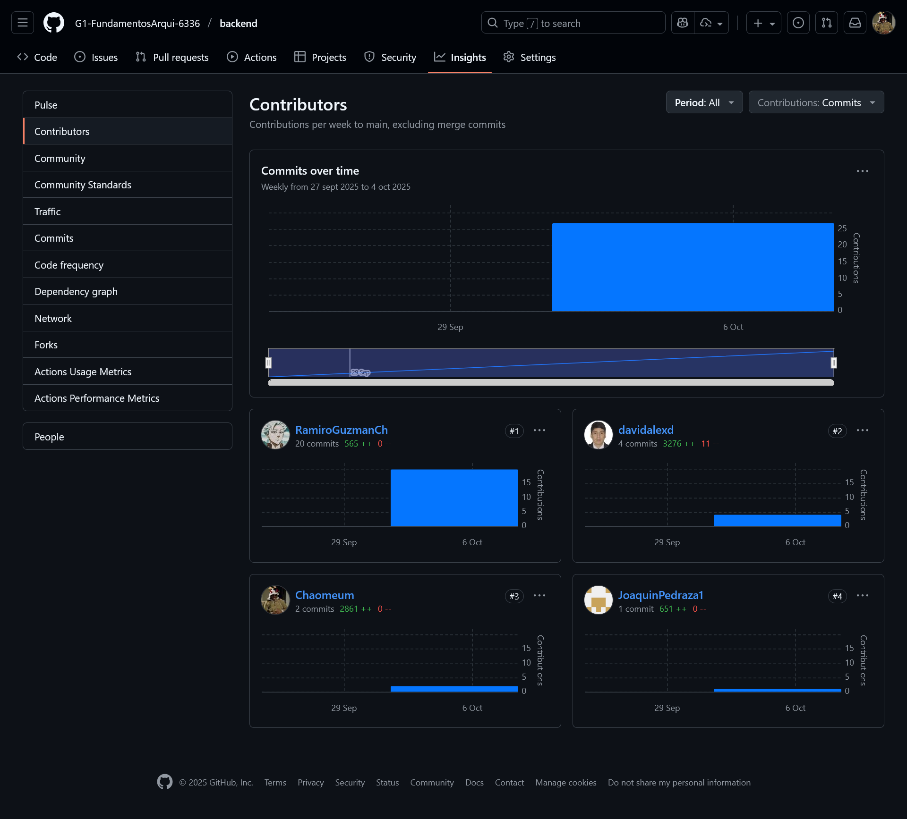
  </div>

  - Landing Page:
  <div align="center">
      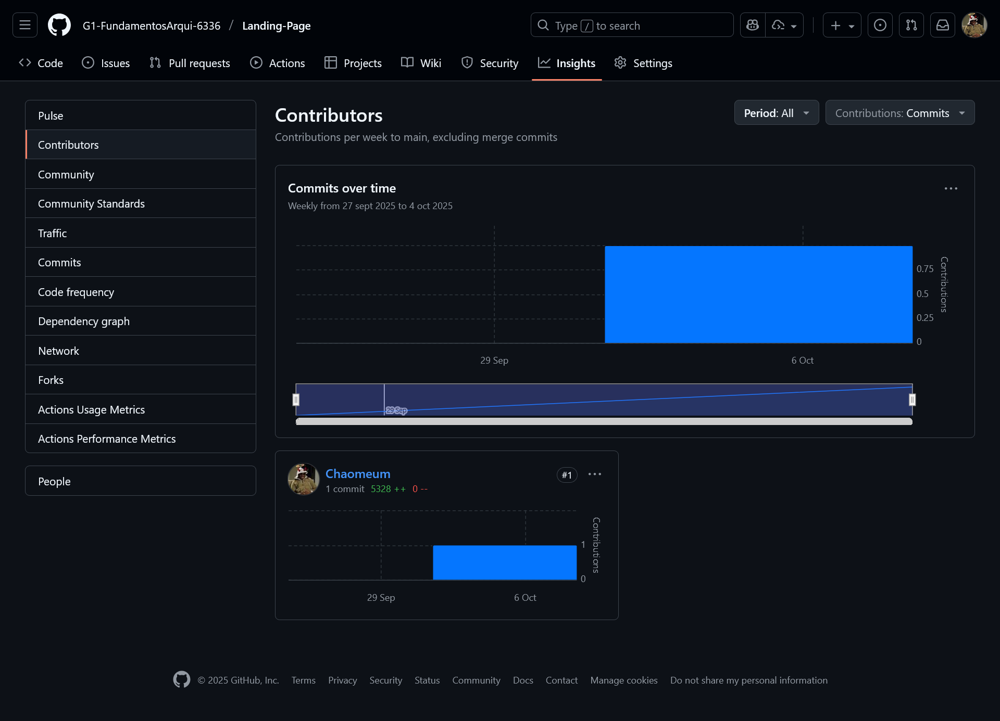
  </div>

  - Reporte:
  <div align="center">
      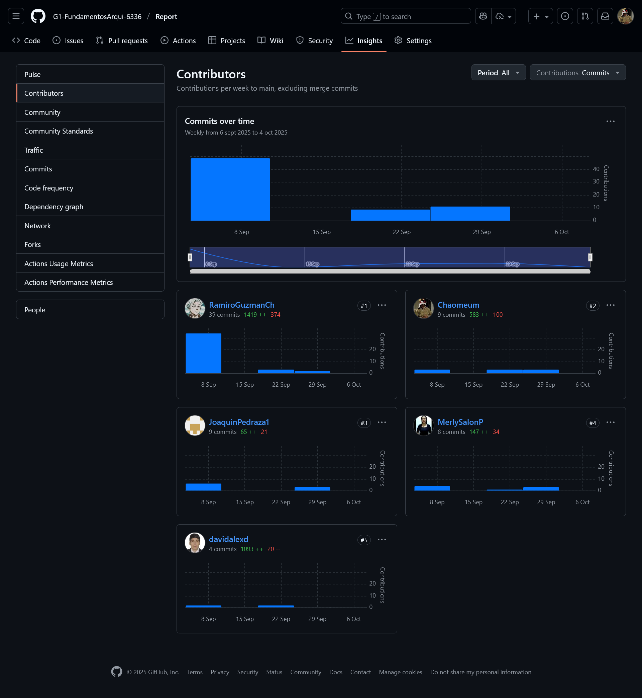
  </div>


##### 5.3.1.8. Kanban Board

[](https://postimg.cc/Ty3vcnSJ)

 Anexo: [https://shorturl.at/CzirV](https://shorturl.at/CzirV)  


 
#### 5.3.2. Sprint 2

Durante el srpint 2, nos centramos en la condiguración de los servicios para luego ejecutarlos. Este sprint resultó clave para establecer las primeras funcionalidades del sistema, sentando jas bases técnicas para los siguientes ciclos de desarrollo.

##### 5.3.2.1 Sprint Backlog 2

Para el segundo sprint backlog, recopilamos las historias de usuario pertinentes. Con el fin de organizar y gestionar eficientemente el trabajo, dividimos cada historia en tareas específicas y alcanzables, asignándolas a los integrantes del equipo mediante la herramienta Trello. Durante este sprint, nos concentramos en completar las historias planificadas, aprovechando las funcionalidades colaborativas de Trello para monitorear el avance, coordinar esfuerzos y resolver los desafíos surgidos durante el desarrollo.

<div align="center">
    
</div>


| User Story / Work-Item ID | Title | Task ID | Task Title | Estimación (pt) | Assigned To | Status |
|----------------------------|--------|----------|-------------|-----------------|--------------|---------|
| US001 | Configuración centralizada de servicios | T01 | Implementar `config-service` para la gestión de configuración externa | 3 | **Ramiro Alexander Guzmán Chávez** | Done |
| TS001 | Servidor de descubrimiento | T02 | Implementar `eureka-service` para registro y descubrimiento de microservicios | 2 | **Jhon Alexander Gálvez Chambi** | Done |
| TS002 | Gateway de entrada | T03 | Implementar `gateway-service` con rutas a los microservicios | 2 | **Jhon Alexander Gálvez Chambi** |Done |
| US002 | Autenticación de usuarios | T04 | Implementar `iam-service` (servicio de autenticación con JWT y roles) | 3 | **David Alexander Pérez García** | Done |
| TS003 | Gestión de flota | T05 | Implementar `fleet-service` con CRUD de vehículos y tracking básico | 3 | **David Alexander Pérez García** |Done |
| TS004 | Servicio de entregas | T06 | Implementar `delivery-service` con endpoints de pedidos y estado de entrega | 3 | **Joaquín Pedraza Maldonado** | Done |
| US003 | Comunicación entre microservicios | T07 | Configurar comunicación vía `FeignClient` entre `fleet` y `delivery` | 2 | **Ramiro Alexander Guzmán Chávez** | Done |
| TS005 | Pruebas y despliegue | T08 | Ejecutar pruebas unitarias e integración para cada microservicio | 2 | **David Alexander Pérez García** | Done |
| TS006 | Documentación general | T09 | Configurar y documentar endpoints con `Swagger`/`SpringDoc` para todos los microservicios | 1 | **Merly Salón Puerta** | Done |

---

##### 5.3.2.2 Development Evidence for Sprint Review

| Repository                | Branch  | Commit Id | Commit Message                                  | Commit Message Body                                                                                                                                             | Committed on (Date) |
| ------------------------- | ------- | --------- | ----------------------------------------------- | --------------------------------------------------------------------------------------------------------------------------------------------------------------- | ------------------- |
| cobox-iam-service         | develop | 9a7c3f1   | feat(develop): add refresh-token & health actuators | Implement refresh token endpoint, secure `/actuator/**` with permitAll for `/health`, add token blacklist cache. Updates to `BearerAuthorizationRequestFilter`. | 02/11/25            |
| cobox-fleet-service       | develop | 3e81b9c   | feat(develop): vehicle assignment aggregate       | New `Assignment` aggregate, repository + application service; DTO mappers; migration V6__assignment.sql.                                                        | 02/11/25            |
| cobox-delivery-service    | develop | b41e7da   | feat(develop): route integration client (ACL)  | REST client to RouteSvc, retry/backoff, circuit breaker; `ExternalRouteServiceImpl` wiring; config via `application.yml`.                                       | 02/11/25            |
| cobox-incident-service    | develop | 7fd29a0   | chore(develop): naming strategy + auditing     | Apply `SnakeCaseWithPluralizedTablePhysicalNamingStrategy`, add `AuditableAggregateRoot`, create flyway baseline.                                               | 02/11/25            |
| cobox-maintenance-service | develop | f2c6a84   | feat(develop): preventive plan scheduler          | Quartz job for preventive maintenance by mileage/time; domain policy + cron config; expose `/plans/{id}` endpoints.                                             | 02/11/25            |


##### 5.3.2.3 Testing Suite Evidence for Sprint Review

| Repository                | Branch  | Commit Id | Commit Message                                     | Commit Message Body | Committed on (Date) |
| ------------------------- | ------- | --------- | -------------------------------------------------- | ------------------- | ------------------- |
| cobox-iam-service         | develop | e6a5c1d   | test(develop): add jwt filter & refresh flow tests     | RamiroGuzmanCh      | 02/11/25            |
| cobox-fleet-service       | develop | 4b9f21e   | test(develop): AssignmentService unit & mapper tests | davidalexd          | 02/11/25            |
| cobox-delivery-service    | develop | 2c7d9a3   | test(develop): RouteIntegrationClient resilience  | Chaoemum            | 02/11/25            |
| cobox-incident-service    | develop | 88ac0f5   | test(develop): repository + flyway baseline       | JoaquinPedraza1     | 02/11/25            |
| cobox-maintenance-service | develop | a1f3d77   | test(develop): scheduler cron & policy specs         | MerlySalonP         | 02/11/25            |


##### 5.3.2.4 Execution Evidence for Sprint Review

Configuramos los services para luego ejecutarlos 
  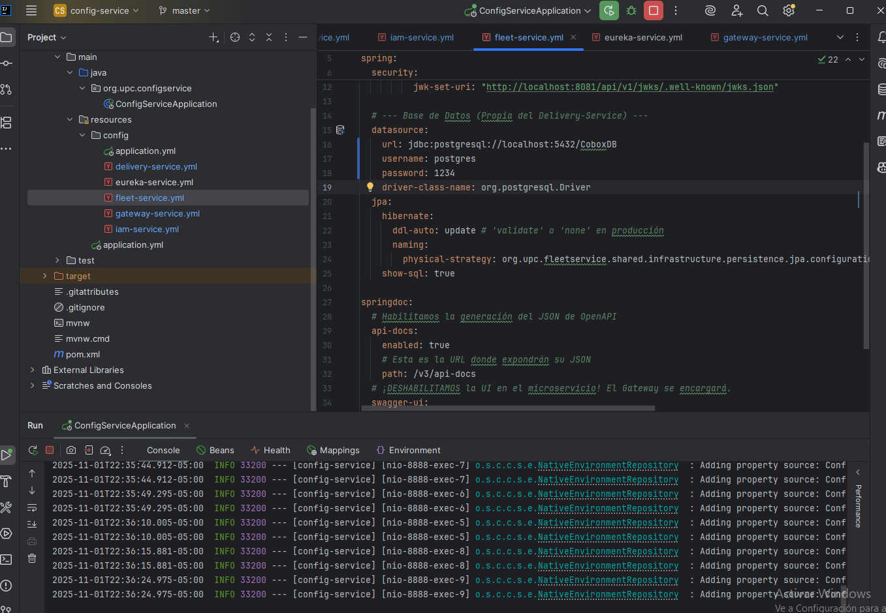
   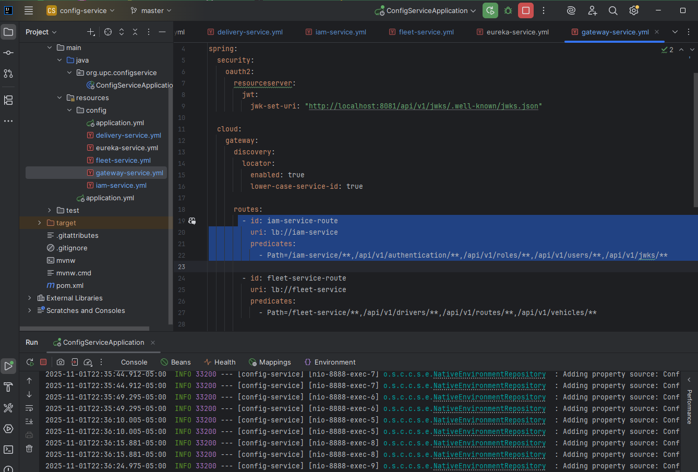
    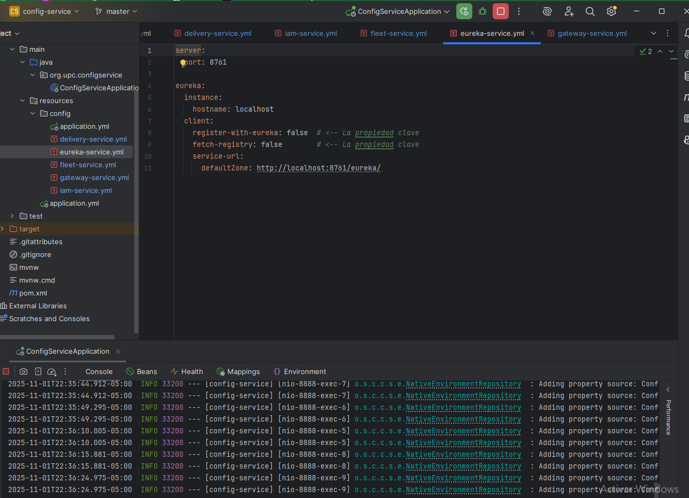
     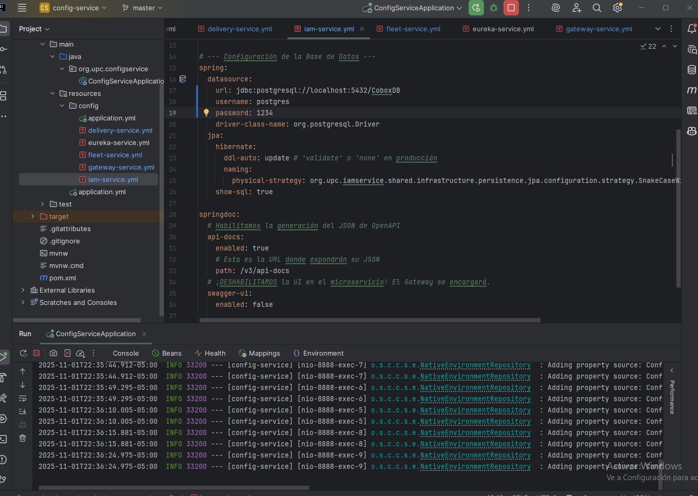
     Esta es la configuración del servicio flota 
           
     Se muestra la ejecución de un microservicio
      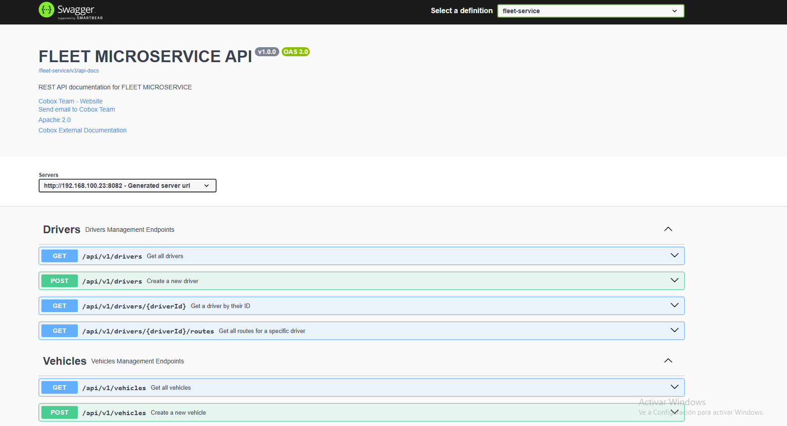
            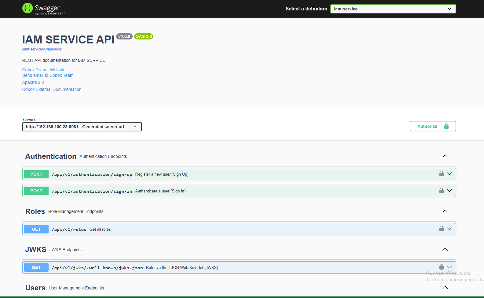
            
##### 5.3.2.5 Microservices Documentation Evidence for Sprint Review

El sistema **CoBox** fue diseñado bajo una **arquitectura de microservicios**, siguiendo los principios de **Domain-Driven Design (DDD)** y la metodología **Attribute-Driven Design (ADD)**.  
Este enfoque permitió estructurar la arquitectura en función de los **atributos de calidad** definidos para el sistema: **escalabilidad, mantenibilidad, disponibilidad y seguridad**.

Además, se implementaron componentes clave de **Spring Cloud** como **Eureka Server** y **Spring Cloud Gateway**, los cuales garantizan el descubrimiento dinámico de servicios y el enrutamiento centralizado de las solicitudes dentro del ecosistema de microservicios.

---

### Aplicación de la metodología ADD

Durante el proceso de diseño, se siguieron las etapas propuestas por la metodología **ADD**:

#### **1. Definición de los objetivos de calidad**
- Se identificaron los atributos críticos: **escalabilidad**, **independencia de despliegue**, **resiliencia** y **seguridad**.  
- Estos atributos guiaron las principales decisiones arquitectónicas, influyendo directamente en la adopción de **Eureka** y **Spring Cloud Gateway** para lograr un entorno distribuido estable y seguro.

#### **2. Identificación de drivers arquitectónicos**
- Se analizaron los **requisitos funcionales** (gestión de flota, autenticación, entregas) y los **requisitos no funcionales** (rendimiento, disponibilidad, consistencia de datos).  
- Se priorizaron decisiones que fomentaran la **modularidad**, la **autonomía de despliegue** y la **comunicación desacoplada** entre microservicios.

#### **3. Descomposición en módulos y asignación de responsabilidades**
- Se definieron **bounded contexts** según DDD, donde cada microservicio representa un dominio independiente con su propia base de datos, API y lógica de negocio.  
- La **alta cohesión** dentro de cada módulo y el **bajo acoplamiento** entre ellos se lograron gracias al uso de **Eureka** como registro de descubrimiento y **Gateway** como punto de entrada único.

#### **4. Evaluación y refinamiento iterativo**
- Se validó la arquitectura mediante *proofs of concept* conectando los microservicios a través de **Eureka Server**.  
- Se configuró **Spring Cloud Gateway** para enrutar las solicitudes externas hacia los servicios internos, garantizando el balanceo y la protección de los endpoints.  
- Se refinaron las configuraciones de **docker-compose** y **config-service** para asegurar el funcionamiento distribuido en entornos locales y en la nube.

---

### Microservicios implementados

| **Microservicio** | **Descripción** | **Responsabilidad Principal** |
|--------------------|-----------------|-------------------------------|
| **IAM Service** | Autenticación y autorización basada en JWT. | Control de usuarios, roles y permisos. |
| **Fleet Service** | Gestión de flota vehicular. | Administración de vehículos, conductores y estados de disponibilidad. |
| **Delivery Service** | Gestión de entregas y pedidos. | Control de pedidos, asignaciones y seguimiento. |
| **Config Service** | Configuración centralizada. | Administración de propiedades compartidas entre microservicios. |
| **Eureka Service** | Descubrimiento de servicios. | Registro dinámico y localización automática de microservicios. |
| **Gateway Service** | Puerta de enlace API. | Enrutamiento, control de acceso y gestión del tráfico entrante. |

---

### Decisiones arquitectónicas basadas en atributos de calidad

| **Atributo de Calidad** | **Decisión Tomada** | **Resultado Esperado** |
|--------------------------|---------------------|------------------------|
| **Escalabilidad** | Uso de **Eureka** para descubrimiento automático y despliegue independiente por microservicio. | Permite escalar horizontalmente cada servicio según demanda. |
| **Mantenibilidad** | Diseño modular guiado por DDD y separación clara de responsabilidades. | Cambios localizados sin afectar a otros servicios. |
| **Disponibilidad** | Integración de **Spring Boot Actuator** (`/actuator/health`) y despliegue replicado. | Monitoreo y alta disponibilidad ante fallos. |
| **Seguridad** | Autenticación centralizada mediante **IAM Service** y control de rutas seguras en **Gateway**. | Acceso seguro y validado en cada petición. |

---

<div align="center">
    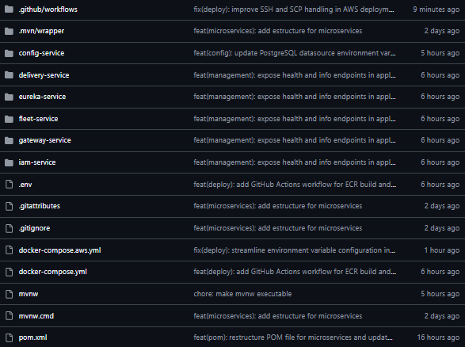
</div>

##### 5.3.2.6 Software Deployment Evidence for Sprint Review

El despliegue de los microservicios del sistema **CoBox** se realizó en una infraestructura basada en **Amazon Web Services (AWS)**, garantizando la escalabilidad, disponibilidad y seguridad de los componentes.
A continuación, se resumen los pasos más relevantes y las evidencias técnicas del proceso de deployment automatizado.

---

### **1. Configuración de la Infraestructura en AWS**

Se aprovisionaron los recursos esenciales para la ejecución de los microservicios:

* **Instancia EC2** (Amazon Linux 2) configurada como host principal de Docker y Docker Compose.
* **Repositorio ECR (Elastic Container Registry)** para almacenar las imágenes Docker generadas por los pipelines de CI/CD.
* **Base de datos RDS PostgreSQL** como backend persistente de los contextos IAM, Fleet y Delivery.
* **AWS Systems Manager (SSM Parameter Store)** para gestionar credenciales (DB, JWT, API Keys) evitando su exposición en repositorios.

<div align="center">
  
  <p><em>Configuración de la infraestructura base en AWS (EC2, RDS, ECR y SSM)</em></p>
</div>

---

### **2. Construcción y Versionamiento de Imágenes Docker**

Cada microservicio se empaquetó en un contenedor independiente siguiendo el principio de **isolated bounded contexts**.
El pipeline de GitHub Actions compila el código, ejecuta pruebas y genera imágenes etiquetadas con `:latest` y `:<timestamp>`, las cuales se publican automáticamente en ECR.

Pasos esenciales del workflow:

1. Compilación del microservicio con **Maven**.
2. Construcción del contenedor mediante su `Dockerfile`.
3. Autenticación OIDC → Push a ECR (sin credenciales estáticas).

<div align="center">
  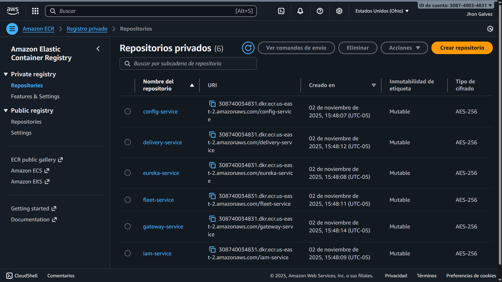
  <p><em>Pipeline de CI/CD en GitHub Actions para build & push a ECR</em></p>
</div>

---

### **3. Despliegue Automatizado en EC2 mediante GitHub Actions**

El pipeline ejecuta una conexión SSH controlada hacia la instancia EC2 para desplegar las imágenes más recientes.
Dentro de `/opt/cobox`, se recrea el entorno con los siguientes pasos:

1. Carga de variables desde `cobox-env.sh` y archivos `.env` específicos por servicio.
2. Verificación del servicio Docker y autenticación con ECR.
3. Ejecución de `docker compose -f docker-compose.aws.yml up -d` para recrear contenedores.
4. Validación automática de estados `healthy` mediante healthchecks de `/actuator/health`.

<div align="center">
  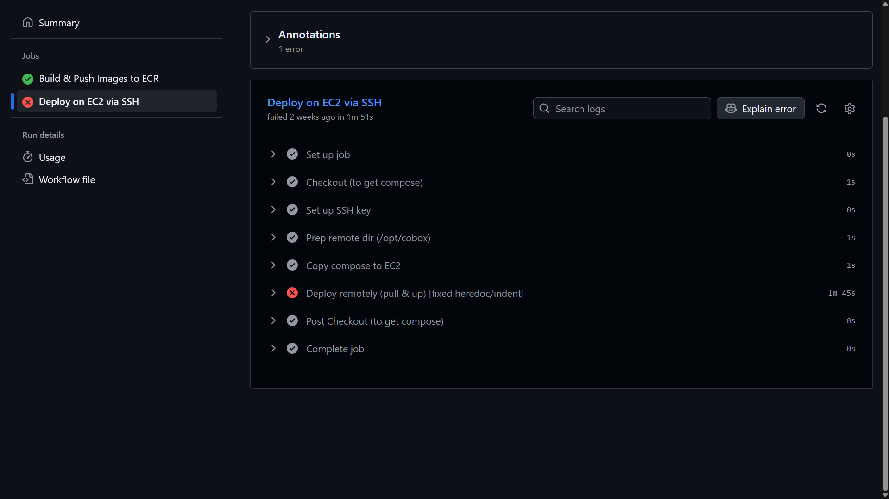
  <p><em>Ejecución de Docker Compose para levantar los microservicios en EC2</em></p>
</div>

---

### **4. Validación del Despliegue y Healthchecks**

Una vez desplegados los servicios:

* Se comprobó que todos los contenedores (`config-service`, `eureka-service`, `iam-service`, `fleet-service`, `delivery-service`, `gateway-service`) se encuentren en estado **healthy**.
* Se accedió al gateway mediante su IP pública, verificando la respuesta correcta del endpoint `/actuator/health` y los redireccionamientos internos hacia cada microservicio.

```bash
$ curl http://<public-ip>/actuator/health
HTTP/1.1 200 OK
{"status":"UP"}
```

<div align="center">
  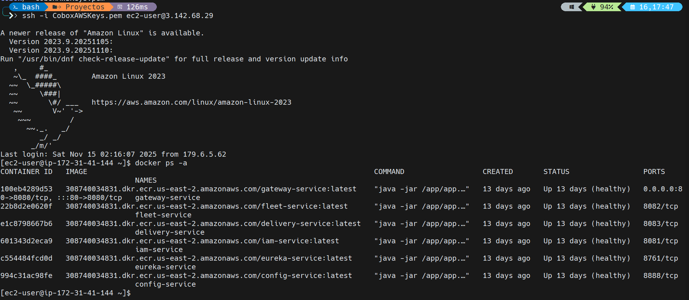
  <p><em>Validación del estado del Gateway y microservicios mediante healthchecks</em></p>
</div>

---

### **5. Resultado Final**

El despliegue se completó exitosamente con los siguientes resultados:

* Todos los microservicios levantados en contenedores independientes y registrados en **Eureka Server**.
* Gateway accesible externamente a través de la IP pública de la instancia EC2.
* Integración continua funcionando de forma automática ante nuevos commits en la rama principal (`main`).

<div align="center">
  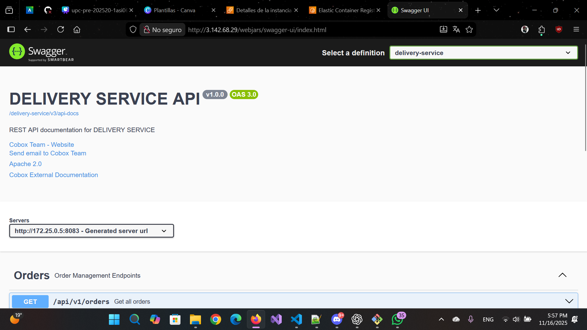
  <p><em>Evidencia final del estado de los contenedores desplegados</em></p>
</div>

##### 5.3.2.7 Team Collaboration Insights during Sprint

Durante esta fase de entrega, el equipo mantuvo una coordinación constante en las tareas de desarrollo de la landing page y los servicios backend.
Además, se realizaron las actualizaciones pertinentes en la documentación. Esta colaboración efectiva fue clave para asegurar el correcto modelado y la funcionalidad de nuestra lógica de negocio.

- _Evidencias de colaboración:_

  - Backend Web Services:
  <div align="center">
      
  </div>

  - Reporte:
  <div align="center">
      
  </div>

##### 5.3.2.8. Kanban Board
##### 5.3.3. Sprint 3
Durante el srpint 3, nos centramos en la condiguración de los servicios para luego ejecutarlos. Este sprint resultó clave para establecer las primeras funcionalidades del sistema, sentando jas bases técnicas para los siguientes ciclos de desarrollo.
##### 5.3.3.1 Sprint Backlog 3
Para el tercer sprint backlog, recopilamos y organizamos las historias de usuario prioritarias, dividiéndolas en tareas específicas y asignándolas a los integrantes del equipo mediante Trello. Este sprint se centró en completar las pantallas del frontend, finalizar microservicios restantes y generar evidencia de desarrollo, pruebas, ejecución, documentación y colaboración. El tablero Kanban permitió gestionar eficientemente el flujo de trabajo y mantener la transparencia entre los miembros del equipo.

<div align="center">
    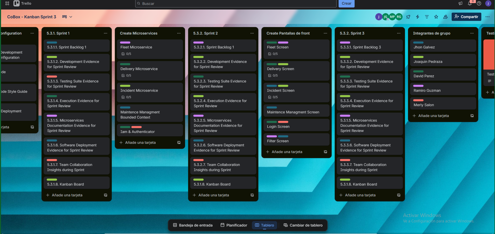
</div>

---

| User Story / Work-Item ID | Title | Task ID | Task Title | Estimación (pt) | Assigned To | Status |
|----------------------------|--------|----------|-------------|-----------------|--------------|---------|
| US004 | Implementación de pantallas frontend | T10 | Crear pantalla **Fleet Screen** | 3 | **Joaquín Pedraza Maldonado** | Done |
| US004 | Implementación de pantallas frontend | T11 | Crear pantalla **Delivery Screen** | 2 | **Merly Salón Puerta** | Done |
| US004 | Implementación de pantallas frontend | T12 | Crear pantalla **Incident Screen** | 2 | **Ramiro Alexander Guzmán Chávez** | Done |
| US004 | Implementación de pantallas frontend | T13 | Crear pantalla **Maintenance Management Screen** | 3 | **David Alexander Pérez García** | Done |
| US004 | Implementación de pantallas frontend | T14 | Crear **Login Screen** | 1 | **Jhon Alexander Gálvez Chambi** | Done |
| US004 | Implementación de pantallas frontend | T15 | Crear **Filter Screen** | 1 | **Merly Salón Puerta** | Done |
| TS007 | Microservicios – fase final | T16 | Completar estructura y validaciones del `incident-service` | 3 | **Ramiro Alexander Guzmán Chávez** | Done |
| TS008 | Microservicios – fase final | T17 | Completar `maintenance-service` y su contexto | 2 | **Jhon Alexander Gálvez Chambi** | Done |
| TS009 | Integración IAM | T18 | Integración del módulo IAM con frontend | 2 | **David Alexander Pérez García** | Done |
| TS010 | Evidencia de ejecución | T19 | Logs, análisis y profiling de endpoints | 1 | **Equipo** | Done |
| TS011 | Pruebas Sprint 3 | T20 | Pruebas unitarias y de integración | 2 | **Equipo** | Done |
| TS012 | Documentación | T21 | Documentar servicios, pantallas y dependencias | 1 | **Merly Salón Puerta** | Done |
| TS013 | Despliegue | T22 | Evidencia de despliegue en contenedores / entorno local | 2 | **David Alexander Pérez García** | Done |
| TS014 | Colaboración | T23 | Consolidar *Team Collaboration Insights during Sprint* | 1 | **Equipo** | Done |

---


##### 5.3.3.2 Development Evidence for Sprint Review


| Repository      | Branch  | Commit Id | Commit Message                                         | Commit Message Body                                                                                                                                                 | Committed on (Date) |
|-----------------|---------|-----------|--------------------------------------------------------|---------------------------------------------------------------------------------------------------------------------------------------------------------------------|----------------------|
| cobox-webapp    | develop | 91bd2f3   | feat(front): add driver dashboard & pending orders card | Implementación de la vista del conductor con tarjeta de pedidos pendientes, información del conductor y rutas semanales. Se agregaron componentes reutilizables y estilos globales. | 02/11/25 |
| cobox-webapp    | develop | c3ae71d   | feat(front): assignment view with live map integration  | Desarrollo de la pantalla de asignación con integración de mapa en tiempo real. Marcador dinámico, actualización periódica y comunicación con delivery-service.      | 02/11/25 |
| cobox-webapp    | develop | 7fd9ab0   | feat(front): incidents module + create/report UI        | Implementación del módulo completo de incidencias: formulario reactivo, subida de adjuntos, tabs de estado y listado conectado al incident-service vía API Gateway.   | 02/11/25 |
| cobox-webapp    | develop | a92c4d5   | feat(front): order detail view + tracking map           | Creación de la vista de detalle del pedido: datos del cliente, estado, historial y mapa de tracking en tiempo real. Integración con delivery-service.                | 02/11/25 |
| cobox-webapp    | develop | e5b1c7f   | feat(front): admin dashboard with fleets & incidents    | Implementación del dashboard de administrador: flotas, conductores activos, pedidos pendientes e incidencias. Se añadieron badges de estado y mapa consolidado.       | 02/11/25 |
| cobox-webapp    | develop | b7f31e9   | fix(front): adjust map loading delay on mobile          | Corrección del retraso en la carga del mapa en dispositivos móviles mediante optimización de hooks, lazy loading y ajustes en el layout responsive.                  | 02/11/25 |
| cobox-webapp    | develop | d8a6710   | style(front): unify card spacing & sidebar consistency  | Ajustes visuales globales para unificar paddings, espaciados, tamaños de tarjeta e iconografía del sidebar siguiendo la guía de diseño de CoBox.                      | 02/11/25 |


##### 5.3.3.3 Testing Suite Evidence for Sprint Review

### Feature: Implementación del Front del Dashboard, Pedidos, Conductores, Flotas e Incidencias

| Repository      | Branch  | Commit Id | Commit Message                                         | Commit Message Body                                                                                                                           | Committed on (Date) |
|-----------------|---------|-----------|--------------------------------------------------------|-----------------------------------------------------------------------------------------------------------------------------------------------|----------------------|
| cobox-webapp    | develop | 91bd2f3   | feat(front): add driver dashboard & pending orders card | Implementación de la pantalla del conductor con tarjeta de pedidos pendientes, información del conductor y rutas semanales. Incluye componentes reutilizables y estilos Material. | 02/11/25 |
| cobox-webapp    | develop | c3ae71d   | feat(front): assignment view with live map integration  | Integración del mapa en tiempo real para conductores con pedido asignado. Se agregó marcador dinámico y actualización por WebSocket/Pooling. | 02/11/25 |
| cobox-webapp    | develop | 7fd9ab0   | feat(front): incidents module + create/report UI        | Desarrollo del módulo “Incidencias”: formulario completo, adjuntos, filtros, tabs de estado y listado actualizado desde incident-service.     | 02/11/25 |
| cobox-webapp    | develop | a92c4d5   | feat(front): order detail view + tracking map           | Implementación de la vista de detalles del pedido con datos del cliente, estado del pedido y mapa en tiempo real. Conexión con delivery-service. | 02/11/25 |
| cobox-webapp    | develop | e5b1c7f   | feat(front): admin dashboard with fleets & incidents    | Implementación del dashboard general para administradores: flotas, conductores, pedidos pendientes, incidencias y mapa consolidado. Incluye badges por estado. | 02/11/25 |
| cobox-webapp    | develop | f0d9ce1   | test(front): add component tests for dashboard & orders | Pruebas unitarias para componentes de Dashboard y PendingOrders; verificación de render, bindings y consumo de servicios.                     | 02/11/25 |
| cobox-webapp    | develop | 3c79aa2   | test(front): incidents form validation & list behavior  | Pruebas unitarias y e2e del formulario de incidencias, validaciones, adjuntos y tabs. Corrección de casos límite.                             | 02/11/25 |
| cobox-webapp    | develop | b7f31e9   | fix(front): adjust map loading delay on mobile          | Bugfix del mapa en vista mobile que demoraba en cargar. Optimización del lifecycle hook y lazy loading.                                       | 02/11/25 |
| cobox-webapp    | develop | d8a6710   | style(front): unify card spacing & sidebar consistency  | Ajuste de paddings, espaciados y estilos globales para mantener coherencia visual según la guía de diseño CoBox.                              | 02/11/25 |


##### 5.3.3.4 Execution Evidence for Sprint Review

[](https://postimg.cc/XpD4VcWR)
[](https://postimg.cc/CRqTS3mv)
[](https://postimg.cc/ft518DTB)
##### 5.3.3.5 Microservices Documentation Evidence for Sprint Review


### Microservicios implementados


### Decisiones arquitectónicas basadas en atributos de calidad


<div align="center">
    
</div>

##### 5.3.3.6 Software Deployment Evidence for Sprint Review

## 1. Crear Proyecto en Firebase y configurar Firebase Hosting

1. Accede a [Firebase Console](https://console.firebase.google.com/)
2. Click en **"Agregar proyecto"**
3. Nombre del proyecto: `app-cobox`
4. Desactiva Google Analytics (opcional)
5. Click en **"Crear proyecto"**
6. En el menú lateral, selecciona **"Hosting"**
7. Click en **"Comenzar"**

---

## 2. Instalar y Autenticar Firebase CLI

### Instalación

```bash
npm install -g firebase-tools
```

### Autenticación

```bash
firebase login
```

Se abrirá el navegador para autorizar Firebase CLI con tu cuenta de Google.


---

## 3. Inicializar Firebase en el Proyecto

Desde la raíz del proyecto:

```bash
firebase init hosting
```

**Configuración:**
- **Proyecto:** `app-cobox`
- **Public directory:** `dist`
- **Single-page app:** `Yes`
- **GitHub deploys:** `No`
- **Overwrite index.html:** `No`

[](https://postimg.cc/ZBdkwr3F)

### Archivos Generados

**`.firebaserc`**
```json
{
  "projects": {
    "default": "app-cobox"
  }
}
```

**`firebase.json`**
```json
{
  "hosting": {
    "public": "dist",
    "ignore": ["firebase.json", "**/.*", "**/node_modules/**"],
    "rewrites": [
      {
        "source": "**",
        "destination": "/index.html"
      }
    ]
  }
}
```

---

## 4. Crear Workflow de GitHub Actions

Crea `.github/workflows/firebase-deploy.yml`:

```yaml
name: Deploy Frontend to Firebase Hosting

on:
  push:
    branches:
      - main
  workflow_dispatch:

jobs:
  build-and-deploy:
    runs-on: ubuntu-latest

    steps:
      - name: Checkout code
        uses: actions/checkout@v4

      - name: Setup Node.js
        uses: actions/setup-node@v4
        with:
          node-version: '22'
          cache: 'npm'

      - name: Install dependencies
        run: npm ci

      - name: Run TypeScript type check
        run: npm run build -- --mode production

      - name: Run linter
        run: npm run lint

      - name: Build React + Vite app
        run: npm run build

      - name: Deploy to Firebase Hosting
        run: npx firebase-tools deploy --only hosting --non-interactive
        env:
          FIREBASE_TOKEN: ${{ secrets.FIREBASE_SERVICE_ACCOUNT }}
```

---

## 5. Generar Token de Firebase

En la terminal:

```bash
firebase login:ci
```

El navegador se abrirá para autorizar. Una vez autorizado, copia el token generado.
[](https://postimg.cc/SYdgdsZt)

---

## 6. Configurar Secret en GitHub

1. Ve a: `https://github.com/G1-FundamentosArqui-6336/frontend/settings/secrets/actions`
2. Click en **"New repository secret"**
3. **Name:** `FIREBASE_SERVICE_ACCOUNT`
4. **Secret:** Pega el token generado
5. Click en **"Add secret"**

[](https://postimg.cc/w1nYLfRy)
---

## 7. Desplegar a Producción

### Push a Main

```bash
git add .
git commit -m "feat: configure Firebase Hosting deployment"
git push origin main
```

### Monitorear el Despliegue

1. Ve a la pestaña **Actions** en GitHub
2. Observa la ejecución del workflow

### Workflow Completado

[](https://postimg.cc/tYmKGS5D)
---

## 8. Verificar en Firebase Console

1. Accede a [Firebase Console](https://console.firebase.google.com/)
2. Proyecto: `app-cobox`
3. Menú lateral: **Hosting**

[](https://postimg.cc/mzwnX8kZ)

##### 5.3.3.7 Team Collaboration Insights during Sprint
##### 5.3.3.8. Kanban Board
<div align="center">
    
</div>
Link
https://shorturl.at/bNYfk

[](https://postimg.cc/Ty3vcnSJ)

 Anexo: [https://shorturl.at/CzirV](https://shorturl.at/CzirV)  


#### 5.3.3. Sprint 3

Durante el sprint 2, nos centramos en la condiguración de los servicios para luego ejecutarlos. Este sprint resultó clave para establecer las primeras funcionalidades del sistema, sentando jas bases técnicas para los siguientes ciclos de desarrollo.

##### 5.3.3.1 Sprint Backlog 3

Para el segundo sprint backlog, recopilamos las historias de usuario pertinentes. Con el fin de organizar y gestionar eficientemente el trabajo, dividimos cada historia en tareas específicas y alcanzables, asignándolas a los integrantes del equipo mediante la herramienta Trello. Durante este sprint, nos concentramos en completar las historias planificadas, aprovechando las funcionalidades colaborativas de Trello para monitorear el avance, coordinar esfuerzos y resolver los desafíos surgidos durante el desarrollo.

<div align="center">
    
</div>


| User Story / Work-Item ID | Title | Task ID | Task Title | Estimación (pt) | Assigned To | Status |
|----------------------------|--------|----------|-------------|-----------------|--------------|---------|
| US001 | Configuración centralizada de servicios | T01 | Implementar `config-service` para la gestión de configuración externa | 3 | **Ramiro Alexander Guzmán Chávez** | Done |
| TS001 | Servidor de descubrimiento | T02 | Implementar `eureka-service` para registro y descubrimiento de microservicios | 2 | **Jhon Alexander Gálvez Chambi** | Done |
| TS002 | Gateway de entrada | T03 | Implementar `gateway-service` con rutas a los microservicios | 2 | **Jhon Alexander Gálvez Chambi** |Done |
| US002 | Autenticación de usuarios | T04 | Implementar `iam-service` (servicio de autenticación con JWT y roles) | 3 | **David Alexander Pérez García** | Done |
| TS003 | Gestión de flota | T05 | Implementar `fleet-service` con CRUD de vehículos y tracking básico | 3 | **David Alexander Pérez García** |Done |
| TS004 | Servicio de entregas | T06 | Implementar `delivery-service` con endpoints de pedidos y estado de entrega | 3 | **Joaquín Pedraza Maldonado** | Done |
| US003 | Comunicación entre microservicios | T07 | Configurar comunicación vía `FeignClient` entre `fleet` y `delivery` | 2 | **Ramiro Alexander Guzmán Chávez** | Done |
| TS005 | Pruebas y despliegue | T08 | Ejecutar pruebas unitarias e integración para cada microservicio | 2 | **David Alexander Pérez García** | Done |
| TS006 | Documentación general | T09 | Configurar y documentar endpoints con `Swagger`/`SpringDoc` para todos los microservicios | 1 | **Merly Salón Puerta** | Done |

---

##### 5.3.3.2 Development Evidence for Sprint Review

| Repository                | Branch  | Commit Id | Commit Message                                  | Commit Message Body                                                                                                                                             | Committed on (Date) |
| ------------------------- | ------- | --------- | ----------------------------------------------- | --------------------------------------------------------------------------------------------------------------------------------------------------------------- | ------------------- |
| cobox-iam-service         | develop | 9a7c3f1   | feat(develop): add refresh-token & health actuators | Implement refresh token endpoint, secure `/actuator/**` with permitAll for `/health`, add token blacklist cache. Updates to `BearerAuthorizationRequestFilter`. | 02/11/25            |
| cobox-fleet-service       | develop | 3e81b9c   | feat(develop): vehicle assignment aggregate       | New `Assignment` aggregate, repository + application service; DTO mappers; migration V6__assignment.sql.                                                        | 02/11/25            |
| cobox-delivery-service    | develop | b41e7da   | feat(develop): route integration client (ACL)  | REST client to RouteSvc, retry/backoff, circuit breaker; `ExternalRouteServiceImpl` wiring; config via `application.yml`.                                       | 02/11/25            |
| cobox-incident-service    | develop | 7fd29a0   | chore(develop): naming strategy + auditing     | Apply `SnakeCaseWithPluralizedTablePhysicalNamingStrategy`, add `AuditableAggregateRoot`, create flyway baseline.                                               | 02/11/25            |
| cobox-maintenance-service | develop | f2c6a84   | feat(develop): preventive plan scheduler          | Quartz job for preventive maintenance by mileage/time; domain policy + cron config; expose `/plans/{id}` endpoints.                                             | 02/11/25            |


##### 5.3.3.3 Testing Suite Evidence for Sprint Review

| Repository                | Branch  | Commit Id | Commit Message                                     | Commit Message Body | Committed on (Date) |
| ------------------------- | ------- | --------- | -------------------------------------------------- | ------------------- | ------------------- |
| cobox-iam-service         | develop | e6a5c1d   | test(develop): add jwt filter & refresh flow tests     | RamiroGuzmanCh      | 02/11/25            |
| cobox-fleet-service       | develop | 4b9f21e   | test(develop): AssignmentService unit & mapper tests | davidalexd          | 02/11/25            |
| cobox-delivery-service    | develop | 2c7d9a3   | test(develop): RouteIntegrationClient resilience  | Chaoemum            | 02/11/25            |
| cobox-incident-service    | develop | 88ac0f5   | test(develop): repository + flyway baseline       | JoaquinPedraza1     | 02/11/25            |
| cobox-maintenance-service | develop | a1f3d77   | test(develop): scheduler cron & policy specs         | MerlySalonP         | 02/11/25            |

##### 5.3.3.4 Execution Evidence for Sprint Review

Configuramos los services para luego ejecutarlos 
  
   
    
     
     Esta es la configuración del servicio flota 
           
     Se muestra la ejecución de un microservicio
      
            
            
##### 5.3.3.5 Microservices Documentation Evidence for Sprint Review

El sistema **CoBox** fue diseñado bajo una **arquitectura de microservicios**, siguiendo los principios de **Domain-Driven Design (DDD)** y la metodología **Attribute-Driven Design (ADD)**.  
Este enfoque permitió estructurar la arquitectura en función de los **atributos de calidad** definidos para el sistema: **escalabilidad, mantenibilidad, disponibilidad y seguridad**.

Además, se implementaron componentes clave de **Spring Cloud** como **Eureka Server** y **Spring Cloud Gateway**, los cuales garantizan el descubrimiento dinámico de servicios y el enrutamiento centralizado de las solicitudes dentro del ecosistema de microservicios.

---

### Aplicación de la metodología ADD

Durante el proceso de diseño, se siguieron las etapas propuestas por la metodología **ADD**:

#### **1. Definición de los objetivos de calidad**
- Se identificaron los atributos críticos: **escalabilidad**, **independencia de despliegue**, **resiliencia** y **seguridad**.  
- Estos atributos guiaron las principales decisiones arquitectónicas, influyendo directamente en la adopción de **Eureka** y **Spring Cloud Gateway** para lograr un entorno distribuido estable y seguro.

#### **2. Identificación de drivers arquitectónicos**
- Se analizaron los **requisitos funcionales** (gestión de flota, autenticación, entregas) y los **requisitos no funcionales** (rendimiento, disponibilidad, consistencia de datos).  
- Se priorizaron decisiones que fomentaran la **modularidad**, la **autonomía de despliegue** y la **comunicación desacoplada** entre microservicios.

#### **3. Descomposición en módulos y asignación de responsabilidades**
- Se definieron **bounded contexts** según DDD, donde cada microservicio representa un dominio independiente con su propia base de datos, API y lógica de negocio.  
- La **alta cohesión** dentro de cada módulo y el **bajo acoplamiento** entre ellos se lograron gracias al uso de **Eureka** como registro de descubrimiento y **Gateway** como punto de entrada único.

#### **4. Evaluación y refinamiento iterativo**
- Se validó la arquitectura mediante *proofs of concept* conectando los microservicios a través de **Eureka Server**.  
- Se configuró **Spring Cloud Gateway** para enrutar las solicitudes externas hacia los servicios internos, garantizando el balanceo y la protección de los endpoints.  
- Se refinaron las configuraciones de **docker-compose** y **config-service** para asegurar el funcionamiento distribuido en entornos locales y en la nube.

---

### Microservicios implementados

| **Microservicio** | **Descripción** | **Responsabilidad Principal** |
|--------------------|-----------------|-------------------------------|
| **IAM Service** | Autenticación y autorización basada en JWT. | Control de usuarios, roles y permisos. |
| **Fleet Service** | Gestión de flota vehicular. | Administración de vehículos, conductores y estados de disponibilidad. |
| **Delivery Service** | Gestión de entregas y pedidos. | Control de pedidos, asignaciones y seguimiento. |
| **Config Service** | Configuración centralizada. | Administración de propiedades compartidas entre microservicios. |
| **Eureka Service** | Descubrimiento de servicios. | Registro dinámico y localización automática de microservicios. |
| **Gateway Service** | Puerta de enlace API. | Enrutamiento, control de acceso y gestión del tráfico entrante. |

---

### Decisiones arquitectónicas basadas en atributos de calidad

| **Atributo de Calidad** | **Decisión Tomada** | **Resultado Esperado** |
|--------------------------|---------------------|------------------------|
| **Escalabilidad** | Uso de **Eureka** para descubrimiento automático y despliegue independiente por microservicio. | Permite escalar horizontalmente cada servicio según demanda. |
| **Mantenibilidad** | Diseño modular guiado por DDD y separación clara de responsabilidades. | Cambios localizados sin afectar a otros servicios. |
| **Disponibilidad** | Integración de **Spring Boot Actuator** (`/actuator/health`) y despliegue replicado. | Monitoreo y alta disponibilidad ante fallos. |
| **Seguridad** | Autenticación centralizada mediante **IAM Service** y control de rutas seguras en **Gateway**. | Acceso seguro y validado en cada petición. |

---

<div align="center">
    
</div>

##### 5.3.3.6 Software Deployment Evidence for Sprint Review

El despliegue de los microservicios del sistema **CoBox** se realizó en una infraestructura basada en **Amazon Web Services (AWS)**, garantizando la escalabilidad, disponibilidad y seguridad de los componentes.
A continuación, se resumen los pasos más relevantes y las evidencias técnicas del proceso de deployment automatizado.

---

### **1. Configuración de la Infraestructura en AWS**

Se aprovisionaron los recursos esenciales para la ejecución de los microservicios:

* **Instancia EC2** (Amazon Linux 2) configurada como host principal de Docker y Docker Compose.
* **Repositorio ECR (Elastic Container Registry)** para almacenar las imágenes Docker generadas por los pipelines de CI/CD.
* **Base de datos RDS PostgreSQL** como backend persistente de los contextos IAM, Fleet y Delivery.
* **AWS Systems Manager (SSM Parameter Store)** para gestionar credenciales (DB, JWT, API Keys) evitando su exposición en repositorios.

<div align="center">
  
  <p><em>Configuración de la infraestructura base en AWS (EC2, RDS, ECR y SSM)</em></p>
</div>

---

### **2. Construcción y Versionamiento de Imágenes Docker**

Cada microservicio se empaquetó en un contenedor independiente siguiendo el principio de **isolated bounded contexts**.
El pipeline de GitHub Actions compila el código, ejecuta pruebas y genera imágenes etiquetadas con `:latest` y `:<timestamp>`, las cuales se publican automáticamente en ECR.

Pasos esenciales del workflow:

1. Compilación del microservicio con **Maven**.
2. Construcción del contenedor mediante su `Dockerfile`.
3. Autenticación OIDC → Push a ECR (sin credenciales estáticas).

<div align="center">
  
  <p><em>Pipeline de CI/CD en GitHub Actions para build & push a ECR</em></p>
</div>

---

### **3. Despliegue Automatizado en EC2 mediante GitHub Actions**

El pipeline ejecuta una conexión SSH controlada hacia la instancia EC2 para desplegar las imágenes más recientes.
Dentro de `/opt/cobox`, se recrea el entorno con los siguientes pasos:

1. Carga de variables desde `cobox-env.sh` y archivos `.env` específicos por servicio.
2. Verificación del servicio Docker y autenticación con ECR.
3. Ejecución de `docker compose -f docker-compose.aws.yml up -d` para recrear contenedores.
4. Validación automática de estados `healthy` mediante healthchecks de `/actuator/health`.

<div align="center">
  
  <p><em>Ejecución de Docker Compose para levantar los microservicios en EC2</em></p>
</div>

---

### **4. Validación del Despliegue y Healthchecks**

Una vez desplegados los servicios:

* Se comprobó que todos los contenedores (`config-service`, `eureka-service`, `iam-service`, `fleet-service`, `delivery-service`, `gateway-service`) se encuentren en estado **healthy**.
* Se accedió al gateway mediante su IP pública, verificando la respuesta correcta del endpoint `/actuator/health` y los redireccionamientos internos hacia cada microservicio.

```bash
$ curl http://<public-ip>/actuator/health
HTTP/1.1 200 OK
{"status":"UP"}
```

<div align="center">
  
  <p><em>Validación del estado del Gateway y microservicios mediante healthchecks</em></p>
</div>

---

### **5. Resultado Final**

El despliegue se completó exitosamente con los siguientes resultados:

* Todos los microservicios levantados en contenedores independientes y registrados en **Eureka Server**.
* Gateway accesible externamente a través de la IP pública de la instancia EC2.
* Integración continua funcionando de forma automática ante nuevos commits en la rama principal (`main`).

<div align="center">
  
  <p><em>Evidencia final del estado de los contenedores desplegados</em></p>
</div>

##### 5.3.3.7 Team Collaboration Insights during Sprint

Durante esta fase de entrega, el equipo mantuvo una coordinación constante en las tareas de desarrollo de la landing page y los servicios backend.
Además, se realizaron las actualizaciones pertinentes en la documentación. Esta colaboración efectiva fue clave para asegurar el correcto modelado y la funcionalidad de nuestra lógica de negocio.

- _Evidencias de colaboración:_

  - Backend Web Services:
  <div align="center">
      
  </div>

  - Reporte:
  <div align="center">
      
  </div>

##### 5.3.3.8. Kanban Board

<div align="center">
    
</div>


### Conclusiones y Recomendaciones

**Conclusiones**

1. La aplicación del enfoque Lean UX fue determinante, ya que permitió validar hipótesis, identificar necesidades reales de los usuarios y orientar el diseño hacia una solución centrada en el cliente, asegurando que la propuesta de CoWare responda a problemas concretos del sector.

2. El uso de herramientas de investigación como entrevistas, User Personas, Empathy Maps y Scenario Mapping facilitó la detección de puntos de dolor y oportunidades de mejora en la gestión del transporte de carga, aportando una base sólida para el diseño de la plataforma.

3. La estructuración del Product Backlog proporcionó un camino claro de desarrollo, priorizando funcionalidades críticas que garantizan eficiencia operativa y transparencia en los procesos, lo que refuerza la viabilidad de la solución tecnológica propuesta.

4. La implementación del método ADD v3 (Attribute-Driven Design) ha permitido establecer una arquitectura robusta y escalable que responde directamente a los drivers arquitectónicos identificados. La separación en bounded contexts mediante Domain-Driven Design asegura que cada dominio de negocio (Fleet Management, Delivery Management, Incident Management, Maintenance Management y Analytics & Reporting) mantenga responsabilidades claras y específicas.

5. La arquitectura de microservicios adoptada proporciona la flexibilidad necesaria para el crecimiento independiente de cada módulo, permitiendo deployments específicos y tecnologías optimizadas según las necesidades del dominio. La implementación de un API Gateway centralizado garantiza seguridad, control de acceso y trazabilidad en todas las operaciones.

6. El análisis de la Iteración 1 del ADD evidenció el cumplimiento exitoso de los tres drivers críticos establecidos: Trazabilidad en Tiempo Real mediante geolocalización GPS y WebSockets, Eficiencia Operativa a través de dashboards analíticos y reportes automatizados, y Seguridad de Datos mediante autenticación JWT y control de acceso basado en roles (RBAC).

7. La aplicación de patrones arquitectónicos específicos como Factory, Observer, Command, Strategy y Facade, junto con las tácticas de calidad implementadas, aseguran que el sistema sea mantenible, escalable y resiliente ante fallos, cumpliendo con los estándares de la industria para aplicaciones críticas de transporte.


**Recomendaciones**

1. Continuar con un proceso de validación continua, incorporando feedback de usuarios finales en cada iteración del desarrollo.  
2. Desplegar un plan piloto con un grupo de empresas de transporte para evaluar el desempeño de la plataforma en un entorno real.  
3. Priorizar en las primeras fases los módulos de **geolocalización en tiempo real**, **registro de incidencias** y **reportes automáticos**, al ser los de mayor impacto en la eficiencia operativa.  
4. Implementar estrategias de capacitación para los usuarios finales, a fin de garantizar una adopción fluida de la herramienta.  
5. Mantener un proceso de documentación y mejora continua que permita escalar la solución a nuevos mercados y escenarios logísticos.
6. Desarrollar un plan de capacitación técnica específico para el equipo de desarrollo en tecnologías clave como Spring Cloud Gateway, PostgreSQL + PostGIS, RabbitMQ y Kafka, identificadas como críticas en las decisiones de diseño registradas.
7. Implementar estrategias de testing automatizado que incluyan pruebas de integración entre microservicios, pruebas de carga para el sistema de tracking en tiempo real, y pruebas de seguridad para validar el control de acceso RBAC.
8. Establecer métricas de calidad arquitectónica para evaluar continuamente aspectos como acoplamiento entre servicios, cohesión interna de bounded contexts, tiempo de respuesta de APIs y efectividad de las tácticas de disponibilidad implementadas.
9. Planificar una estrategia de migración gradual que permita escalar la solución de un ambiente de desarrollo local hacia una infraestructura cloud nativa, considerando las restricciones de recursos identificadas y las necesidades de escalabilidad CoBoxtal.
10. Mantener un proceso de documentación arquitectónica evolutiva que registre nuevas decisiones de diseño, patrones implementados y lecciones aprendidas, facilitando la transferencia de conocimiento y la continuidad del proyecto a largo plazo.

### Referencias Bibliográficas

- Gothelf, J., & Seiden, J. (2013). *Lean UX: Applying Lean Principles to Improve User Experience*. O’Reilly Media.  
- Osterwalder, A., Pigneur, Y., Bernarda, G., & Smith, A. (2014). *Value Proposition Design: How to Create Products and Services Customers Want*. Wiley.  
- Interaction Design Foundation. (2025). *Lean UX*. Recuperado de: [https://www.interaction-design.org](https://www.interaction-design.org)  
- Nielsen Norman Group. (2025). *User Research Methods*. Recuperado de: [https://www.nngroup.com](https://www.nngroup.com)  

### Anexos

A continuación, se incluyen materiales complementarios que respaldan el desarrollo del proyecto y facilitan la comprensión del proceso y los resultados obtenidos.

**Anexo 1: Presentación del Proyecto (PPT)**  
Contiene un resumen visual del proceso de diseño, incluyendo hipótesis, metodología, hallazgos de investigación, wireframes y conclusiones.  
🔗 [Ver presentación en Canva](https://www.canva.com/design/DAGyy9be9zs/WfcFl0FUxStlw49J7G4pAA/edit?utm_content=DAGyy9be9zs&utm_campaign=designshare&utm_medium=link2&utm_source=sharebutton)

**Anexo 2: Repositorio del Reporte Completo**  
Incluye el informe detallado del proyecto, con documentación técnica, resultados de investigación, mapas de empatía, escenarios y backlog priorizado.  
🔗 [Acceder al repositorio en GitHub](https://github.com/G1-FundamentosArqui-6336/Report)

