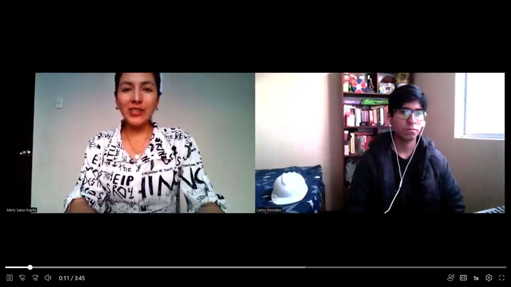

# CoWare
## Producto: CoBox
# UNIVERSIDAD PERUANA DE CIENCIAS APLICADAS

  

### Carrera: Ingeniería de Software  
### Ciclo: 7° ciclo  
### Curso: Fundamentos de Arquitectura de Software  
### NRC: 6336  
### Profesor: Jorge Luis Delgado Vite

## Informe de Trabajo Final  
**"CoWare"**  
**Producto: "CoBox"**

### Integrantes:
- Ramiro Alexander Guzmán Chávez – U202217062  
- David Alexander Pérez García – U202222942  
- Joaquín Pedraza Maldonado – U202218514
- Merly Salon Puerta – U20201b772  
- Jhon Alexander Galvez Chambi – U202323270  

**Septiembre, 2025**  
**URL del proyecto:** [https://github.com/G1-FundamentosArqui-6336](https://github.com/G1-FundamentosArqui-6336)

---

## Registro de Versiones del Informe

| Versión | Fecha       | Autor                                      | Descripción                                                                 |
|---------|-------------|--------------------------------------------|-----------------------------------------------------------------------------|
| TB1     | 09/09/2025  | Ramiro Alexander Guzmán Chávez             | Desarrollo de la carátula, tabla de contenidos y estructura general del informe. |
| TB1     | 09/09/2025  | David Alexander Pérez García               | Redacción de la sección "Descripción de la Startup" y Lean UX Assumptions/Hypothesis. |
| TB1     | 09/09/2025  | Joaquín Pedraza Maldonado                  | Elaboración de perfiles de integrantes y Segmentos Objetivo.                |
| TB1     | 10/09/2025  | Merly Salon Puerta                         | Desarrollo de antecedentes, problemática y User Task Matrix.               |
| TB1     | 10/09/2025  | Jhon Alexander Galvez Chambi              | Lean UX Problem Statement y Empathy Maps.                                   |
| TB1     | 10/09/2025  | Ramiro Alexander Guzmán Chávez             | Diseño del Lean UX Canvas y análisis de entrevistas.                        |
| TB1     | 11/09/2025  | Merly Salon Puerta                         | Análisis de competidores y apoyo en entrevistas.                            |
| TB1     | 11/09/2025  | Joaquín Pedraza Maldonado                  | Desarrollo de User Personas y User Stories.                                 |
| TB1     | 11/09/2025  | David Alexander Pérez García               | Registro y vaciado de entrevistas; elaboración de To-Be Scenario Mapping.  |
| TB1     | 11/09/2025  | Jhon Alexander Galvez Chambi              | Diseño del formato de entrevistas y desarrollo del Product Backlog.         |
| TB1     | 12/09/2025  | Ramiro Alexander Guzmán Chávez             | As-is Scenario Mapping, conclusiones y recomendaciones.                     |
| TB1     | 12/09/2025  | Merly Salon Puerta                         | Impact Map y apoyo en revisión general.                                     |
| TB1     | 12/09/2025  | Todos los integrantes                      | Revisión final, formato del documento, referencias y anexos.                |

---

## Project Report Collaboration Insights

- **URL de la organización del proyecto:**  
  [https://github.com/G1-FundamentosArqui-6336](https://github.com/G1-FundamentosArqui-6336)
- **URL del repositorio del informe:**  
 [https://github.com/G1-FundamentosArqui-6336/Report](https://github.com/G1-FundamentosArqui-6336/Report)

 
---
## Contenido
#### Tabla de contenidos

- [Carátula](#carátula)
  - [Universidad, carrera, ciclo](#universidad-peruana-de-ciencias-aplicadas)
  - [Nombre del Startup](#cobox)
  - [Nombre del Producto](#cobox)
  - [Relación de Integrantes](#integrantes)
  - [Mes y Año](#mes-y-año)
- [Registro de Versiones del Informe](#registro-de-versiones-del-informe)
- [Contenido](#contenido)
- [Student Outcome](#student-outcome)

- [Capítulo I: Introducción](#capítulo-i-introducción)
  - [1.1. Startup Profile](#11-startup-profile)
    - [1.1.1. Descripción de la Startup](#111-descripción-de-la-startup)
    - [1.1.2. Perfiles de los integrantes del equipo](#112-perfiles-de-los-integrantes-del-equipo)
  - [1.2. Solution Profile](#12-solution-profile)
    - [1.2.1. Nombre del producto](#121-nombre-del-producto)
    - [1.2.2. Antecedentes y problemática](#122-antecedentes-y-problemática)
    - [1.2.3. Lean UX Process](#123-lean-ux-process)
      - [1.2.3.1. Lean UX Problem Statement](#1231-lean-ux-problem-statement)
      - [1.2.3.2. Lean UX Assumptions](#1232-lean-ux-assumptions)
      - [1.2.3.3. Lean UX Hypothesis](#1233-lean-ux-hypothesis)
      - [1.2.3.4. Lean UX Canvas](#1234-lean-ux-canvas)
  - [1.3. Segmentos Objetivo](#13-segmentos-objetivo)

- [Capítulo II: Requirements & Analysis](#capítulo-ii-requirements--analysis)
  - [2.1. Competidores](#21-competidores)
  - [2.2. Entrevistas](#22-entrevistas)
    - [2.2.1. Diseño de entrevistas](#221-diseño-de-entrevistas)
    - [2.2.2. Registro de entrevistas](#222-registro-de-entrevistas)
    - [2.2.3. Análisis de entrevistas](#223-análisis-de-entrevistas)
  - [2.3. Needfinding](#23-needfinding)
    - [2.3.1. User Personas](#231-user-personas)
    - [2.3.2. User Task Matrix](#232-user-task-matrix)
    - [2.3.3. Empathy Maps](#233-empathy-maps)
    - [2.3.4. As-is Scenario Mapping](#234-as-is-scenario-mapping)

- [Capítulo III: Requirements Specification](#capítulo-iii-requirements-specification)
  - [3.1. To-Be Scenario Mapping](#31-to-be-scenario-mapping)
  - [3.2. User Stories](#32-user-stories)
  - [3.3. Impact Map](#33-impact-map)
  - [3.4. Product Backlog](#34-product-backlog)

- [Conclusiones y Recomendaciones](#conclusiones-y-recomendaciones)
- [Referencias Bibliográficas](#referencias-bibliográficas)
- [Anexos ](#anexos)
- [Links](#links)

## Student Outcome  

---

### ABET – EAC - Student Outcome 7  

**Criterio: La capacidad de adquirir y aplicar nuevos conocimientos según sea necesario, utilizando estrategias de aprendizaje apropiadas.**  

En el siguiente cuadro se describen las acciones realizadas y enunciados de conclusiones por parte del equipo, que permiten sustentar el haber alcanzado el logro del ABET – EAC - Student Outcome:

| Criterio específico | Acciones realizadas | Conclusiones |
|----------------------|---------------------|--------------|
| Actualiza conceptos y conocimientos necesarios para su desarrollo profesional y en especial para su proyecto en soluciones de software. | **TB1:** **David Alexander Pérez García:** Me encargué de investigar y analizar los requerimientos del sistema, lo cual me permitió profundizar en el diseño de arquitecturas escalables, aplicar buenas prácticas de desarrollo y conocer mejor el uso de bases de datos geoespaciales para funcionalidades críticas como geolocalización, evidencias y reportes.  **TB1:** **Ramiro Alexander Guzmán Chávez:** Investigué metodologías ágiles, centrándome en Scrum, para aplicarlas en la planificación del proyecto. Esto me permitió mejorar la organización del equipo y entender cómo adaptar estos marcos de trabajo a equipos pequeños y tareas técnicas dentro de un entorno real de desarrollo.  **TB1:** **Joaquín Pedraza Maldonado:** Aprendí a utilizar Figma para la creación de prototipos de alta fidelidad y estudié principios de diseño centrado en el usuario. Esto me permitió estructurar interfaces intuitivas y validar decisiones de diseño con base en criterios funcionales y estéticos dentro del proyecto.  **TB1:** **Merly Salon Puerta:** Profundicé en técnicas de análisis cualitativo y *needfinding* para comprender mejor las necesidades del usuario. Apliqué herramientas como mapas de empatía y user personas, lo cual facilitó la identificación de funcionalidades relevantes para el sistema desde una perspectiva centrada en el usuario.  **TB1:** **Jhon Alexander Galvez Chambi:** Investigué el funcionamiento de APIs de geolocalización y su integración con sistemas backend. Estudié también estructuras de datos espaciales, lo cual me permitió implementar el seguimiento en tiempo real dentro del sistema y comprender mejor el procesamiento de información geográfica. | **TB1:** Durante esta fase, el equipo demostró su capacidad para adquirir nuevos conocimientos y aplicarlos en el desarrollo del proyecto. La búsqueda activa de información, el dominio de herramientas técnicas y el enfoque práctico evidencian que cada integrante fortaleció sus competencias, aportando valor al sistema propuesto mediante un aprendizaje técnico autónomo y efectivo. |
| Reconoce la necesidad del aprendizaje permanente para el desempeño profesional y el desarrollo de proyectos en soluciones de software. | **TB1:** **David Alexander Pérez García:** Reconocí la importancia del aprendizaje continuo y actualicé mis conocimientos en React, Next.js y Spring Boot. También aprendí a usar PostGIS para manejar datos geoespaciales y estudié mejores prácticas para el tratamiento de información sensible y evidencias digitales en plataformas web.  **TB1:** **Ramiro Alexander Guzmán Chávez:** Acepté la necesidad de seguir aprendiendo para responder a las exigencias del proyecto, por lo que estudié liderazgo técnico, gestión de tiempos y coordinación en equipos ágiles, apoyándome en libros, artículos y recursos académicos relacionados a metodologías de desarrollo de software.  **TB1:** **Joaquín Pedraza Maldonado:** Consideré fundamental actualizar mis habilidades en diseño UX/UI, por lo que revisé guías, buenas prácticas y recursos actualizados sobre accesibilidad, diseño responsivo y comportamiento del usuario. Esto me permitió diseñar una experiencia visual adecuada y adaptada a las necesidades reales del proyecto.  **TB1:** **Merly Salon Puerta:** Comprendí que el aprendizaje permanente es clave para obtener información útil del usuario, por lo que me capacité en métodos de recolección de datos cualitativos, análisis de entrevistas y síntesis de hallazgos para mejorar la relevancia y funcionalidad del sistema propuesto.  **TB1:** **Jhon Alexander Galvez Chambi:** Reafirmé la necesidad del aprendizaje continuo para dominar tecnologías nuevas, por eso profundicé en el uso de servicios de geolocalización, estructuras REST y autenticación segura, aplicando ese conocimiento para integrar funcionalidades críticas del sistema. | **TB1:** Los integrantes del equipo demostramos ser conscientes de la necesidad del aprendizaje continuo en un entorno tecnológico cambiante. Al buscar activamente nuevos conocimientos, adaptarnos a herramientas y enfrentar retos técnicos, desarrollamos una actitud profesional orientada a la mejora constante y al crecimiento personal dentro del ámbito del desarrollo de software. |

---

## Capítulo I: Introducción

### 1.1. Startup Profile

El perfil de la startup es un pilar fundamental para articular la identidad y la hoja de ruta de una nueva empresa. Este apartado desglosa no solo su ambición y los principios que rigen sus acciones, sino que también clarifica su oferta única y cómo se distingue en el panorama competitivo. En esta sección, se detallarán los componentes cruciales que definen el carácter de la startup, incluyendo su génesis, los impulsos que motivaron su fundación, el desafío específico que se propone abordar y cómo su perspectiva innovadora le otorga una ventaja competitiva. Asimismo, se explorarán sus objetivos a corto, mediano y largo plazo, junto con las tácticas empleadas para su expansión y consolidación en su nicho de mercado. Entender estos aspectos es vital para apreciar el potencial inherente al perfil de la startup y la influencia que puede ejercer en su ecosistema.

#### 1.1.1. Descripción de la Startup

CoWare es una plataforma web innovadora diseñada para revolucionar el sector del transporte de carga, ofreciendo una solución integral y tecnológica para la gestión de operaciones logísticas. La aplicación conecta a empresas de transporte con herramientas inteligentes que permiten el control preciso de cada servicio realizado. Entre sus funcionalidades se destacan el registro automatizado del kilometraje, la captura de evidencia fotográfica al momento de las entregas, y la geolocalización en tiempo real. Además, la generación automática de reportes e indicadores de desempeño facilita la toma de decisiones, optimizando la eficiencia operativa y reduciendo costos innecesarios.

Esta solución está pensada tanto para compañías de transporte que buscan mejorar la trazabilidad de sus operaciones, como para empresas logísticas que requieren de un control detallado y eficiente de sus servicios. Al digitalizar y potenciar cada etapa del proceso, Co-box logistic asegura una mayor transparencia y calidad en la entrega de productos, contribuyendo a fortalecer la confianza del cliente final.

Misión: Nuestra misión en Co-box logistic es transformar la gestión del transporte de carga a través de soluciones tecnológicas inteligentes, permitiendo a nuestros clientes operar de manera más eficiente, reducir costos y mejorar la trazabilidad de sus servicios.

Visión: Aspiramos a ser líderes en la innovación logística, impulsando un futuro en el que el transporte de carga sea cada vez más transparente, eficiente y sostenible, expandiendo nuestra presencia a nivel nacional e internacional.

#### 1.1.2. Perfiles de los integrantes del equipo

---

#### **Joaquin Pedraza Maldonado – Ingeniería de Software – U202218514**  

Estudio Ing. Software. Me considero que soy una persona perseverante, entusiasta en aprender cosas nuevas. Me gusta ayudar a los demás y sé trabajar en equipo. Cuento con conocimientos en lenguajes de Programación como C++, Python,CSS, JavaScript.
.

---

#### **Ramiro Alexander Guzman Chavez – Ingeniería de Software – U202217062**  

Mi perfil se basa en ser una persona responsable, disciplinada en todo aspecto y comprometida con las actividades que me puedan tocar.
Considero que tengo una experiencia altamente capacitada para este tipo de tareas. Suelo desarrollarme de manera positiva en los trabajos grupales y tengo conocimientos en bases de datos, lo cual puede aportar de manera importante al equipo.
Además, cuento con conocimientos en lenguajes de programación como Java y JavaScript, lo que me permite desarrollar soluciones tanto del lado del backend como del frontend, contribuyendo a proyectos de desarrollo de software de manera integral.

---

#### **David Alexander Pérez García – Ingeniería de Software – U202222942**  

Hola, soy David, estudiante de Ingeniería de Software en el octavo ciclo. Me considero una persona responsable, perseverante y apasionada por la tecnología. Tengo experiencia en el desarrollo de aplicaciones web utilizando lenguajes como TypeScript, Java y PHP, y frameworks modernos como React, Next.js, Spring Boot, Express y Laravel. Creo que puedo aportar al grupo brindando soluciones técnicas eficientes, apoyando en el desarrollo del sistema y proponiendo mejoras continuas para alcanzar los objetivos del proyecto con calidad y compromiso.

---

#### **Merly Salon Puerta – Ingeniería de Software - u20201b772**

Soy estudiante de Ingeniería de Software en la Universidad Peruana de Ciencias Aplicadas. Me considero una persona comprometida, responsable y con una actitud proactiva hacia el trabajo en equipo. Estoy dispuesta a colaborar con mi equipo para alcanzar los objetivos del proyecto, aportando mis conocimientos y habilidades técnicas.  Cuento con experiencia en el desarrollo de interfaces web utilizando tecnologías como HTML, CSS y JavaScript, lo que me permite contribuir en la creación de soluciones visuales y funcionales. Además, tengo interés en seguir aprendiendo y perfeccionando mis habilidades en el diseño y desarrollo de software, con el objetivo de aportar valor al proyecto y garantizar su éxito.  

---

#### **Jhon Alexander Galvez Chambi - Ingeniería de Software - U202323270**  

Soy una persona responsable y comprometida con la consecución de los mejores resultados en trabajo en equipo. Poseo experiencia en diversos lenguajes de programación, incluyendo Python, JavaScript y C++, así como en varios de los frameworks asociados a estos lenguajes. Además, tengo conocimientos en tecnologías emergentes como Cloud Computing e Internet de las Cosas (IoT), y estoy dispuesto a aportar mi experiencia en estas áreas para contribuir al éxito de los proyectos en los que participo.

---

### 1.2. Solution Profile

#### 1.2.1. Nombre del producto

CoBox es una plataforma digital que integra tecnología avanzada para optimizar y transformar la gestión logística del transporte de carga. Su nombre refleja la idea de una "caja" inteligente que centraliza, organiza y facilita el control de operaciones, conectando a empresas y conductores con herramientas innovadoras para lograr mayor eficiencia, trazabilidad y transparencia en cada servicio.

#### 1.2.2. Antecedentes y problemática

| Elemento     | Descripción |
|--------------|-------------|
| **Who (Quién)**      | Empresas de transporte de carga, operadores logísticos, despachadores y choferes que necesitan controlar, supervisar y reportar sus operaciones de manera precisa y eficiente. |
| **What (Qué)**       | Plataforma web que digitaliza y automatiza la gestión logística del transporte de carga, incluyendo planificación de servicios, registro de kilometraje, consumo de combustible, evidencia fotográfica, geolocalización y generación de reportes. |
| **Where (Dónde)**    | En oficinas de operación logística, empresas de transporte, y en campo a través de dispositivos móviles utilizados por los choferes. |
| **When (Cuándo)**    | Durante todas las etapas del proceso logístico: planificación previa, ejecución del servicio y post-servicio (análisis e informes). |
| **Why (Por qué)**    | Actualmente, muchas empresas gestionan sus operaciones en papel o Excel, lo cual implica errores, pérdida de información, falta de trazabilidad y un uso ineficiente de los recursos. Esto limita la capacidad de tomar decisiones basadas en datos en tiempo real y reduce la confianza del cliente. |
| **How (Cómo)**       | A través de una plataforma digital que permite crear servicios, registrar recorridos y consumos en tiempo real, visualizar la ubicación GPS de los vehículos, y generar reportes automáticos con métricas clave para mejorar el desempeño operativo. |
| **How Much (Cuánto)**| El acceso a la plataforma se brinda mediante planes de suscripción mensual, dependiendo del número de usuarios, vehículos y funcionalidades activadas por empresa. |

#### 1.2.3. Lean UX Process

##### 1.2.3.1. Lean UX Problem Statement

CoBox es una plataforma creada para digitalizar por completo la gestión del transporte de carga, eliminando procesos manuales y mejorando la eficiencia operativa. Actualmente, muchas empresas aún dependen de formularios físicos, reportes en papel y hojas de cálculo, lo que genera pérdida de tiempo, errores humanos y falta de trazabilidad.

Nuestro mayor desafío es lograr que las empresas adopten esta solución digital como una herramienta confiable, intuitiva y transformadora. Aunque la propuesta tecnológica representa una mejora significativa, algunas compañías pueden mostrarse reacias al cambio por temor a la complejidad o por depender de procesos tradicionales.

¿Cómo podríamos facilitar la adopción de Co-box logistic como una herramienta confiable, simple y efectiva para transformar digitalmente la gestión del transporte de carga y optimizar los procesos logísticos?

##### 1.2.3.2. Lean UX Assumptions

###### Business Assumptions

1. Creemos que nuestros clientes necesitan una forma digital y automatizada de gestionar las operaciones logísticas del transporte de carga.
2. Estas necesidades se resuelven con una plataforma web que digitalice el registro de kilometraje, consumo de combustible, geolocalización y genere reportes automáticos.
3. Nuestros clientes iniciales serán pequeñas y medianas empresas de transporte de carga que buscan mejorar la eficiencia operativa y reducir errores manuales.
4. El valor más importante de lo que el cliente requiere de nuestro servicio es la trazabilidad completa y automatizada de cada servicio logístico realizado.
5. El cliente puede tener los siguientes beneficios adicionales: reducción de tiempo administrativo, evidencia fotográfica de entregas, optimización de rutas, y análisis de desempeño de flota.
6. Vamos a adquirir clientes mediante marketing directo a empresas de transporte, participación en ferias logísticas, y recomendaciones de clientes satisfechos.
7. Haremos dinero a través de suscripciones mensuales basadas en el número de usuarios, vehículos y funcionalidades activadas por empresa.
8. Nuestra competencia principal serán sistemas ERP logísticos tradicionales, hojas de cálculo, y otras plataformas de gestión de flotas.
9. Los venceremos ya que nuestra plataforma se enfoca específicamente en la digitalización del transporte de carga con funcionalidades precisas y una interfaz simple.
10. Nuestro mayor riesgo es que las empresas tradicionales se resistan al cambio digital o consideren la herramienta muy compleja para sus conductores.
11. Resolveremos esto mediante capacitación personalizada, interfaces ultra-simples para conductores, funcionamiento offline, y soporte técnico dedicado durante la implementación.
12. ¿Qué otras suposiciones tenemos que, si resultan falsas, harán que nuestro negocio/proyecto fracase?
    * Que las empresas de transporte están dispuestas a pagar por digitalización cuando han funcionado con métodos tradicionales.
    * Que los conductores adoptarán una aplicación móvil a pesar de tener diferentes niveles de habilidad tecnológica.
    * Que las empresas valoran más la precisión de datos que la simplicidad de sus procesos actuales.

###### User Assumptions

1. ¿Quién será nuestro usuario?
   * El usuario principal de CoBox son gerentes y coordinadores de operaciones logísticas que necesitan control detallado sobre su flota de vehículos.
   * Co-box Logistic también está pensado para conductores de carga que requieren una herramienta simple para registrar información de viajes sin complicaciones técnicas.

2. ¿Dónde encaja nuestro producto en su vida?
   * Se integra en la rutina diaria de trabajo tanto en oficinas de operación logística como en campo durante la ejecución de servicios de transporte, facilitando el control y seguimiento en tiempo real.

3. ¿Qué problemas resuelve nuestro producto?
   * Se busca resolver la pérdida de tiempo y errores generados por registros manuales en papel, falta de trazabilidad en entregas, y discrepancias en reportes de kilometraje y combustible.
   * Los procesos manuales generan conflictos entre conductores y coordinadores por falta de evidencia objetiva, afectando la confianza y eficiencia operativa.

4. ¿Cómo y Cuándo es usado nuestro producto?
   * Es utilizado durante todas las etapas del proceso logístico: planificación previa en oficinas, registro en tiempo real durante rutas, y análisis post-servicio para reportes. Los gerentes acceden principalmente desde computadoras, mientras conductores usan dispositivos móviles en campo.

5. ¿Qué características son importantes?
   * Registro automatizado de kilometraje con evidencia fotográfica
   * Geolocalización en tiempo real y funcionamiento offline
   * Generación automática de reportes e indicadores de desempeño
   * Interfaz simple para conductores con botones grandes y flujo intuitivo

6. ¿Cómo luce y se comporta nuestro producto?
   * Con interfaces diferenciadas: dashboards analíticos para gerentes y aplicación móvil ultra-simple para conductores.
   * Funcionamiento confiable offline, sincronización automática, confirmaciones visuales claras, y recordatorios inteligentes para completar registros.

##### 1.2.3.3. Lean UX Hypothesis

Creemos que al ofrecer una plataforma digital integral que centraliza todas las operaciones logísticas, mejoraremos la eficiencia y trazabilidad del transporte de carga. Sabremos que estamos en lo correcto cuando observemos una reducción en errores operativos y una mejora en los tiempos de entrega y gestión.

Creemos que al incluir geolocalización en tiempo real y evidencia fotográfica de entregas, aumentaremos la confianza del cliente final y mejoraremos la transparencia. Sabremos que estamos en lo correcto cuando se reduzcan las incidencias reportadas y aumente la satisfacción de los clientes.

Creemos que al automatizar los reportes e indicadores, facilitaremos la toma de decisiones basada en datos. Sabremos que estamos en lo correcto cuando los gestores logren tomar acciones correctivas más rápidamente y reporten mejoras en sus KPIs logísticos.

Creemos que al ofrecer una interfaz simple, junto con capacitación para los usuarios, incrementaremos la adopción de la plataforma incluso en equipos con poca experiencia digital. Sabremos que estamos en lo correcto cuando disminuya la necesidad de soporte técnico y se mantenga una alta tasa de uso activo.

Creemos que al permitir la gestión de roles y accesos diferenciados, aumentaremos la seguridad y eficiencia interna. Sabremos que estamos en lo correcto cuando se eviten manipulaciones no autorizadas de datos y los usuarios valoren positivamente la organización del sistema.

##### 1.2.3.4. Lean UX Canvas

---

### 1.3. Segmentos Objetivo

Co-box Logistic ha identificado dos segmentos objetivos principales que representan los usuarios clave dentro del ecosistema del transporte de carga:

**Segmento Primario: Gerencia de Empresas de Transporte de Carga**

Este segmento comprende a las genrecias de pequeñas y medianas empresas (PyMES) del sector logístico que operan flotas de 5 a 30 vehículos, principalmente enfocadas en transporte interprovincial y distribución urbana. Estas empresas se caracterizan por:

- **Perfil organizacional**: Empresas familiares o de estructura tradicional que han dependido de procesos manuales (formularios en papel, Excel, WhatsApp) pero reconocen la necesidad de modernizarse para mantenerse competitivas.

- **Necesidades específicas**: Buscan digitalizar su operación para reducir errores administrativos, mejorar el control de costos operativos, aumentar la trazabilidad de servicios y ofrecer mayor transparencia a sus clientes finales.

- **Roles decisores**: Gerentes de operaciones, coordinadores logísticos y propietarios que requieren información precisa y oportuna para la toma de decisiones, control de flota y generación de reportes gerenciales.

- **Motivaciones clave**: Competir efectivamente con grandes operadores logísticos, optimizar recursos, reducir conflictos internos por discrepancias de datos y fortalecer la confianza con sus clientes.

**Segmento Secundario: Conductores de Unidades de Carga**

Este segmento incluye a los operadores de campo que ejecutan físicamente los servicios de transporte, con experiencia variable en el sector y diferentes niveles de familiaridad tecnológica:

- **Perfil demográfico**: Conductores con experiencia de 3 a 15 años en el sector, edades entre 25 y 55 años, con niveles educativos diversos y habilidades tecnológicas que van desde básicas hasta intermedias.

- **Responsabilidades operativas**: Encargados de registrar eventos críticos del viaje (kilometraje inicial/final, consumo de combustible, entregas realizadas), proporcionar evidencia fotográfica de operaciones y mantener comunicación constante con coordinadores.

- **Necesidades funcionales**: Requieren herramientas simples e intuitivas que no interfieran con su concentración en la conducción, que funcionen en zonas de conectividad limitada y que les proporcionen protección mediante evidencia objetiva de su trabajo.

- **Motivaciones personales**: Facilitar su trabajo diario, evitar conflictos por discrepancias de datos, obtener reconocimiento por desempeño y tener acceso a información que les permita mejorar profesionalmente.

## Capítulo II: Requirements & Analysis

### 2.1. Competidores

Competidor 1: Samsara
Samsara es una plataforma de IoT y telemática para gestión de flotas que ofrece GPS en tiempo real, registro automático de odómetro y combustible, programación de rutas, alertas de mantenimiento y reportes detallados de eficiencia operativa. Está presente en LATAM y cuenta con integraciones fáciles de desplegar en vehículos.

Competidor 2: Fleet Complete
Fleet Complete proporciona soluciones de rastreo GPS, monitoreo de consumo de combustible, gestión de conductores y planificación de servicios. Su enfoque está en la eficiencia de la operación diaria, con dashboards personalizables y API para conectar con ERPs.

Competidor 3: Sendd
Sendd es una startup peruana de última milla que permite programar rutas de entrega, hacer seguimiento en tiempo real y capturar prueba de entrega (fotos, firmas). Aunque no controla combustible, su fortaleza está en la experiencia local y en la usabilidad de su app móvil.

#### 2.1.1. Análisis competitivo

### Competitive Analysis Landscape

**¿Por qué llevar a cabo este análisis?**  
Para identificar cómo otras soluciones gestionan rutas, odómetro, combustible, prueba fotográfica y reportes, y descubrir oportunidades de diferenciación para **CoBox**.

---

### Comparativa de Productos

| Productos            | **CoBox**                                                                 | **Samsara**                                                                 | **Fleet Complete**                                                            | **Sendd**                                                                 |
|----------------------|--------------------------------------------------------------------------------------|------------------------------------------------------------------------------|--------------------------------------------------------------------------------|----------------------------------------------------------------------------|
| **Perfil**           | Programación de servicios, captura de odómetro (foto), registro de combustible y geolocalización, reportes web & móvil. | IoT + telemática: GPS en tiempo real, odómetro automático, control de combustible, alertas de mantenimiento. | Rastreo GPS, monitoreo de combustible, gestión de conductores, planificación de rutas. | Rutas de última milla, seguimiento en tiempo real, proof of delivery (foto/firmas). |
| **Ventaja competitiva** | Flujo completo: unifica foto del odómetro, combustible y ruta en un solo proceso adaptado a transporte de carga. | Madurez de producto y hardware plug-and-play fácil de instalar. | Dashboards personalizables y API robusta para integraciones. | Experiencia local en Perú y UX optimizada para conductores. |

---

### Perfil de Marketing

| Aspecto                   | **CoBox**                                                              | **Samsara**                                   | **Fleet Complete**                                         | **Sendd**                                                 |
|---------------------------|----------------------------------------------------------------------------------|-----------------------------------------------|-------------------------------------------------------------|------------------------------------------------------------|
| **Mercado Objetivo**      | Empresas de transporte de carga refrigerada o seca, supermercados, laboratorios y distribución general. | Flotas medianas y grandes de transporte en LATAM. | Flotas corporativas que requieren integración con ERPs.    | Negocios de e‑commerce y paquetería en Lima y alrededores. |
| **Estrategias de Marketing** | Marketing B2B digital, demos gratuitas, alianzas con talleres y gremios de transporte. | Ferias de logística y partnerships con fabricantes de vehículos. | Partnerships con proveedores de ERP y consultoras.         | Promociones locales y boca a boca en cooperativas de delivery. |

---

### Perfil de Producto

| Aspecto                 | **CoBox**                                         | **Samsara**                                                  | **Fleet Complete**                                                  | **Sendd**                                               |
|-------------------------|-------------------------------------------------------------|---------------------------------------------------------------|---------------------------------------------------------------------|----------------------------------------------------------|
| **Productos & Servicios** | Programación de viajes, captura de odómetro, combustible y temperatura, reportes analíticos. | GPS tracking, scheduling, alertas de mantenimiento, reporte de combustible. | Rastreo GPS, monitoreo de combustible, gestión de conductores, planificación de rutas. | Prueba de entrega con foto/firmas, seguimiento en ruta. |
| **Precios & Costos**     | USD 25/equipo/mes + USD 100 instalación única.             | Desde USD 30/vehículo/mes, hardware incluido.                 | Desde USD 28/vehículo/mes, descuentos anuales.                      | USD 5/entrega + comisión, sin hardware ni suscripción fija. |
| **Canales de distribución** | Web & App móvil (iOS/Android).                            | Web, App móvil y dispositivo plug‑and‑play.                   | Web, App móvil e integraciones API.                                 | App móvil y portal web liviano.                         |

---

### Análisis SWOT

|                        | **CoBox**                                          | **Samsara**                                    | **Fleet Complete**                                 | **Sendd**                                      |
|------------------------|--------------------------------------------------------------|------------------------------------------------|---------------------------------------------------|------------------------------------------------|
| **Fortalezas**         | Integración odómetro + combustible + geolocalización en un solo sistema. | Hardware plug‑and‑play y ecosistema IoT completo. | Dashboards a medida y API robusta.                | Proof of delivery con foto y firmas.          |
| **Debilidades**        | MVP en fase temprana; base de usuarios pequeña.              | Costo inicial alto y curva de configuración.    | Requiere integración técnica y tiempo de onboarding. | No registra combustible ni odómetro.          |
| **Oportunidades**      | Integrar alertas predictivas y expandir a flotas generales.  | Añadir módulos de foto del odómetro y proof of delivery. | Ofrecer paquetes para pymes sin ERP.              | Expandir a gestión de combustible.            |
| **Amenazas**           | Competidores consolidados añadiendo funciones similares.     | Startups más ágiles con UX simplificado.       | Soluciones todo‑en‑uno emergentes.                | Plataformas integrales en LATAM.              |

---

### 2.2. Entrevistas

#### 2.2.1 Diseño de entrevistas

**Segmento 1: Gerencia de flota**

1. ¿Cuál es su rol y responsabilidades principales?  
2. ¿Cuántos vehículos administra y qué tipos de rutas realiza?  
3. ¿Cómo registra hoy el odómetro y el consumo de combustible?  
4. ¿Utiliza software o formularios en papel para programar y reportar servicios?  
5. ¿Qué problemas más frecuentes encuentra en la gestión de rutas y consumo?  
6. ¿Con qué frecuencia revisa los reportes de eficiencia de su flota?  
7. ¿Qué datos le gustaría recibir automáticamente después de cada viaje?  
8. ¿Cómo impactan las discrepancias de kilometraje o combustible en su operación diaria?  
9. ¿Qué tan dispuesto estaría a adoptar una app que integre fotos de odómetro y reportes automáticos?  
10. ¿Cuál es el presupuesto mensual aproximado que invertiría en este tipo de herramienta?  

**Segmento 2: Conductores/operadores de ruta**

1. ¿Cuál es su experiencia conduciendo rutas de carga?  
2. ¿Cómo registra actualmente el inicio y fin de cada viaje?  
3. ¿Toma fotos del odómetro o anota el kilometraje manualmente?  
4. ¿Cuánto tiempo le toma completar el registro de combustible y odómetro hoy?  
5. ¿Qué dificultades tiene al usar apps o formularios para reportar su viaje?  
6. ¿Preferiría usar una app móvil con botones claros para “Iniciar”, “Foto odómetro” y “Fin”?  
7. ¿Qué tan útil le resultaría una geolocalización automática de cada parada?  
8. ¿Le preocupa la precisión del kilometraje que ingresa?  
9. ¿Qué comentarios o sugerencias tendría para que la app sea fácil de usar en ruta?  
10. ¿Qué incentivos podrían motivarlo a completar su reporte diario a tiempo?  

#### 2.2.2 Registro de entrevistas

**Segmento 1: Gerencia de flota**

- **Entrevista #1**

  

Roberto Martínez, gerente de una flota de 15 camiones, enfrenta problemas con el registro manual en papel, que genera errores, campos incompletos y pérdida de documentos. Este método retrasa la información 24-48 horas, dificultando decisiones oportunas. Las discrepancias en kilometraje afectan costos de combustible y mantenimiento, además de generar conflictos con conductores y clientes.

Coordina por WhatsApp, pero el desorden complica la gestión. Necesita una herramienta digital que proporcione datos en tiempo real, kilometraje exacto, consumo de combustible con evidencia, ubicación de paradas y confirmaciones fotográficas de entregas para mejorar trazabilidad y servicio al cliente.

Está dispuesto a invertir entre S/800 y S/1,200 mensuales si la solución ahorra tiempo administrativo y reduce costos operativos. Valora que incluya capacitación, soporte técnico y actualizaciones, dado su escepticismo por experiencias previas con herramientas poco confiables.

| Detalle           | Información                    |
|-------------------|--------------------------------|
| **Entrevistador** | Jhon Alexander Galvez Chambi  |
| **Entrevistado**  | Roberto Martinez              |
| **Edad**          | 31 años                       |
| **Duración**      | 11:52 minutos                 |
| **Enlace**        | https://shorturl.at/prt7H     |

- **Entrevista #2**

  

María Cabello Alzate, de 24 años y con cuatro años de experiencia en gestión de flotas en La Victoria (Chiclayo), supervisa alrededor de 25 camiones que cubren rutas regionales y de última milla. Actualmente, los choferes anotan el odómetro y el consumo de combustible en formularios impresos, envían fotos por WhatsApp y ella consolida manualmente todo en Excel, lo que provoca errores de transcripción, fotos de baja calidad o sin geolocalización y demoras de uno o dos días en disponer de información fiable. Para mejorar la eficiencia, María busca una plataforma que registre automáticamente el kilometraje, los litros cargados, la ubicación GPS de inicio y fin de ruta, y una fotografía clara del odómetro con fecha y hora. Revisa semanalmente un dashboard en Excel y presenta un informe mensual a la gerencia; estaría dispuesta a invertir entre USD 400 y USD 600 al mes si el sistema le permite ahorrar al menos esa misma cifra en tiempo y costos operativos, siempre y cuando la curva de aprendizaje sea mínima y los beneficios sean inmediatos.

| Detalle          | Información                                |
|------------------|--------------------------------------------|
| **Entrevistador** | Joseph Pablo Rodriguez Parco           |
| **Entrevistado**  | Maria Cabello Alzate                   |
| **Edad**          | 24 años                                |
| **Duración**      | 5:00 minutos                               |
| **Enlace**        | https://shorturl.at/sRNaN |

- **Entrevista #3**

 

  

El rol que tiene es ver la programación para las unidades, revisar el gps de cada unidad, estar al tanto de la operación de cada vehículo, maneja 38 vehículos lo cual tienen una ruta de lima a provincias, el registra el consumo de combustible a través de formatos que se llenan manualmente, la frecuencia que tiene de revisión es cada 2 días, lo que espera de una pagina web ver el consumo de combustible, el rendimiento del combustible, gastos de peajes y cosas esenciales para una buena gestión de sus unidades, nos dice que la aplicación seria de mucha utilidad ya que ellos hacen sus registros manualmente, lo que el quiere es la facilidad de accesibilidad de la web.

| Detalle          | Información                |
|------------------|----------------------------|
| **Entrevistador** | Raul Sanchez Cruz         |
| **Entrevistado**  | Jorge Perez               |
| **Edad**          | 44 años                   |
| **Duración**      | 3:16 minutos              |
| **Enlace**        | https://shorturl.at/I7pGH |

---

**Segmento 2: Conductores/operadores de ruta**

- **Entrevista #4**

  

Miguel, conductor de carga con 8 años de experiencia en rutas de Lima y el interior, encuentra tedioso y propenso a errores su actual registro manual en papel. A menudo olvida anotar datos a tiempo y debe tomar fotos del odómetro, lo que complica el proceso por falta de luz, suciedad o prisa. Estima que dedica hasta 45 minutos diarios a estos registros.

Para él, una app ideal sería simple, con botones grandes, funcional sin internet y con confirmaciones visuales. Valora la geolocalización automática para justificar demoras y protegerse ante reclamos. También desea que la app registre el kilometraje con precisión para evitar dudas de la empresa.

Miguel busca una herramienta que simplifique su trabajo, ahorre tiempo y permita reportar incidentes fácilmente. Lo motivaría el reconocimiento público y objetivo de su buen desempeño, más allá de incentivos económicos.

| Detalle          | Información                            |
|------------------|----------------------------------------|
| **Entrevistador** | Jhon Alexander Galvez Chambi          |
| **Entrevistado**  | Miguel Torres                         |
| **Edad**          | 26 años                               |
| **Duración**      | 7:31 minutos                          |
| **Enlace**        | https://shorturl.at/fVAKN             |

- **Entrevista #5**

  

Alonso es un conductor de carga experimentado que actualmente registra sus viajes de forma manual en una libreta. Ha tenido malas experiencias con aplicaciones móviles debido a su lentitud, registros complejos y la cantidad de información que piden.

Busca una aplicación simple, rápida y sin necesidad de internet, que funcione con botones claros para iniciar y finalizar el viaje. Le gustaría una geolocalización automática para no olvidar las paradas y una alta precisión en el kilometraje, ya que su empresa es muy estricta al respecto. Como incentivo, le motivarían bonos, reconocimientos o la garantía de que no le descontarán por errores en sus reportes.

| Detalle          | Información                  |
|------------------|----------------------------|
| **Entrevistador** | Joaquín Pedraza Maldonado   |
| **Entrevistado**  | Alonso Rafael               |
| **Edad**          |  23 años                    |
| **Duración**      |  3:58 minutos               |
| **Enlace**        | https://youtu.be/-YnaG3hX8B |

- **Entrevista #6**

  

Carlos tiene más de 10 años de experiencia en transporte de carga dentro de Lima. Registra sus viajes en un cuaderno y envía mensajes por WhatsApp; además, toma fotos del odómetro, aunque llenar los reportes le toma unos 10 minutos.
Menciona que los principales problemas son la mala señal y la complejidad de los formularios. Le gustaría una app sencilla con botones claros e integración de geolocalización automática.
Le preocupa equivocarse en el kilometraje y sugiere que la app funcione también sin conexión. Como incentivo, considera útil un bono por puntualidad junto con un proceso más ágil.

| Detalle          | Información                |
|------------------|----------------------------|
| **Entrevistador** |  Merly Salon Puerta       |
| **Entrevistado**  |  Carlos Gonzales          |
| **Edad**          |  29 años                  |
| **Duración**      |  3:45 minutos             |
| **Enlace**        | https://shorturl.at/x8AN2 |

#### 2.2.3. Análisis de entrevistas

##### Segmento: Empresas de Transporte de Carga (Gerencia de Flota)

Las entrevistas realizadas revelan que los gerentes y coordinadores de flota enfrentan desafíos operativos similares, independientemente del tamaño de su operación (15-38 vehículos).

    

- **Problemas identificados:**
        - Procesos manuales actuales (papel, WhatsApp, Excel) generan:
                - Errores de transcripción.
                - Pérdida de información.
                - Demoras de 24-48 horas para obtener datos confiables.
        - Desorganización y conflictos internos debido a discrepancias en kilometraje y consumo de combustible.

    

- **Disposición a invertir:**
        - Entre S/400 y S/1,200 mensuales, siempre que la solución:
                - Demuestre ahorro administrativo tangible.
                - Incluya capacitación y soporte técnico confiable.

    

- **Necesidades clave:**
        - Herramientas que proporcionen:
                - Datos en tiempo real.
                - Evidencia fotográfica automática.
                - Trazabilidad completa para mejorar el control de costos y la relación con clientes.

##### Segmento: Conductores/Operadores de Ruta

Las entrevistas con conductores, independientemente de su experiencia (3-10 años), destacan los siguientes puntos:

    

- **Problemas identificados:**
        - Registro manual percibido como:
                - Tedioso y propenso a errores.
                - Consumo excesivo de tiempo (10-45 minutos diarios).
                - Distracción de la conducción segura.

    

- **Preocupaciones compartidas:**
        - Precisión del kilometraje como fuente de estrés laboral, debido a la necesidad de justificar discrepancias sin evidencia objetiva.

    

- **Necesidades clave:**
        - Aplicación que sea:
                - Simple, con botones grandes y confirmaciones visuales claras.
                - Funcional sin conexión a internet.
                - Capaz de proporcionar geolocalización automática para:
                        - Justificar demoras o desvíos.
                        - Proteger ante reclamos.

- **Actitud hacia herramientas digitales:**
        - Apertura a soluciones que simplifiquen su trabajo.
        - Preferencia por reconocimiento de desempeño sobre incentivos económicos complejos.

### 2.3. Needfinding

#### 2.3.1. User Personas

Un user persona es una representación ficticia y detallada de un grupo de usuarios que comparten características, necesidades y comportamientos similares. Se utiliza para comprender mejor las motivaciones, objetivos y problemas de los usuarios, ayudando a diseñar productos o servicios que satisfagan sus expectativas. El user persona se basa en datos reales obtenidos de investigaciones y entrevistas, pero se presenta de manera resumida para facilitar la toma de decisiones en el diseño. A continuacón presentamos las User Personas de nuestro proyecto Coo-box logistic:

Segmento 1: Gestores de Flota

Segmento 2: Conductores de Transporte

#### 2.3.2. User Task Matrix

| Tareas / User Persona     | Jorge Perez (Frec.) | Jorge Perez (Imp.) | Darikson Brito (Frec.) | Darikson Brito (Imp.) |
|---------------------------|---------------------|---------------------|-------------------------|------------------------|
| **Planificar rutas**      | Alta                | Alta                | N/A                     | N/A                    |
| **Coordinar entregas**    | Alta                | Alta                | Media                   | Alta                   |
| **Registrar kilometraje** | Media               | Alta                | Alta                    | Alta                   |
| **Reportar combustible**  | Media               | Alta                | Alta                    | Alta                   |
| **Consolidar datos**      | Alta                | Alta                | N/A                     | N/A                    |
| **Generar reportes**      | Media               | Alta                | N/A                     | N/A                    |
| **Foto del odómetro**     | Baja                | Media               | Media                   | Alta                   |
| **Usar apps móviles**     | Media               | Alta                | Baja                    | Alta                   |
| **Verificar entregas**    | Alta                | Alta                | Media                   | Alta                   |
| **Atender reclamos**      | Media               | Alta                | Baja                    | Media                  |

---

### Conclusiones:
- Ambos valoran **registrar kilometraje y consumo de combustible**.
- **Jorge Perez** (frecuente e importante) se enfoca en **análisis y consolidación**.
- **Darikson Brito** (frecuente e importante) se enfoca en **ejecución operativa**.
- La app debe enfocarse en **tareas compartidas y críticas**, optimizando especialmente la experiencia de registro de kilometraje, combustible y verificación de entregas.

#### 2.3.3. Empathy Maps
El Empathy Mapping es una herramienta utilizada para comprender mejor a los usuarios o clientes al explorar sus pensamientos, sentimientos, comportamientos y necesidades. Se organiza en secciones como ¿Qué escucha?, ¿Qué ve?, ¿Qué piensa y siente?, ¿Qué dice y hace?, Frustraciones y Motivaciones. Ayuda a los equipos de diseño a crear soluciones más alineadas con las experiencias y perspectivas de los usuarios. A continuación los mapas de empatía de los dos segmento de nuestro proyecto Coo-box Logistic:

Segmento 1: Gestores de Flota

Segmento 2: Conductores de Transporte

#### 2.3.4. As-is Scenario Mapping
Segmento 1: Gestores de Flota

Segmento 2: Conductores de Transporte

---

## Capítulo III: Requirements Specification

### 3.1. To-Be Scenario Mapping

Segmento 1: Gestores de Flota

Segmento 2: Conductores de Transporte

### 3.2. User Stories

### Epics

| Epics ID | Título                           | Descripción                                                                                     |
|----------|----------------------------------|-------------------------------------------------------------------------------------------------|
| EP01     | Gestión de flota                | Como gestor quiero tener control total de las unidades de transporte, rutas y mantenimientos. |
| EP02     | Gestión de entregas             | Como conductor quiero registrar y visualizar mis entregas para tener claridad en mis tareas.  |
| EP03     | Gestión de incidencias          | Como conductor o gestor quiero reportar y visualizar incidencias para actuar rápidamente.     |
| EP04     | Gestión de mantenimiento        | Como gestor quiero planificar y llevar control de los mantenimientos de cada vehículo.         |
| EP05     | Gestión de indicadores          | Como gestor quiero ver reportes e indicadores automáticos para evaluar el desempeño diario.    |
| EP-LP    | Sitio web estático              | Como visitante quiero conocer los servicios y características de la plataforma para decidir si contratar.|
| EP-API   | API RESTful                     | Como desarrollador quiero acceder a los servicios mediante endpoints para integrarlos con otras aplicaciones. |
### User Stories 
 <table>
    <thead>
        <tr>
            <th>Epic/Story ID</th>
            <th>Título</th>
            <th>Descripción</th>
            <th>Criterios de Aceptación</th>
            <th>Relacionada con (Epic ID)</th>
        </tr>
    </thead>
    <tbody>
        <tr>
            <td>US-01</td>
            <td>Consultar rutas asignadas</td>
            <td>Como gestor, quiero conocer las rutas asignadas a cada unidad para supervisar su cumplimiento operativo.</td>
            <td>
                Escenario 01: Consulta de rutas 
                Dado que el gestor accede al módulo de unidades 
                Cuando consulta una unidad específica 
                Entonces el sistema proporciona la información de ruta, horarios y destinos.
            </td>
            <td>EP01</td>
        </tr>
        <tr>
            <td>US-02</td>
            <td>Asignar unidades a rutas</td>
            <td>Como gestor, quiero asignar unidades de transporte a rutas específicas para controlar la operación.</td>
            <td>
                Escenario 01: Asignación de unidad 
                Dado que el gestor accede a la sección de asignaciones 
                Cuando selecciona una ruta y una unidad disponible 
                Entonces el sistema registra la asignación correctamente.
            </td>
            <td>EP01</td>
        </tr>
        <tr>
            <td>US-03</td>
            <td>Actualizar estado de unidad</td>
            <td>Como gestor, quiero marcar una unidad como disponible o en mantenimiento para una mejor gestión.</td>
            <td>
                Escenario 01: Actualización de estado 
                Dado que el gestor selecciona una unidad 
                Cuando modifica su estado a disponible o en mantenimiento 
                Entonces el sistema refleja correctamente el nuevo estado.
            </td>
            <td>EP01</td>
        </tr>
        <tr>
            <td>US-04</td>
            <td>Consultar historial de movimientos</td>
            <td>Como gestor, quiero revisar el historial de movimientos de una unidad para rastrear su actividad.</td>
            <td>
                Escenario 01: Revisión de historial 
                Dado que el gestor accede al detalle de una unidad 
                Cuando consulta el historial de movimientos 
                Entonces el sistema entrega una lista con fechas y tipos de movimiento.
            </td>
            <td>EP01</td>
        </tr>
        <tr>
            <td>US-05</td>
            <td>Consultar entregas asignadas</td>
            <td>Como conductor, quiero conocer las entregas asignadas del día para planificar mi jornada.</td>
            <td>
                Escenario 01: Revisión de entregas 
                Dado que el conductor ha iniciado sesión 
                Cuando accede a su información de entregas 
                Entonces el sistema presenta las entregas con datos de hora, cliente y dirección.
            </td>
            <td>EP02</td>
        </tr>
        <tr>
            <td>US-06</td>
            <td>Registrar evidencia de entrega</td>
            <td>Como conductor, quiero dejar constancia de entregas realizadas mediante evidencia para validarlas.</td>
            <td>
                Escenario 01: Registro de entrega 
                Dado que se finaliza una entrega 
                Cuando se adjunta la información de evidencia 
                Entonces el sistema almacena los datos con fecha, hora y ubicación.
            </td>
            <td>EP02</td>
        </tr>
        <tr>
            <td>US-07</td>
            <td>Revisar entregas completadas</td>
            <td>Como conductor, quiero consultar mis entregas pasadas para llevar control de mis actividades.</td>
            <td>
                Escenario 01: Consulta de historial 
                Dado que el conductor accede al módulo de entregas 
                Cuando filtra por fecha 
                Entonces el sistema muestra la información correspondiente.
            </td>
            <td>EP02</td>
        </tr>
        <tr>
            <td>US-08</td>
            <td>Registrar inicio de ruta</td>
            <td>Como conductor, quiero confirmar el inicio de mi ruta para registrar la hora de salida.</td>
            <td>
                Escenario 01: Registro de inicio 
                Dado que el conductor cuenta con entregas asignadas 
                Cuando inicia su jornada 
                Entonces el sistema registra la hora de salida.
            </td>
            <td>EP02</td>
        </tr>
        <tr>
            <td>US-09</td>
            <td>Reportar incidente</td>
            <td>Como conductor, quiero reportar incidentes durante la entrega para que el gestor pueda intervenir.</td>
            <td>
                Escenario 01: Registro de incidente 
                Dado que ocurre un problema en ruta 
                Cuando se reporta con evidencia 
                Entonces el sistema notifica al responsable correspondiente.
            </td>
            <td>EP03</td>
        </tr>
        <tr>
            <td>US-10</td>
            <td>Consultar incidencias</td>
            <td>Como gestor, quiero revisar las incidencias activas para tomar decisiones rápidas.</td>
            <td>
                Escenario 01: Revisión de incidencias 
                Dado que existen incidencias registradas 
                Cuando el gestor accede a la información 
                Entonces el sistema presenta datos como unidad, fecha y gravedad.
            </td>
            <td>EP03</td>
        </tr>
        <tr>
            <td>US-11</td>
            <td>Filtrar incidencias</td>
            <td>Como gestor, quiero filtrar las incidencias por gravedad para priorizar acciones.</td>
            <td>
                Escenario 01: Aplicación de filtros 
                Dado que hay múltiples incidencias 
                Cuando se selecciona un nivel de gravedad 
                Entonces el sistema presenta solo las que corresponden al filtro.
            </td>
            <td>EP03</td>
        </tr>
        <tr>
            <td>US-12</td>
            <td>Revisar historial de incidencias</td>
            <td>Como gestor, quiero analizar incidencias pasadas para tomar decisiones preventivas.</td>
            <td>
                Escenario 01: Consulta histórica 
                Dado que el gestor accede a registros anteriores 
                Cuando filtra por fechas 
                Entonces el sistema muestra detalles y estado de resolución.
            </td>
            <td>EP03</td>
        </tr>
        <tr>
            <td>US-13</td>
            <td>Programar mantenimiento</td>
            <td>Como gestor, quiero definir mantenimientos periódicos para evitar fallos imprevistos.</td>
            <td>
                Escenario 01: Planificación 
                Dado que el gestor selecciona una unidad 
                Cuando define la frecuencia de mantenimiento 
                Entonces el sistema agenda las fechas correspondientes.
            </td>
            <td>EP04</td>
        </tr>
        <tr>
            <td>US-14</td>
            <td>Registrar mantenimiento</td>
            <td>Como técnico, quiero documentar el mantenimiento realizado para dejar constancia.</td>
            <td>
                Escenario 01: Registro 
                Dado que el mantenimiento fue realizado 
                Cuando se documentan las acciones realizadas 
                Entonces el sistema almacena el informe en el historial.
            </td>
            <td>EP04</td>
        </tr>
        <tr>
            <td>US-15</td>
            <td>Consultar mantenimientos próximos</td>
            <td>Como gestor, quiero conocer las próximas fechas de mantenimiento para planificar con anticipación.</td>
            <td>
                Escenario 01: Consulta de agenda 
                Dado que hay mantenimientos programados 
                Cuando se accede al calendario 
                Entonces el sistema muestra las fechas por unidad.
            </td>
            <td>EP04</td>
        </tr>
        <tr>
            <td>US-16</td>
            <td>Recibir alertas de mantenimiento</td>
            <td>Como gestor, quiero recibir alertas de mantenimiento próximo para evitar retrasos.</td>
            <td>
                Escenario 01: Generación de alertas 
                Dado que se acerca una fecha de mantenimiento 
                Cuando faltan 3 días 
                Entonces el sistema envía una alerta automática.
            </td>
            <td>EP04</td>
        </tr>
        <tr>
            <td>US-17</td>
            <td>Generar reporte semanal</td>
            <td>Como gestor, quiero ver reportes semanales de entregas para evaluar el rendimiento del personal.</td>
            <td>
                Escenario 01: Visualización de reporte 
                Dado que ha concluido la semana 
                Cuando se accede al módulo de reportes 
                Entonces el sistema presenta estadísticas de cumplimiento por conductor.
            </td>
            <td>EP05</td>
        </tr>
        <tr>
            <td>US-18</td>
            <td>Evaluar eficiencia por unidad</td>
            <td>Como gestor, quiero conocer el rendimiento por unidad para tomar decisiones de uso.</td>
            <td>
                Escenario 01: Evaluación de rendimiento 
                Dado que hay datos de entregas y kilometraje 
                Cuando se accede al análisis 
                Entonces el sistema presenta eficiencia por unidad.
            </td>
            <td>EP05</td>
        </tr>
        <tr>
            <td>US-19</td>
            <td>Comparar desempeño entre conductores</td>
            <td>Como gestor, quiero comparar a los conductores para fomentar mejores prácticas.</td>
            <td>
                Escenario 01: Comparación de desempeño 
                Dado que existen registros suficientes 
                Cuando se selecciona un periodo 
                Entonces el sistema genera un ranking con métricas relevantes.
            </td>
            <td>EP05</td>
        </tr>
        <tr>
            <td>US-20</td>
            <td>Monitorear alertas críticas</td>
            <td>Como gestor, quiero visualizar alertas críticas del sistema para tomar acciones inmediatas.</td>
            <td>
                Escenario 01: Visualización de alertas 
                Dado que existen alertas activas 
                Cuando se accede al panel principal 
                Entonces el sistema muestra las de mayor prioridad destacadas.
            </td>
            <td>EP05</td>
        </tr>
                <tr>
            <td>US-21</td>
            <td>Consultar información de servicios</td>
            <td>Como visitante, quiero conocer los servicios disponibles para evaluar si se adecuan a mis necesidades.</td>
            <td>
                Escenario 01: Acceso a información 
                Dado que el visitante accede al sitio web 
                Cuando recorre la sección informativa 
                Entonces el sistema presenta descripciones claras de los servicios.  
                Escenario 02: Consulta de características 
                Dado que se requiere mayor detalle 
                Cuando se solicita información específica 
                Entonces el sistema entrega las características correspondientes.
            </td>
            <td>EP-LP</td>
        </tr>
        <tr>
            <td>US-22</td>
            <td>Solicitar demostración</td>
            <td>Como visitante, quiero registrar interés en una demostración para conocer mejor el sistema.</td>
            <td>
                Escenario 01: Registro exitoso 
                Dado que se ingresan datos válidos 
                Cuando se envía la solicitud 
                Entonces el sistema confirma la recepción y describe el siguiente paso.  
                Escenario 02: Registro inválido 
                Dado que se ingresan datos incompletos 
                Cuando se procesa la solicitud 
                Entonces el sistema informa los errores identificados.
            </td>
            <td>EP-LP</td>
        </tr>
        <tr>
            <td>US-23</td>
            <td>Consultar planes y precios</td>
            <td>Como visitante, quiero comparar los planes disponibles para elegir el que mejor se adapta.</td>
            <td>
                Escenario 01: Comparación de planes 
                Dado que se accede a la sección de precios 
                Cuando se consulta la información 
                Entonces el sistema presenta detalles y precios de cada plan.  
                Escenario 02: Elección de plan 
                Dado que se elige un plan 
                Cuando se solicita continuar 
                Entonces el sistema redirige a la sección correspondiente con el plan predefinido.
            </td>
            <td>EP-LP</td>
        </tr>
        <tr>
            <td>US-24</td>
            <td>Solicitar asistencia</td>
            <td>Como visitante, quiero contactar con el soporte para resolver dudas sobre el servicio.</td>
            <td>
                Escenario 01: Envío de consulta 
                Dado que se redacta un mensaje de contacto 
                Cuando se envía la solicitud 
                Entonces el sistema registra la consulta y comunica un tiempo estimado de respuesta.  
                Escenario 02: Acceso a preguntas frecuentes 
                Dado que se buscan respuestas previas 
                Cuando se accede a la sección informativa 
                Entonces el sistema presenta las preguntas frecuentes disponibles.
            </td>
            <td>EP-LP</td>
        </tr>
        <tr>
            <td>US-25</td>
            <td>Consultar casos de éxito</td>
            <td>Como visitante, quiero revisar casos de éxito para conocer experiencias reales con el sistema.</td>
            <td>
                Escenario 01: Revisión de testimonios 
                Dado que se accede a la sección de experiencias 
                Cuando se selecciona un caso 
                Entonces el sistema presenta el contenido completo con resultados.  
                Escenario 02: Filtrado de casos 
                Dado que se requiere una vista segmentada 
                Cuando se filtra por industria 
                Entonces el sistema muestra solo los casos relacionados.
            </td>
            <td>EP-LP</td>
        </tr>
        <tr>
            <td>TS-01</td>
            <td>Autenticación API</td>
            <td>Como desarrollador, quiero implementar autenticación mediante JWT para proteger el acceso a la API.</td>
            <td>
                Escenario 01: Autenticación válida 
                Dado que se envían credenciales correctas 
                Cuando la API las procesa 
                Entonces retorna un token JWT y código 200.  
                Escenario 02: Autenticación fallida 
                Dado que las credenciales son incorrectas 
                Cuando se procesa la solicitud 
                Entonces se retorna error con código 401.  
                Escenario 03: Token expirado 
                Dado que se utiliza un token vencido 
                Cuando se realiza una solicitud 
                Entonces el sistema retorna error 401 por expiración.
            </td>
            <td>EP-API</td>
        </tr>
        <tr>
            <td>TS-02</td>
            <td>Gestión de unidades vía API</td>
            <td>Como desarrollador, quiero usar endpoints CRUD para gestionar unidades desde aplicaciones externas.</td>
            <td>
                Escenario 01: Consulta de unidades 
                Dado que se realiza una solicitud GET autorizada 
                Cuando se consulta /api/units 
                Entonces la API retorna la lista de unidades.  
                Escenario 02: Registro de unidad 
                Dado que se proporciona información válida 
                Cuando se envía una solicitud POST 
                Entonces la API registra la unidad y retorna código 201.  
                Escenario 03: Datos inválidos 
                Dado que la solicitud contiene errores 
                Cuando la API valida los datos 
                Entonces retorna error con código 400.
            </td>
            <td>EP-API</td>
        </tr>
        <tr>
            <td>TS-03</td>
            <td>Gestión de entregas vía API</td>
            <td>Como desarrollador, quiero usar endpoints para registrar y consultar entregas desde apps móviles.</td>
            <td>
                Escenario 01: Registro de entrega 
                Dado que se proporciona información válida 
                Cuando se envía una solicitud POST 
                Entonces la API guarda la entrega y retorna su ID.  
                Escenario 02: Consulta de entregas 
                Dado que se desea consultar entregas por conductor 
                Cuando se usa un filtro adecuado 
                Entonces la API retorna los resultados correspondientes.  
                Escenario 03: Actualización de estado 
                Dado que se requiere cambiar el estado de una entrega 
                Cuando se envía una solicitud PATCH 
                Entonces el estado se actualiza correctamente.
            </td>
            <td>EP-API</td>
        </tr>
        <tr>
            <td>TS-04</td>
            <td>Gestión de incidencias vía API</td>
            <td>Como desarrollador, quiero implementar endpoints para reportar y resolver incidencias del sistema.</td>
            <td>
                Escenario 01: Reporte de incidencia 
                Dado que se ingresa información válida 
                Cuando se envía a /api/incidents 
                Entonces la API registra el incidente y notifica.  
                Escenario 02: Consulta de incidencias activas 
                Dado que se requiere información filtrada 
                Cuando se usa active=true 
                Entonces la API devuelve solo las incidencias pendientes.  
                Escenario 03: Cierre de incidencia 
                Dado que se resuelve un incidente 
                Cuando se actualiza su estado 
                Entonces la API marca como resuelta y notifica al interesado.
            </td>
            <td>EP-API</td>
        </tr>
        <tr>
            <td>TS-05</td>
            <td>Consulta de estadísticas vía API</td>
            <td>Como desarrollador, quiero acceder a estadísticas desde la API para integrarlas en reportes externos.</td>
            <td>
                Escenario 01: Consulta de métricas 
                Dado que se realiza una solicitud GET con filtros 
                Cuando la API procesa los parámetros 
                Entonces retorna los datos agregados.  
                Escenario 02: Exportación de reportes 
                Dado que se solicita un reporte 
                Cuando se indica el formato (CSV, PDF) 
                Entonces la API entrega el archivo correspondiente.  
                Escenario 03: Consulta en tiempo real 
                Dado que se requiere información actualizada 
                Cuando se consulta el endpoint de tiempo real 
                Entonces la API entrega datos en vivo.
            </td>
            <td>EP-API</td>
        </tr>
    </tbody>
</table>

### 3.3. Impact Map
Segmento 1: Gestores de Flota

Segmento 2: Conductores de Transporte

### 3.4. Product Backlog

| #  | User Story ID | Título                                      | Descripción                                                                                   | Story Points |
|----|---------------|---------------------------------------------|-----------------------------------------------------------------------------------------------|--------------|
| 1  | US-05         | Consultar entregas pendientes               | Como conductor, quiero ver las entregas asignadas del día, para planificar mi ruta.           | 8            |
| 2  | US-01         | Visualizar rutas asignadas                  | Como gestor, quiero ver las rutas asignadas a cada unidad, para hacer seguimiento efectivo.   | 8            |
| 3  | US-09         | Reportar incidente durante entrega          | Como conductor, quiero reportar un incidente, para alertar al gestor y agilizar la solución.  | 8            |
| 4  | US-13         | Programar mantenimiento preventivo          | Como gestor, quiero programar mantenimientos regulares, para evitar fallas inesperadas.       | 8            |
| 5  | US-17         | Ver reporte semanal de entregas             | Como gestor, quiero ver un reporte semanal por conductor, para evaluar su rendimiento.        | 5            |
| 6  | US-03         | Registrar disponibilidad de unidad          | Como gestor, quiero marcar una unidad como disponible o en mantenimiento, para gestionar eficientemente. | 5     |
| 7  | US-08         | Confirmar inicio de ruta                    | Como conductor, quiero confirmar el inicio de mi ruta, para registrar la hora de salida.      | 5            |
| 8  | US-12         | Visualizar historial de incidencias         | Como gestor, quiero revisar el historial de incidencias pasadas, para tomar decisiones preventivas. | 5       |
| 9  | US-04         | Visualizar historial de movimientos         | Como gestor, quiero ver el historial de movimientos de una unidad, para rastrear sus actividades. | 5         |
| 10 | US-16         | Notificación de mantenimiento pendiente     | Como gestor, quiero recibir alertas de mantenimiento próximo, para actuar con anticipación.   | 5            |
| 11 | US-07         | Visualizar entregas completadas             | Como conductor, quiero ver un historial de entregas completadas, para llevar control de mis actividades. | 5     |
| 12 | US-10         | Visualizar estado de incidencias            | Como gestor, quiero ver un listado de incidencias activas, para tomar acción rápidamente.     | 5            |
| 13 | US-14         | Registrar mantenimiento realizado           | Como técnico, quiero registrar el mantenimiento con detalles, para dejar constancia de lo realizado. | 3      |
| 14 | US-19         | Comparar rendimiento entre conductores      | Como gestor, quiero comparar eficiencia entre conductores, para fomentar buenas prácticas.    | 3            |
| 15 | US-06         | Registrar entrega con evidencia             | Como conductor, quiero registrar entregas con foto y firma, para validar su cumplimiento.     | 3            |
| 16 | US-11         | Filtrar incidencias por gravedad            | Como gestor, quiero filtrar las incidencias según su gravedad, para priorizar las más urgentes. | 3         |
| 17 | US-02         | Asignar unidades a rutas                    | Como gestor, quiero asignar unidades de transporte a rutas específicas, para controlar la operación. | 2        |
| 18 | US-18         | Ver eficiencia por unidad                   | Como gestor, quiero ver rendimiento por unidad, para tomar decisiones sobre el uso de la flota. | 2          |
| 19 | US-15         | Ver próximas fechas de mantenimiento        | Como gestor, quiero ver en un calendario las fechas de mantenimiento, para no olvidar los programados. | 2      |
| 20 | US-20         | Visualizar alertas críticas en dashboard    | Como gestor, quiero ver alertas prioritarias en el dashboard, para atender eventos críticos.  | 1            |
| 21 | US-21         | Visualizar información de servicio          | Como visitante, quiero conocer los servicios de gestión de flotas ofrecidos, para evaluar si satisface mis necesidades. | 3 |
| 22 | US-22         | Registrar solicitud de demo                 | Como visitante, quiero solicitar una demostración del sistema, para conocer la plataforma antes de contratar. | 5     |
| 23 | US-23         | Visualizar planes y precios                 | Como visitante, quiero conocer los diferentes planes disponibles y sus precios, para seleccionar el más adecuado. | 3   |
| 24 | US-24         | Contactar con soporte                       | Como visitante, quiero contactar con el equipo de soporte, para resolver dudas sobre el servicio. | 2        |
| 25 | US-25         | Visualizar casos de éxito                   | Como visitante, quiero ver testimonios y casos de éxito, para evaluar la efectividad del sistema en casos reales. | 5   |
| 26 | TS-01         | Autenticación API                           | Como desarrollador, quiero implementar un sistema de autenticación JWT, para asegurar el acceso a la API. | 8     |
| 27 | TS-02         | Endpoints de unidades                       | Como desarrollador, quiero implementar endpoints CRUD para unidades de transporte, para gestionar la flota desde aplicaciones externas. | 5 |
| 28 | TS-03         | Endpoints de entregas                       | Como desarrollador, quiero implementar endpoints para gestionar entregas desde apps móviles.   | 5            |
| 29 | TS-04         | Endpoints de incidencias                    | Como desarrollador, quiero implementar endpoints para gestionar incidencias.                  | 5            |
| 30 | TS-05         | Endpoints de estadísticas                   | Como desarrollador, quiero implementar endpoints para obtener métricas y estadísticas.        | 8            |

### Conclusiones y Recomendaciones

**Conclusiones**

La aplicación del enfoque Lean UX fue determinante, ya que permitió validar hipótesis, identificar necesidades reales de los usuarios y orientar el diseño hacia una solución centrada en el cliente, asegurando que la propuesta de Co-box logistic responda a problemas concretos del sector.

El uso de herramientas de investigación como entrevistas, User Personas, Empathy Maps y Scenario Mapping facilitó la detección de puntos de dolor y oportunidades de mejora en la gestión del transporte de carga, aportando una base sólida para el diseño de la plataforma.

La estructuración del Product Backlog proporcionó un camino claro de desarrollo, priorizando funcionalidades críticas que garantizan eficiencia operativa y transparencia en los procesos, lo que refuerza la viabilidad de la solución tecnológica propuesta.

**Recomendaciones**

1. Continuar con un proceso de validación continua, incorporando feedback de usuarios finales en cada iteración del desarrollo.  
2. Desplegar un plan piloto con un grupo de empresas de transporte para evaluar el desempeño de la plataforma en un entorno real.  
3. Priorizar en las primeras fases los módulos de **geolocalización en tiempo real**, **registro de incidencias** y **reportes automáticos**, al ser los de mayor impacto en la eficiencia operativa.  
4. Implementar estrategias de capacitación para los usuarios finales, a fin de garantizar una adopción fluida de la herramienta.  
5. Mantener un proceso de documentación y mejora continua que permita escalar la solución a nuevos mercados y escenarios logísticos.

### Referencias Bibliográficas

- Gothelf, J., & Seiden, J. (2013). *Lean UX: Applying Lean Principles to Improve User Experience*. O’Reilly Media.  
- Osterwalder, A., Pigneur, Y., Bernarda, G., & Smith, A. (2014). *Value Proposition Design: How to Create Products and Services Customers Want*. Wiley.  
- Interaction Design Foundation. (2025). *Lean UX*. Recuperado de: [https://www.interaction-design.org](https://www.interaction-design.org)  
- Nielsen Norman Group. (2025). *User Research Methods*. Recuperado de: [https://www.nngroup.com](https://www.nngroup.com)  
- GitHub. (2025). *Repositorio del informe del proyecto*. Recuperado de: [https://github.com/G1-FundamentosArqui-6336/Report](https://github.com/G1-FundamentosArqui-6336/Report)  

### Anexos

### Links
